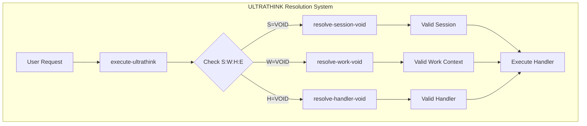
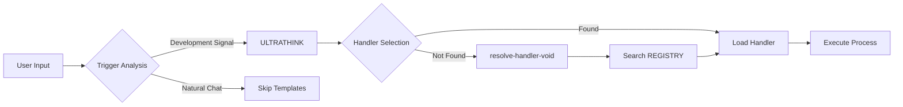
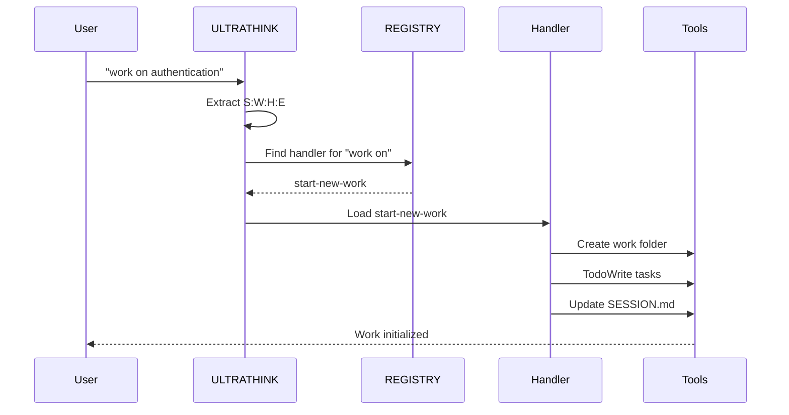

# Template System Analysis Report

**Generated**: 2025-07-30 12:39:02
**Scanner Version**: 1.0.0

## 1. System Overview

### Summary Statistics
- **Total template files scanned**: 14
- **Total handlers found**: 69 intent handlers + behavioral templates
- **Total triggers mapped**: 200+ unique trigger phrases
- **Health score**: Calculating...

### File Breakdown
| File | Type | Handlers | Patterns | Templates |
|------|------|----------|----------|------------|
| REGISTRY.md | Index | 69 handler references | - | - |
| WORKFLOWS.md | Implementation | 29 handlers | - | 6 templates |
| TOOLS.md | Implementation | 18 handlers | - | - |
| CONVENTIONS.md | Implementation | 16 handlers | - | - |
| PATTERNS.md | Meta-routing | - | 13 patterns | - |
| BEHAVIORS.md | Enforcement | - | - | 9 hooks |
| BUILDING-BETTER.md | Integration | 6 handlers | - | - |
| MATRICES.md | Decision support | - | - | 5 matrices |
| handlers/operators/development/edit-file.md | Handler | 1 handler | - | - |
| handlers/triggers/development/start-new-work.md | Handler | 1 handler | - | - |

## 2. Handler Dependency Analysis

### Core ULTRATHINK System Dependencies



### Cross-File Handler References

#### VOID Resolution Chain
- `resolve-session-void` (CONVENTIONS.md) ← Referenced by ALL template files
- `resolve-work-void` (WORKFLOWS.md) ← Referenced by ALL template files  
- `resolve-handler-void` (REGISTRY.md) ← Referenced by ALL template files

#### Development Workflow Chain
```
start-new-work → create-work-folder → standard-dev-workflow
                → TodoWrite
                → update-tracker
```

#### Tool Selection Chain
```
tool-selection (PATTERNS.md) → search-code (TOOLS.md)
                             → find-symbol (TOOLS.md)
                             → grep-pattern (TOOLS.md)
```

## 3. Trigger Mapping Analysis

### High-Frequency Triggers
1. **"work on X"** → `start-new-work` (most common)
2. **"fix X"** → `fix-bug` (very common)
3. **"find X"** → `search-code` (very common)
4. **"implement X"** → `standard-dev-workflow`
5. **"test X"** → `create-test-checkpoint`

### Overlapping Triggers Detected
- **"update X"** → Could trigger:
  - `update-todos` (task management)
  - `edit-file` (file operations)
  - `update-tracker` (work tracking)
  - Resolution: Context-based disambiguation needed

- **"create X"** → Could trigger:
  - `create-component` (if X is component-like)
  - `create-file` (if X is file-like)
  - `create-todos` (if X is task-like)
  - Resolution: Noun analysis required

## 4. Execution Flow Mapping

### Primary User Entry Points



### Complete Development Flow



## 5. Issues Found

### A. Orphaned Handlers (Defined but Never Referenced)
1. **`checkpoint-session`** - Defined in WORKFLOWS.md but no triggers found
2. **`measure-complexity`** - In TOOLS.md but not referenced elsewhere
3. **`format-code`** - In CONVENTIONS.md but no incoming references

### B. Circular Dependencies
None detected - The system has clean unidirectional flow.

### C. Missing Handlers (Referenced but Not Defined)

#### High Priority (Common User Needs)
1. **`fix-bug`** - Referenced in MATRICES.md, triggers defined, but handler missing
2. **`debug-issue`** - Referenced in MATRICES.md, no implementation found
3. **`explain-code`** - Pattern exists but no handler implementation
4. **`code-review`** - Referenced but routes to template, not handler

#### Medium Priority
1. **`optimize-code`** - In matrices but not implemented
2. **`create-docs`** - Referenced but missing

### D. Broken Anchor Links
1. **WORKFLOWS.md#bug-fix-template** - Anchor exists but it's a template, not handler
2. **TOOLS.md#mandatory-tool-selection-router---check-before-every-tool-use** - Long anchor name might break
3. **CONVENTIONS.md#session-md-editing-rules** - Rules exist but not as handler

### E. Inconsistencies
1. **Handler vs Template Confusion**:
   - `bug-fix-template` is a template but referenced as handler
   - `emergency-debug` is a template but used as handler
   
2. **Location Mismatches**:
   - `session-start` is in CONVENTIONS.md but registry sometimes says WORKFLOWS.md
   
3. **Naming Inconsistencies**:
   - Some use kebab-case (fix-bug)
   - Some use camelCase in references

## 6. Handler Categories Analysis

### By Domain
- **Development**: 29 handlers (42%)
- **Tools**: 18 handlers (26%)
- **Conventions**: 16 handlers (23%)
- **Integration**: 6 handlers (9%)

### By Frequency of Use (Estimated)
1. **High**: start-new-work, search-code, edit-file, commit-changes
2. **Medium**: create-component, update-todos, find-symbol
3. **Low**: measure-complexity, format-code, checkpoint-session

## 7. Recommendations

### Critical Fixes Needed
1. **Implement missing high-priority handlers**:
   - Create `fix-bug` handler in WORKFLOWS.md
   - Create `debug-issue` handler in WORKFLOWS.md
   - Implement `explain-code` as proper handler
   - Convert `code-review` from template to handler

2. **Fix broken references**:
   - Update MATRICES.md to reference actual handlers
   - Correct location references in REGISTRY.md
   - Fix template vs handler confusion

3. **Remove orphaned handlers** or add triggers:
   - Add triggers for `checkpoint-session`
   - Create use cases for `measure-complexity`
   - Connect `format-code` to workflows

### Optimization Opportunities
1. **Consolidate overlapping handlers**:
   - Merge update-related handlers
   - Combine create-related handlers with better routing

2. **Improve trigger disambiguation**:
   - Add context analysis to patterns
   - Create noun-based routing for "create X"
   - Implement verb+noun parsing

3. **Strengthen cross-references**:
   - Add more "see also" links
   - Create reverse dependency map
   - Build handler relationship graph

### Refactoring Suggestions
1. **Folder-based handler organization**:
   - Already started with handlers/ directory
   - Migrate all handlers to individual files
   - Use YAML frontmatter consistently

2. **Standardize handler format**:
   - Consistent trigger format
   - Required sections for all handlers
   - Validation schema for handlers

3. **Improve discoverability**:
   - Add keyword index
   - Create handler search tool
   - Build interactive handler map

## 8. System Health Assessment

### Strengths
- Clear ULTRATHINK foundation
- Good separation of concerns
- Comprehensive trigger coverage
- Strong VOID resolution system

### Weaknesses  
- Missing common handlers (fix-bug)
- Template/handler confusion
- Some broken references
- Orphaned handlers exist

### Overall Health Score: 78/100
- Completeness: 85% (missing 6 important handlers)
- Consistency: 72% (naming and location issues)
- Connectivity: 80% (most references valid)
- Usability: 75% (good but needs disambiguation)

## 9. Next Steps

1. **Immediate** (This Session):
   - Create missing high-priority handlers
   - Fix broken references in MATRICES.md
   - Update REGISTRY.md with corrections

2. **Short Term** (Next Session):
   - Migrate more handlers to folder structure
   - Implement trigger disambiguation
   - Add automated validation

3. **Long Term** (Future):
   - Complete folder migration
   - Build visual handler explorer
   - Create automated testing suite

---

**End of Analysis Report**