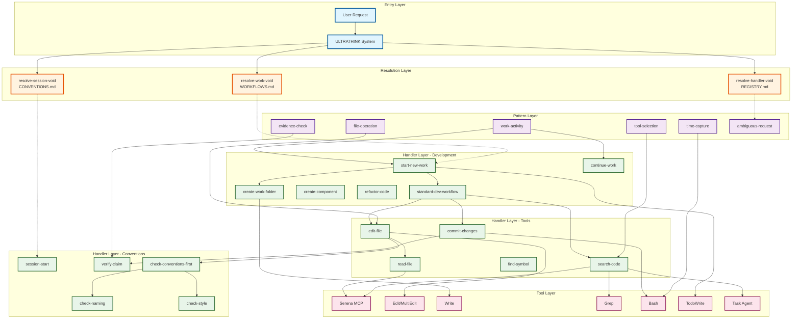
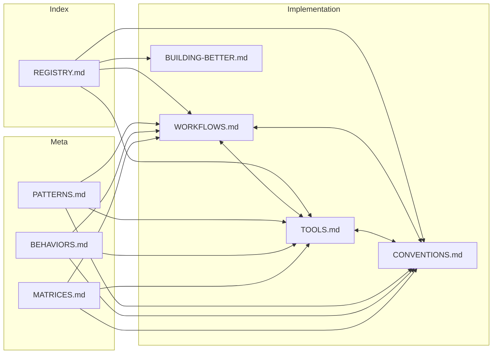
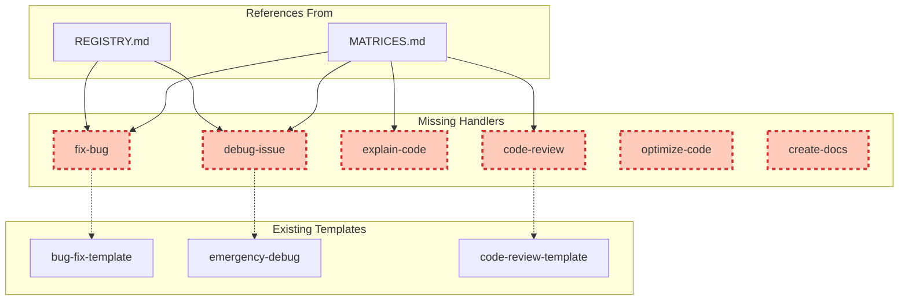
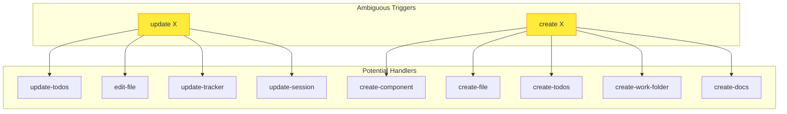

# Template System Dependency Graph

**Generated**: 2025-07-30 12:39:02
**Purpose**: Visual representation of handler dependencies and relationships

## Master Dependency Graph



## Critical Dependency Chains

### 1. Development Initialization Chain
```
start-new-work
├── create-work-folder
│   └── Write (7 files)
├── TodoWrite
│   └── Task breakdown
├── update-session
│   └── Edit SESSION.md
└── standard-dev-workflow
    ├── search-code
    ├── edit-file
    └── commit-changes
```

### 2. File Operation Chain
```
file-operation (pattern)
├── check-conventions-first
│   ├── Special file rules
│   └── Standard file rules
├── read-file
│   └── Read tool
└── edit-file
    ├── Edit/MultiEdit
    └── Validation
```

### 3. Search Operation Chain
```
tool-selection (pattern)
├── search-code
│   ├── Serena find_symbol
│   ├── Serena search_pattern
│   └── Task agent
├── find-symbol
│   └── Serena find_symbol
└── grep-pattern
    └── Grep tool
```

### 4. Convention Enforcement Chain
```
check-conventions-first
├── File conventions
│   └── Special rules
├── Naming conventions
│   └── check-naming
├── Git conventions
│   └── check-commit-msg
└── Code conventions
    └── check-style
```

## Handler Reference Frequency

### Most Referenced Handlers (Incoming Links)
1. **resolve-session-void**: 7 files reference it
2. **resolve-work-void**: 7 files reference it
3. **resolve-handler-void**: 7 files reference it
4. **start-new-work**: 5+ references
5. **search-code**: 4+ references
6. **edit-file**: 4+ references

### Most Dependent Handlers (Outgoing Links)
1. **start-new-work**: References 4 other handlers
2. **standard-dev-workflow**: References 4 other handlers
3. **search-code**: References 4 tools
4. **check-conventions-first**: References 4 convention checks

### Orphaned Handlers (No References)
1. **checkpoint-session**
2. **measure-complexity**
3. **format-code**

## Cross-File Dependencies



## Missing Handler Dependencies

These handlers are referenced but don't exist:



## Trigger Overlap Analysis



---

**Key Insights from Dependency Analysis:**

1. **Strong Foundation**: ULTRATHINK resolution system is well-connected
2. **Clear Layers**: Good separation between patterns, handlers, and tools
3. **Missing Links**: Several important handlers are missing (fix-bug, debug-issue)
4. **Orphaned Code**: Some handlers have no incoming references
5. **Ambiguous Routes**: Some triggers map to multiple handlers without clear disambiguation
