# Template System Execution Flows

**Generated**: 2025-07-30 12:39:02
**Purpose**: Visual representation of handler execution paths

## Core Execution Flows

### 1. ULTRATHINK Resolution Flow

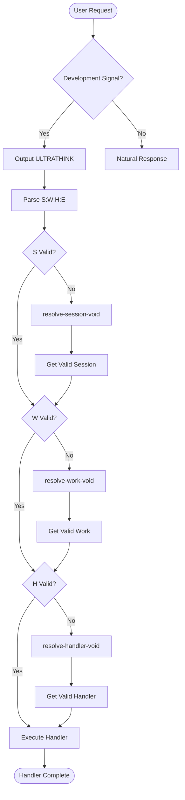

### 2. Development Work Flow

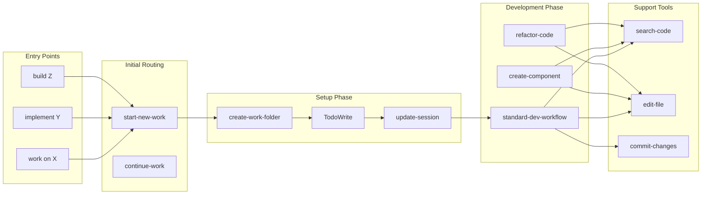

### 3. Search and Analysis Flow

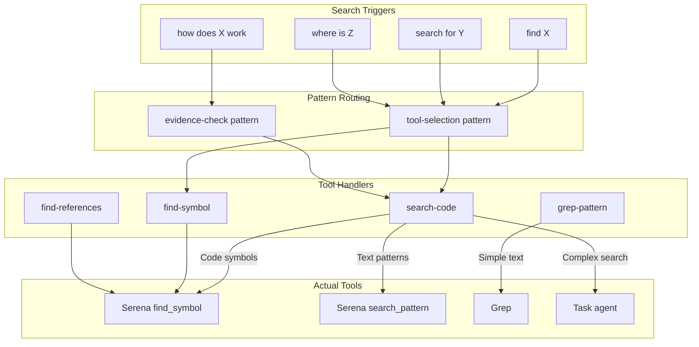

### 4. File Operation Flow

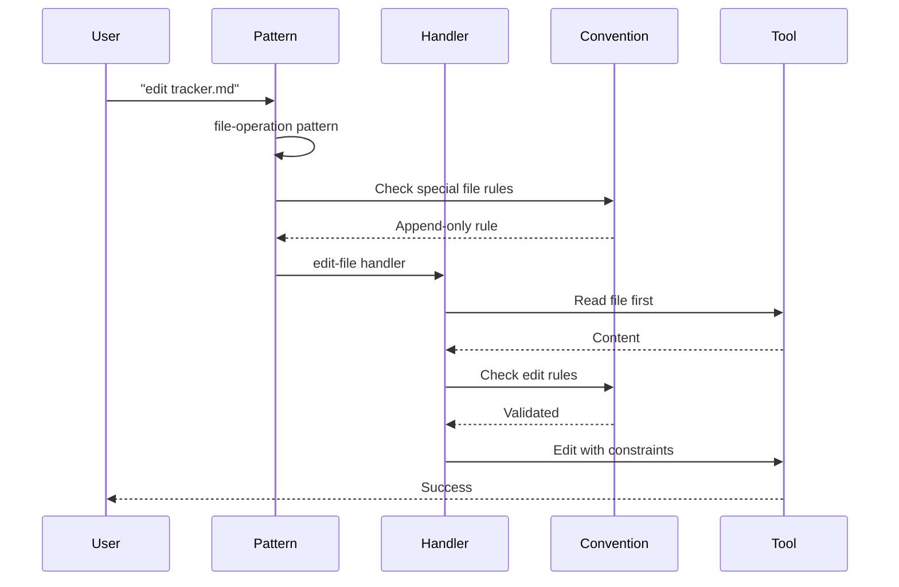

### 5. Git Operations Flow

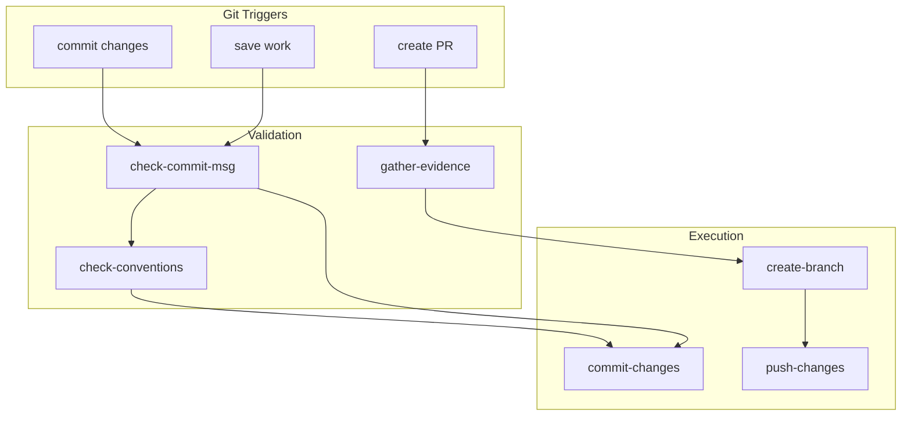

### 6. Testing Flow

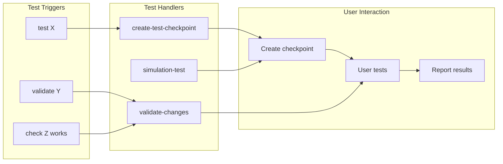

### 7. Session Management Flow

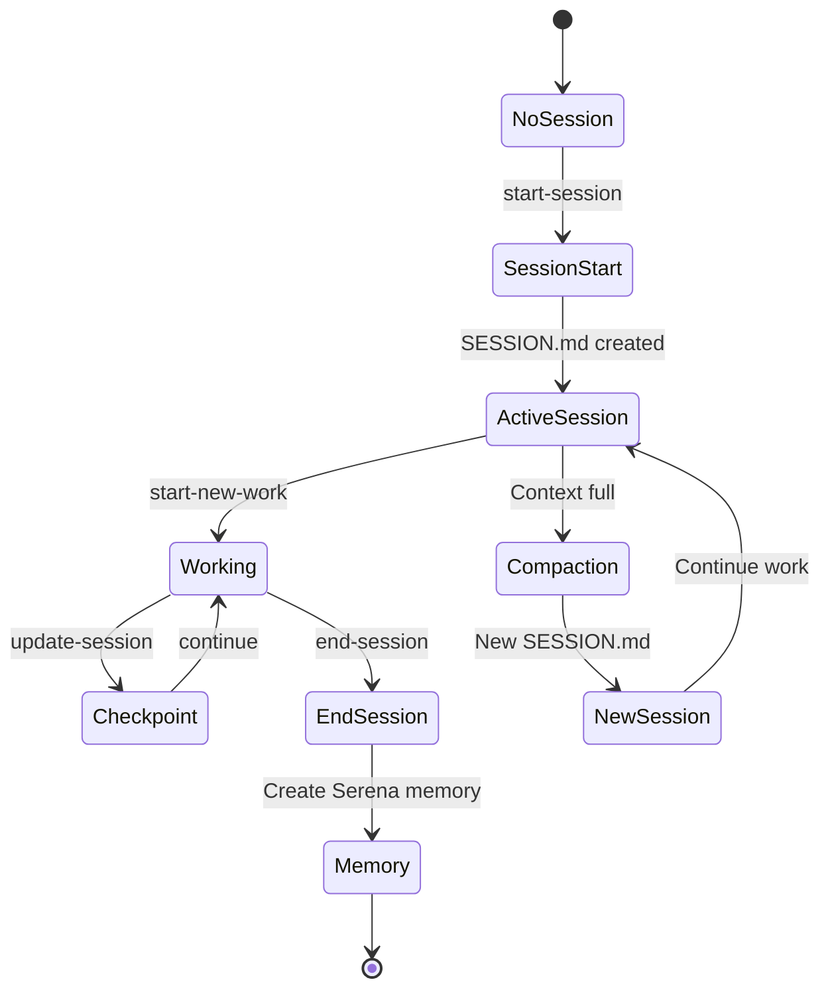

### 8. Error Recovery Flow

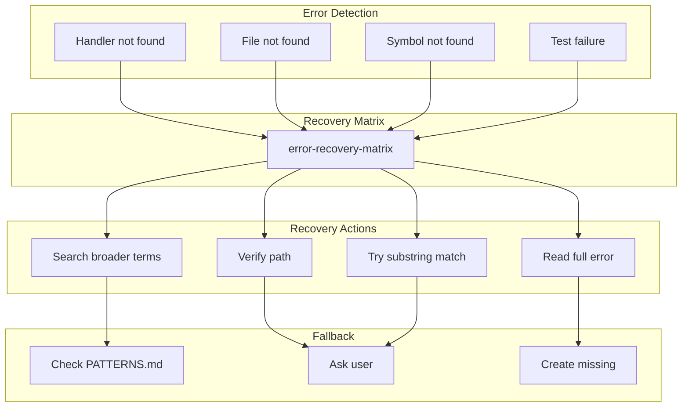

## Handler Dependency Chains

### Development Chain
```
User Input
└── start-new-work
    ├── create-work-folder
    │   └── Write (7 files)
    ├── TodoWrite
    │   └── Task breakdown
    ├── update-session
    │   └── Edit SESSION.md
    └── standard-dev-workflow
        ├── search-code
        ├── edit-file
        ├── create-test-checkpoint
        └── commit-changes
```

### Search Chain
```
User Query
└── tool-selection (pattern)
    ├── search-code (handler)
    │   ├── Serena find_symbol
    │   ├── Serena search_pattern
    │   └── Task agent (complex)
    ├── find-symbol (handler)
    │   └── Serena find_symbol
    └── grep-pattern (handler)
        └── Grep tool
```

### Convention Chain
```
Any Action
└── check-conventions-first
    ├── File conventions
    │   └── Special file rules
    ├── Naming conventions
    │   └── check-naming
    ├── Git conventions
    │   └── check-commit-msg
    └── Code conventions
        └── check-style
```

## Critical Decision Points

### 1. Handler Selection (H = VOID)
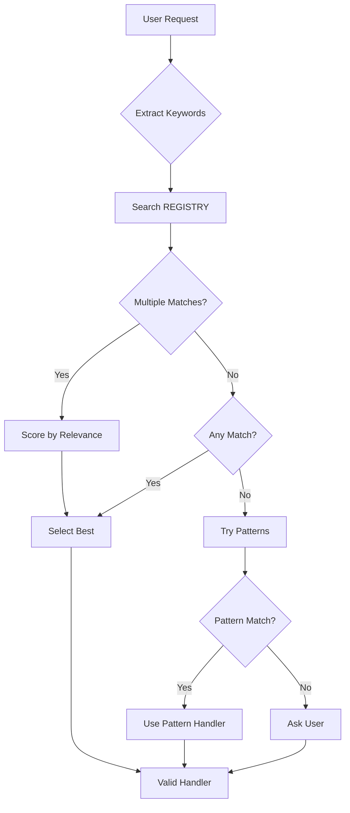

### 2. Tool Selection
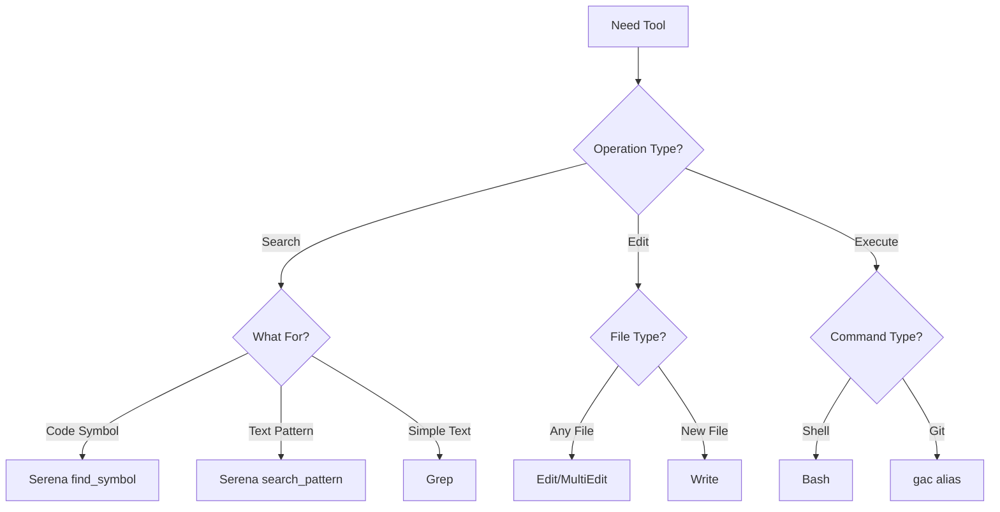

### 3. Work Context (W = VOID)
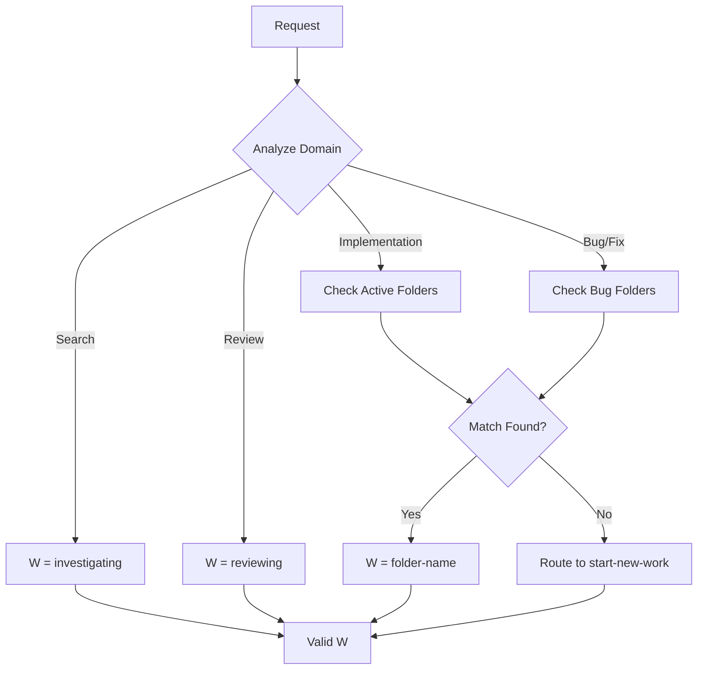

## System Entry Points Summary

1. **Primary Entry**: ULTRATHINK → Handler Selection → Execution
2. **Pattern Entry**: Ambiguous Request → Pattern → Handler
3. **Direct Entry**: Clear Trigger → Specific Handler
4. **Error Entry**: Failure → Recovery Matrix → Fallback
5. **Meta Entry**: System Improvement → Building Better

---

**End of Execution Flow Documentation**