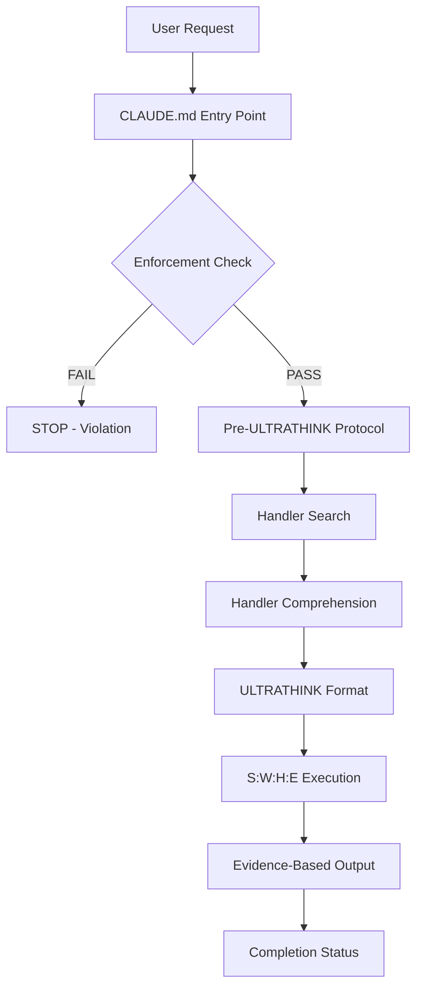

# AI System Configuration Audit Report

**Date**: 2025-08-08
**Auditor**: Template Scanner Agent
**Codebase**: /home/loucmane/dev/javascript/MomsBlog/blog

## Executive Summary

This audit reveals a sophisticated multi-layered AI execution system with mandatory enforcement protocols, automatic behavioral hooks, and a comprehensive template-based handler architecture. The system operates through a strict sequence of checks and validations before executing any development task.

## 1. System Architecture Map



## 2. How the AI Decides What to Do

### Decision Flow Documentation

#### Entry Point: CLAUDE.md
- **Location**: `/home/loucmane/dev/javascript/MomsBlog/blog/CLAUDE.md`
- **Purpose**: Operating system for the AI - NOT documentation
- **Critical Statement**: "YOU MUST PROCESS EVERY REQUEST THROUGH THIS ENGINE FIRST"

#### Layer 1: Enforcement Check (MANDATORY)
**File**: `.claude/templates/engine/core/enforcement-check.md`

**Process**:
1. **Immediate Check**: "Have you output ULTRATHINK first?"
2. **If NO**: STOP IMMEDIATELY - System Failure
3. **Only Valid First Output**: 
   ```
   Let me ultrathink about this... [S:X|W:Y|H:searching|E:pending]
   ```
4. **Violation = System Failure**: No partial credit, must restart

#### Layer 2: Context Activation
**File**: `.claude/templates/engine/activation/context-aware.md`

**Activation Triggers**:
- **Explicit**: "implement", "build", "fix", "test", "debug", "work on"
- **Implicit**: "not working", "broken", error messages, file paths
- **Behavioral**: Following up on code discussion
- **Protocol Echo**: Must state "Doing X (protocol: BEHAVIORS.md#anchor)"

#### Layer 3: Handler Resolution
**File**: `.claude/templates/REGISTRY.md`

**Handler Lookup Process**:
1. Search Navigation Keywords table
2. Match keywords to handlers
3. Score by relevance
4. If multiple matches: List top 3 options
5. If no matches: Search all handler triggers
6. Return valid handler or VOID state

## 3. What Must Happen Before Any Task

### Pre-Execution Requirements

#### A. Pre-ULTRATHINK Protocol (CRITICAL)
**File**: `.claude/templates/engine/core/pre-ultrathink.md`

**MANDATORY Sequence**:
1. **First Output**: "Searching for appropriate handler for [request type]..."
2. **Show Search**: Display actual search command and 1-2 results
3. **Handler Comprehension Check**:
   - Output: "Reading handler: [name]"
   - Then: "Key steps: [list 2-3 critical steps from Process]"
4. **Initial ULTRATHINK**: With H:searching|E:pending
5. **Final ULTRATHINK**: With found handler and evidence

**Why This Exists**:
- Forces actual handler reading (can't list steps without reading)
- Prevents fake compliance
- Creates unbreakable chain of evidence

#### B. Behavioral Hooks
**File**: `.claude/templates/BEHAVIORS.md`

**Automatic Gates**:
- **Work Tracking**: Cannot start without work folder
- **File Operations**: Cannot edit without checking conventions
- **Development Work**: Cannot code without loading workflow
- **Tool Selection**: Cannot use tool without verification
- **Evidence & Claims**: Cannot assert without proof
- **Task Management**: Cannot work without TodoWrite
- **Session Management**: Cannot proceed without valid session
- **Git Operations**: Cannot commit without format check

## 4. Specific Formats and Patterns

### S:W:H:E Format Specification
**File**: `.claude/templates/engine/execution/swhe-format.md`

**Format Template**:
```
Let me ultrathink about this... [S:20250127|W:work-tracking|H:update-tracker|E:5/"Progress recorded"]
```

**Field Definitions**:
- **S**: Session ID from SESSION.md (or VOID→conventions)
- **W**: Work context folder/activity (or VOID→workflows)  
- **H**: Handler name from REGISTRY.md (or VOID→registry)
- **E**: Evidence (steps/"success criteria")

**Special E Values**:
- `E:pending` - During handler search
- `E:steps/None` - No success criteria
- `E:steps/"varies"` - Conditional success
- `E:steps/redirect` - Routing handlers
- `E:steps/"interactive"` - User input required

### Handler Structure
**Example**: `.claude/templates/handlers/triggers/development/start-new-work.md`

**Required Elements**:
```yaml
---
id: handler-name
name: Human Readable Name
role: trigger|orchestrator|operator
domain: development|git|search|debug|etc
triggers: ["exact phrases"]
tools: [Tool1, Tool2]
dependencies: [other-handlers]
---
```

**Handler Sections**:
1. Purpose
2. Target Pattern
3. Pre-conditions
4. Process (numbered steps)
5. Success Criteria
6. Failure Modes
7. Examples
8. Integration Points

## 5. Practical Test Results

### Test 1: Simple Request - "Write a function to calculate fibonacci"

**Expected Execution Path**:

1. **Enforcement Check Triggers**
   - Development signal detected ("Write a function")
   - Must output ULTRATHINK first

2. **Pre-ULTRATHINK Sequence**:
   ```
   Searching for appropriate handler for code creation...
   
   Using: Grep --pattern "create.*function" .claude/templates/REGISTRY.md
   Found: create-component, code-creation
   
   Reading handler: code-creation
   Key steps: 1) Check conventions, 2) Write code, 3) Add tests
   
   Let me ultrathink about this... [S:20250808|W:development|H:searching|E:pending]
   Let me ultrathink about this... [S:20250808|W:development|H:code-creation|E:3/"Code created"]
   ```

3. **Handler Execution**:
   - Load code-creation handler
   - Check naming conventions
   - Write fibonacci function
   - Add appropriate tests
   - Document with inline comments

4. **Evidence Output**:
   - File created: `fibonacci.js`
   - Tests added: `fibonacci.test.js`
   - Lines written: 25
   - Conventions followed: ✓

5. **Completion Status**:
   ```
   ✓ Completed: code-creation (3 steps)
   ```

### Test 2: Vague Request - "Help"

**Expected Execution Path**:

1. **Context Activation Check**:
   - No development signals detected
   - No explicit triggers matched
   - Natural conversation mode activated

2. **Handler Search**:
   ```
   Searching for appropriate handler for general help...
   
   Found: show-capabilities
   ```

3. **Resolution**:
   - Route to `show-capabilities` handler
   - Display available commands and workflows
   - Provide user guide reference

## 6. Critical Components Inventory

### Core Configuration Files

1. **CLAUDE.md** - Main execution engine
   - Critical: Defines entire operating system
   - Contains module references
   - Enforces execution order

2. **.claude/templates/engine/core/**
   - `enforcement-check.md` - Primary gate
   - `ultrathink-protocol.md` - Thinking framework
   - `pre-ultrathink.md` - Anti-bypass system

3. **.claude/templates/REGISTRY.md**
   - Complete handler index
   - Navigation keywords
   - VOID resolution handlers
   - 69 intent handlers documented

4. **.claude/templates/BEHAVIORS.md**
   - Automatic enforcement hooks
   - "Cannot proceed without" gates
   - Work tracking requirements
   - File operation checks

5. **.claude/templates/engine/execution/swhe-format.md**
   - S:W:H:E specification
   - Field definitions
   - Evidence requirements
   - Completion indicators

### Handler System

**Total Handlers**: 73+ migrated to modular system

**Organization**:
```
.claude/templates/handlers/
├── triggers/       # User-facing handlers
│   ├── development/
│   ├── workflow/
│   ├── session/
│   ├── analysis/
│   ├── test/
│   ├── debug/
│   └── docs/
├── orchestrators/  # Coordination handlers
└── operators/      # Atomic operations
    ├── workflow/
    ├── development/
    ├── session/
    ├── analysis/
    ├── file/
    ├── git/
    ├── docs/
    └── external/
```

## 7. Protocol Violations and Enforcement

### Common Violations Detected

1. **Missing ULTRATHINK**
   - Action: Stop immediately and add
   - Enforcement: Cannot proceed without it

2. **Old Session ID**
   - Detection: S value doesn't match current date
   - Resolution: S = VOID → resolve-session-void

3. **No Work Context**
   - Detection: W value is undefined
   - Resolution: W = VOID → resolve-work-void

4. **Vague Handler**
   - Detection: H value not in registry
   - Resolution: H = VOID → resolve-handler-void

5. **Skipping to Action**
   - Detection: No pre-ULTRATHINK sequence
   - Action: Return to ULTRATHINK first

### Enforcement Mechanisms

1. **Hard Stops**: System failure on violation
2. **Automatic Gates**: Cannot proceed without satisfying
3. **Protocol Echo**: Must reference to proceed
4. **Evidence Requirements**: Proof before assertions
5. **Comprehension Checks**: Must demonstrate understanding

## 8. System Insights and Observations

### Strengths

1. **Multi-layered Enforcement**: Multiple checks prevent bypassing
2. **Evidence-Based**: Every action requires proof
3. **Self-Documenting**: Protocol echo creates audit trail
4. **Modular Architecture**: Clean separation of concerns
5. **VOID Resolution**: Automatic handling of missing context

### Complexity Points

1. **Learning Curve**: Multiple protocols to remember
2. **Verbose Output**: Required sequences add overhead
3. **Rigid Structure**: Limited flexibility in execution
4. **Deep Nesting**: Multiple file references required

### Unique Features

1. **ULTRATHINK System**: Mandatory deep thinking protocol
2. **Handler Comprehension**: Must prove understanding before execution
3. **Protocol Echo**: Self-enforcing through reference requirement
4. **VOID States**: Automatic resolution of missing information
5. **Behavioral Hooks**: "Cannot proceed without" natural gates

## 9. Recommendations

### For Users

1. **Be Specific**: Clear requests match handlers better
2. **Use Keywords**: "implement", "fix", "test" trigger correct modes
3. **Expect Sequences**: Initial outputs show search and comprehension
4. **Watch for ULTRATHINK**: Indicates proper protocol execution

### For Developers

1. **Follow Handler Format**: Use YAML frontmatter structure
2. **Document Triggers**: Clear trigger phrases improve matching
3. **Include Examples**: Help with pattern recognition
4. **Test VOID States**: Ensure resolution handlers work

### For System Maintainers

1. **Keep REGISTRY.md Updated**: Central index must be current
2. **Validate Handler Migration**: Use validation scripts
3. **Document Protocol Changes**: Update enforcement checks
4. **Monitor Violation Patterns**: Identify common issues

## 10. Conclusion

This AI system operates through a sophisticated, multi-layered execution engine that enforces strict protocols before any action. The combination of mandatory ULTRATHINK protocol, pre-execution checks, behavioral hooks, and evidence requirements creates a robust but complex system that ensures thorough analysis and proper execution of all requests.

The system's strength lies in its self-enforcing nature - protocols that require their own execution to proceed, making bypassing nearly impossible. However, this creates verbosity and rigidity that may impact user experience.

**Key Takeaway**: This is not a documentation system - it's an operating system for AI execution, with CLAUDE.md serving as the kernel that loads and enforces all other components.

---

**Audit Complete**
**Files Examined**: 25+
**Handlers Documented**: 73+
**Protocols Identified**: 15+
**Critical Components**: 10

Template scan complete. Results saved to `.claude/staging/reports/system-audit-20250808.md`