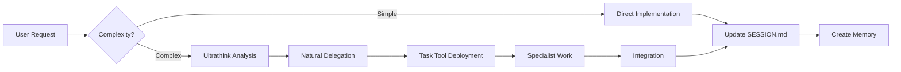

# Tool Configuration and Usage Guide

This document contains all MCP tool configurations, usage patterns, and the unified delegation-first workflow using the built-in Task tool.

## 🚨 MANDATORY TOOL SELECTION ROUTER - CHECK BEFORE EVERY TOOL USE! 🚨

**NEVER** use a tool directly. **ALWAYS** follow this protocol:
1. **STATE**: "I need to [action]"
2. **CHECK**: Router table below for correct tool
3. **CONFIRM**: "Using [tool] for [purpose]"
4. **JUSTIFY**: If deviating, explain why

### Action → Tool Mapping

| I need to... | For... | MUST use... | BLOCKED |
|--------------|---------|-------------|----------|
| Search | Code patterns | `mcp__serena__search_for_pattern` | grep, find |
| Search | File names | `Glob` | find |
| Search | Symbol definitions | `mcp__serena__find_symbol` | grep |
| Find files | By name/pattern | `mcp__serena__find_file` or `Glob` | find |
| List directory | Contents | `mcp__serena__list_dir` or `LS` | ls (bash) |
| Edit | Whole function/class | `mcp__serena__replace_symbol_body` | Edit (for whole symbols) |
| Edit | Small changes | `Edit` | - |
| Edit | Multiple changes | `MultiEdit` | - |
| Edit | Add after symbol | `mcp__serena__insert_after_symbol` | - |
| Edit | Add before symbol | `mcp__serena__insert_before_symbol` | - |
| Replace | By regex | `mcp__serena__replace_regex` | sed, awk |
| Analyze | Code structure | `mcp__serena__get_symbols_overview` | manual reading |
| Find references | To symbols | `mcp__serena__find_referencing_symbols` | grep |
| Timestamp | Any document | `date "+%Y-%m-%d %H:%M %Z"` | manual typing |
| Commit | Code changes | `gac "message"` | git commit |
| Complex search | Multiple files/patterns | `Task` tool with agent | multiple greps |
| Deep analysis | Architecture/patterns | `Task` tool with ultrathink | surface analysis |

### 🎯 Action Triggers

When you catch yourself thinking/saying:
- "I need to search..." → **STOP!** Check router for Serena vs Glob
- "Let me find..." → **STOP!** Serena has semantic understanding
- "I'll update..." → **STOP!** Check timestamp protocol first
- "I'll edit..." → **STOP!** Serena for symbols, Edit for text
- "I'll analyze..." → **STOP!** Serena for structure, Task for deep analysis
- "I'll grep..." → **STOP!** Always use Serena for code search

### 📊 Common Violations (Learn from these!)
1. Using grep instead of Serena for code search
2. Typing timestamps instead of using date command
3. Using Edit for whole function replacement (use Serena)
4. Using ls in Bash instead of LS tool
5. Not using Task tool for complex multi-step searches

---

## 🚦 DECISION FUNNEL - Follow the Questions!

### Q1: What type of operation?
├─ **SEARCH/FIND** → Go to Q2
├─ **EDIT/MODIFY** → Go to Q3  
├─ **RUN/EXECUTE** → Go to Q4
└─ **ANALYZE/UNDERSTAND** → Go to Q5

### Q2: SEARCH - What are you searching for?
├─ **Code patterns/text** → `mcp__serena__search_for_pattern`
├─ **Function/class by name** → `mcp__serena__find_symbol`
├─ **File names** → `Glob` (for patterns) or `mcp__serena__find_file`
├─ **Who uses this symbol** → `mcp__serena__find_referencing_symbols`
└─ **Complex multi-file search** → Deploy specialist with `Task` tool

### Q3: EDIT - What are you editing?
├─ **Whole function/method** → `mcp__serena__replace_symbol_body`
├─ **Small text change** → `Edit` (after Read!)
├─ **Multiple small changes** → `MultiEdit`
├─ **Add code after function** → `mcp__serena__insert_after_symbol`
├─ **Add code before function** → `mcp__serena__insert_before_symbol`
└─ **Replace by pattern** → `mcp__serena__replace_regex`

### Q4: RUN - What are you running?
├─ **Shell command** → `Bash`
├─ **List directory** → `LS` (NOT ls in Bash!)
├─ **Git operations** → `Bash` with proper commands
└─ **Complex automation** → Deploy specialist with `Task` tool

### Q5: ANALYZE - What do you need to understand?
├─ **Code structure overview** → `mcp__serena__get_symbols_overview`
├─ **Deep architectural analysis** → Deploy specialist with `Task` tool
├─ **Simple file reading** → `Read`
└─ **Documentation lookup** → `mcp__context7__get-library-docs`

### 🚫 FORBIDDEN PATHS
If you find yourself wanting to:
- Type `grep` → **STOP!** Use `mcp__serena__search_for_pattern`
- Type `find` → **STOP!** Use `Glob` or `mcp__serena__find_file`
- Type a timestamp → **STOP!** Use `date "+%Y-%m-%d %H:%M %Z"`
- Edit without reading → **STOP!** Always `Read` first
- Use `ls` in Bash → **STOP!** Use `LS` tool

---

## 🎯 Quick Navigation

- **[Core Tools Overview](#core-tools-overview)** - Essential tools for development
- **[Task Tool - Orchestration Foundation](#task-tool---orchestration-foundation)** - Built-in delegation
- **[MCP Integration Pattern](#mcp-integration-pattern)** - Standard tool usage
- **[Serena MCP Integration](#serena-mcp-integration)** - Semantic code analysis
- **[TaskMaster Integration](#taskmaster-integration)** - Project planning
- **[Tool Selection Guide](#tool-selection-guide)** - When to use what
- **[Tool Selection Handlers](#tool-selection-handlers)** - NEW! Protocol navigation handlers
- **[Anti-Patterns](#anti-patterns-to-avoid)** - What NOT to do

## Core Tools Overview

### Built-in Tools (Always Available)

```yaml
File Operations:
  - Read: View file contents
  - Write: Create new files
  - Edit/MultiEdit: Modify existing files
  - Bash: Execute commands
  - Grep/Glob: Search patterns
  - LS: List directories

Task Tool:
  - Purpose: Deploy specialists for complex work
  - Type: Built-in (NOT MCP)
  - Key Feature: Enables unified workflow
```

### MCP Tools (Project-Specific)

```yaml
Serena:
  - Purpose: Semantic code analysis
  - Strengths: Understanding relationships, intelligent refactoring
  - Project: Use full path to avoid errors

TaskMaster:
  - Purpose: Project planning and tracking
  - Strengths: Task dependencies, progress tracking
  - Integration: Syncs with TodoWrite/TodoRead

Context7:
  - Purpose: Latest documentation lookup
  - Usage: Single topics for best results
  - Example: "React hooks", not "React"
```

## Task Tool - Intelligent Sequential Processing

### What It Is

The **Task tool** is a built-in Claude capability (not MCP) that enables intelligent delegation to specialist agents. It processes TaskMaster subtasks sequentially with value-based deployment decisions.

### Core Philosophy

Process TaskMaster subtasks one at a time with intelligent specialist deployment based on value-add analysis, not keywords. Every task in TaskMaster has subtasks, making this approach natural and effective.

### How It Works

1. **Read Task Structure**
   - Get task from TaskMaster
   - Review all subtasks
   - Identify dependencies
   - Plan sequential approach

2. **Sequential Processing**
   For each subtask:
   - Quick ultrathink analysis (5-10 seconds)
   - Assess specialist value-add
   - Deploy if significant improvement expected
   - Complete before moving to next

3. **Intelligent Deployment Decision**
   ```yaml
   Subtask Analysis Process:
     Current: "7.2: Implement Header Component"
     
     Ultrathink considers:
       - Required expertise domains
       - Quality improvement with specialist
       - Time/value tradeoff
       - User patterns from past decisions
     
     Decision thresholds:
       >60% improvement → Auto-deploy specialist
       30-60% → Quick user suggestion
       <30% → Handle directly
   ```

4. **Context Package per Subtask**
   ```yaml
   Specialist Context:
     subtask_info:
       id: "7.2"
       title: "Implement Header Component"
       description: [Full description from TaskMaster]
     
     focus: "Foundation branding, navigation UX"
     files: ["/components/", "/styles/theme.ts"]  # Max 3 relevant files
     constraints: "15 minutes, use design system"
     shared_state:
       session: "Current SESSION.md section"
       previous_work: "7.1 completion notes"
       testing_required: true
   ```

### Real Example Flow

```markdown
User: "Work on task 7"

AI: "Task 7: Core Layout Components (7 subtasks)
    Starting with 7.1: Create Semantic HTML Structure
    
    [Ultrathink: Basic HTML foundation, no specialist needed]
    Implementing semantic structure..."
    
    "Basic structure complete. Since this is foundational HTML,
    no testing checkpoint needed. Moving to next subtask."

AI: "Moving to 7.2: Implement Header Component
    
    [Ultrathink: Visual design, branding, UX patterns
     Specialist value-add: ~70% improvement]
    This involves design decisions. Deploying UI specialist..."
    
    [UI Specialist works with focused context]
    
    "📋 Ready for Your Testing:
    - Files: /components/Header.tsx, /styles/header.module.css
    - Run: pnpm dev
    - Test: Navigation, mobile menu, theme toggle"
    
    [Awaits user testing...]

AI: "Next: 7.5: Implement Accessibility Landmarks
    
    [Ultrathink: ARIA, keyboard nav, screen readers
     Specialist value-add: ~80% improvement]
    Critical for accessibility. Deploying A11y specialist..."
    
    [A11y Specialist implements]
    
    "📋 Ready for Your Testing:
    - Test with screen reader (NVDA/JAWS)
    - Check landmark navigation
    - Verify focus management"
```

### Progressive Learning System

The AI tracks and learns:
```yaml
Pattern Database:
  "Header Component" + UI Specialist: 
    outcomes: [excellent, excellent, good]
    avg_time: 12 minutes
    value_delivered: high
    
  "Basic HTML Structure" + Solo:
    outcomes: [good, good, excellent]
    avg_time: 8 minutes
    value_delivered: appropriate
    
Future Decision:
  Similar component → Likely deploy UI specialist
```

### User Testing Integration

The Task tool recognizes that the user performs all testing. Each specialist deployment includes testing checkpoints:

```yaml
Specialist Deployment with Testing:
  1. Deploy: UI specialist for Header Component
  2. Work: Specialist implements (10-15 min)
  3. Checkpoint: Create testing instructions
  4. Pause: Wait for user testing
  5. Iterate: Fix issues based on feedback
  6. Complete: Move to next subtask
```

#### Testing Checkpoint Creation

When a specialist completes implementation:
1. Specialist finishes the subtask work
2. AI reviews what was implemented
3. AI creates testing checkpoint with:
   - List of modified files
   - Specific test instructions
   - Known concerns or edge cases
   - Clear success criteria
4. Workflow pauses for user testing
5. User provides feedback
6. AI fixes issues or continues

#### Real Testing Flow Example

```markdown
AI: "The UI specialist has completed the Header Component.

✅ Implemented: 7.2 Header Component

📋 Ready for Your Testing:
- Files: /components/Header.tsx (new), /styles/theme.ts (modified)
- Run: pnpm dev
- Test focus: Responsive behavior, theme switching
- Specialist notes: 'Used CSS Grid for flexibility'

The specialist has returned. I'll wait for your test results before continuing."

User: "The desktop version is perfect but mobile menu doesn't close on route change"

AI: "Understood. Let me fix that issue before we continue to the next subtask..."
[Fixes issue]
"Ready for re-test. Same files updated."
```

### Future Parallel Support

While processing sequentially now, the system tracks:
```yaml
Parallel Opportunity Detected:
  Task: 7
  Independent Subtasks: [7.2, 7.3, 7.4, 7.6]
  Reason: "No interdependencies found"
  Potential Time Saved: ~30 minutes
  Confidence: 85%
  
This data informs future system evolution.
```

## MCP Integration Pattern

### Standard Usage Flow

```bash
# 1. Check available tools for task
TaskMaster for planning
Serena for code analysis
Context7 for documentation

# 2. Use tools in logical order
Context7 → Research best practices
Serena → Analyze current code
TaskMaster → Plan implementation
Task → Deploy specialists if needed

# 3. Track everything
TodoWrite → Task breakdown
SESSION.md → Progress updates
```

### Tool Combination Examples

#### Research + Implementation
```
1. Context7: "Next.js app router"
2. Serena: Find current routing setup
3. Task: Deploy research + implementation agents
4. TodoWrite: Track all subtasks
```

#### Code Review Pattern
```
1. Serena: Find all auth-related code
2. Task: Deploy security specialist
3. SESSION.md: Document findings
4. MultiEdit: Apply fixes
```

## Serena MCP Integration

### Initial Serena Activation (First Time)

```bash
# Read instructions first
mcp__serena__initial_instructions

# Then activate with FULL PATH
mcp__serena__activate_project --project="/home/loucmane/dev/javascript/MomsBlog/blog"

# Perform onboarding
mcp__serena__onboarding
```

**Note**: The project name in Serena is "blog", not "MomsBlog". Always use the full path.

### Standard Session Starters with Serena

#### 1. **New Development Session** (Most Common)
```
Activate project /home/loucmane/dev/javascript/MomsBlog/blog, read all memories, and check SESSION.md for previous work.
Today I'm working on [specific task/feature].
```

#### 2. **Continuing Previous Work**
```
Activate project /home/loucmane/dev/javascript/MomsBlog/blog, read the most recent session memory and SESSION.md.
Let's continue where we left off.
```

#### 3. **TaskMaster Integration**
```
Activate project /home/loucmane/dev/javascript/MomsBlog/blog and read all memories.
Check TaskMaster for current task status, then help me work on task [ID].
```

### Serena Tools for This Project

#### Semantic Code Analysis
```bash
# Find components using theme
mcp__serena__find_symbol --name_path="theme" --substring_matching=true

# Show package relationships
mcp__serena__get_symbols_overview --relative_path="packages"

# Find type usage across packages
mcp__serena__search_for_pattern --substring_pattern="Animal.*type"
```

#### Intelligent Refactoring
```bash
# Update component to standards
mcp__serena__replace_symbol_body --name_path="Button" --relative_path="components/Button.tsx"

# Fix import order
mcp__serena__find_symbol --name_path="import" --include_kinds=[15]
```

### Serena Memory Management

#### Create Session Memory
```bash
# Format: session_YYYY-MM-DD_description
mcp__serena__write_memory \
  --memory_name="session_$(date +%Y-%m-%d)_unified_workflow_design" \
  --content="[session details]"
```

#### List and Read Memories
```bash
# See all memories
mcp__serena__list_memories

# Read specific memory
mcp__serena__read_memory --memory_file_name="session_2025-01-06_orchestration.md"
```

## TaskMaster Integration

### Checking Task Status

```bash
# ALWAYS run get_tasks first
mcp__taskmaster-ai__get_tasks --projectRoot="/home/loucmane/dev/javascript/MomsBlog/blog"

# Then get specific task details
mcp__taskmaster-ai__get_task --id="7" --projectRoot="/home/loucmane/dev/javascript/MomsBlog/blog"
```

### Updating Task Progress

```bash
# Mark task complete
mcp__taskmaster-ai__set_task_status \
  --id="7" \
  --status="done" \
  --projectRoot="/home/loucmane/dev/javascript/MomsBlog/blog"

# Update task with new info
mcp__taskmaster-ai__update_task \
  --id="7" \
  --prompt="Added authentication with OAuth2" \
  --projectRoot="/home/loucmane/dev/javascript/MomsBlog/blog"
```

### Creating New Tasks

```bash
# Add task with AI
mcp__taskmaster-ai__add_task \
  --prompt="Add search functionality with performance optimization" \
  --projectRoot="/home/loucmane/dev/javascript/MomsBlog/blog"

# Expand task to subtasks
mcp__taskmaster-ai__expand_task \
  --id="8" \
  --num="5" \
  --projectRoot="/home/loucmane/dev/javascript/MomsBlog/blog"
```

## 📊 Comprehensive Tool Selection Matrix

### Quick Tool Finder

| I need to... | Best Tool | Why | Example |
|--------------|-----------|-----|---------|
| **Find a file by name** | Glob | Fast pattern matching | `Glob "**/*Header*"` |
| **Search for text in files** | Grep | Content search | `Grep "useState"` |
| **Find a specific function** | Serena find_symbol | Semantic understanding | `find_symbol "handleAuth"` |
| **See file structure** | Serena get_symbols_overview | Shows all symbols | `get_symbols_overview "src/"` |
| **Replace entire function** | Serena replace_symbol_body | Clean replacement | Better than manual edit |
| **Add imports/functions** | Serena insert_before/after | Precise placement | No manual line counting |
| **Complex search task** | Task tool | Deploy search specialist | "Find all auth implementations" |
| **Small text change** | Edit or Serena replace_regex | Quick edits | Use wildcards in regex! |
| **Multiple changes in file** | MultiEdit | Batch operations | All edits in one go |
| **Run commands** | Bash | System operations | Always quote paths! |
| **Track work** | TodoWrite | Task management | Before starting work |
| **Plan project** | TaskMaster | Dependencies + progress | Major features |
| **Remember for later** | Serena write_memory | Session knowledge | End of session |
| **Get documentation** | Context7 | Latest docs | Single topic queries |

### Tool Decision Tree

```
Need to find something?
├─ Know exact filename? → Glob
├─ Know text content? → Grep  
├─ Know function/class name? → Serena find_symbol
├─ Need to explore structure? → Serena get_symbols_overview
└─ Complex multi-file search? → Task tool with search specialist

Need to edit code?
├─ Replace whole function? → Serena replace_symbol_body
├─ Add new code? → Serena insert_before/after_symbol
├─ Small text change? → Edit or Serena replace_regex
├─ Multiple changes? → MultiEdit
└─ Complex refactor? → Task tool with clear instructions

Need analysis/planning?
├─ Track current work? → TodoWrite
├─ Plan features? → TaskMaster
├─ Check progress? → TaskMaster get_tasks
├─ Remember info? → Serena memory
└─ Document work? → Work tracking 6-file system

Need project info?
├─ What did we do before? → Serena list/read memories
├─ Current project state? → Serena get_current_config
├─ Documentation lookup? → Context7
└─ Blog-specific config? → PROJECT-BLOG.md
```

### Tool Combination Patterns

| Workflow | Tool Sequence | Example |
|----------|---------------|---------|
| **Feature Implementation** | Context7 → Serena → TodoWrite → Implementation → Testing | Research → Analyze → Plan → Build → Verify |
| **Bug Fix** | Grep/Serena → Analyze → Edit → Test | Find issue → Understand → Fix → Validate |
| **Code Understanding** | Serena overview → find_symbol → find_referencing | Survey → Locate → Trace usage |
| **Refactoring** | Serena find_referencing → TodoWrite → MultiEdit | Find usage → Plan → Execute |
| **Research Task** | Context7 → Task → Serena memory | Learn → Deep dive → Remember |

### Tool Synergy Guide

**Serena + Task**:
- Serena finds the code → Task specialist analyzes deeply
- Example: Find all auth code → Security review

**TaskMaster + TodoWrite**:
- TaskMaster provides structure → TodoWrite tracks progress
- Example: Get subtasks → Track completion

**Context7 + Memory**:
- Context7 gets docs → Memory saves insights
- Example: Research Next.js → Save patterns found

**Grep + Serena**:
- Grep finds text → Serena understands structure
- Example: Find "TODO" → Understand context

### When to Use Which Tool

**For Code Navigation & Understanding**:
- **Quick file search** → Glob/Grep tools
- **Find specific symbol (class/function)** → Serena `find_symbol`
- **See file structure** → Serena `get_symbols_overview`
- **Find who uses a function** → Serena `find_referencing_symbols`
- **Search code patterns** → Serena `search_for_pattern`

**For Code Editing**:
- **Replace entire function/class** → Serena `replace_symbol_body`
- **Add new function/import** → Serena `insert_before/after_symbol`
- **Small edits within functions** → Serena `replace_regex` (with wildcards!)
- **Multiple edits in one file** → MultiEdit tool
- **Complex refactoring** → Task tool with specialist

**For Project Memory**:
- **Save session knowledge** → Serena `write_memory`
- **Check what we know** → Serena `list_memories` + `read_memory`
- **Project onboarding** → Serena `onboarding`
- **Think about progress** → Serena thinking tools

**For Analysis & Planning**:
- **Task breakdown** → TodoWrite + TaskMaster
- **Feature planning** → TaskMaster expand_task
- **Progress tracking** → TaskMaster get_tasks
- **Documentation lookup** → Context7

**Serena's Superpowers**:
- **Semantic understanding** - Knows code structure, not just text
- **Smart refactoring** - Updates all references automatically
- **Minimal reading** - Only reads what's needed, not entire files
- **Project memory** - Remembers important context between sessions
- **Intelligent regex** - Uses wildcards for efficient replacements

### Intelligent Decision Framework

When working on TaskMaster tasks, the AI uses intelligent analysis rather than keyword matching:

| Subtask Type | Analysis Focus | Typical Specialist Value-Add |
|--------------|----------------|------------------------------|
| UI Components | Design patterns, UX, branding | 60-80% improvement |
| Security Features | Vulnerabilities, best practices | 80-90% improvement |
| Performance Work | Optimization, profiling | 50-70% improvement |
| Accessibility | ARIA, keyboard nav, standards | 70-85% improvement |
| Basic Config | Setup, boilerplate | 10-20% improvement |
| Research Tasks | Unknown tech, evaluation | 60-75% improvement |

### Sequential Processing Examples

For non-TaskMaster work:

| User Says | AI Response | Tool Flow |
|-----------|-------------|-----------|
| "Fix auth bug" | Analyzes impact → deploys security specialist if critical | Read → Ultrathink → Task (if needed) → Edit |
| "Work on task 7" | Gets subtasks → processes sequentially | TaskMaster → Sequential subtask processing |
| "Add search feature" | Breaks down → assesses each part | TodoWrite → Context7 → Implementation |
| "Optimize images" | Evaluates scope → specialist for complex cases | Serena → Task (if performance critical) |

### Natural Language Understanding

The AI understands implicit needs:

When you say... | AI understands... | Likely action
---|---|---
"Make it look good" | UI/UX expertise needed | Deploy UI specialist
"Make it fast" | Performance optimization | Deploy performance specialist  
"Make it secure" | Security review critical | Deploy security specialist
"Make it accessible" | A11y compliance needed | Deploy accessibility specialist
"Just a quick fix" | Simple change | Handle directly

## Tool Usage Best Practices

### Always Explain Complex Tool Usage

Before using Task or complex MCP tools:
```
"I'd like to use the Task tool to deploy specialists. They will:
- Research best OAuth libraries (10 min)
- Implement chosen solution (15 min)
- Review security implications (10 min)
Is that okay?"
```

### Context Optimization

```yaml
Good Context Package:
  files: ["/lib/auth.ts", "/api/oauth/*"]  # 2-3 files max
  focus: "Token storage and CSRF"          # Specific area
  constraints: "15 minutes, use Auth0"     # Clear bounds
  shared_docs: ["SESSION.md", "auth-tracker.md"]

Bad Context Package:
  files: ["/**/*.ts"]                      # Too broad
  focus: "Fix authentication"              # Too vague
  constraints: "Make it work"              # No bounds
```

### Progress Visibility

Always maintain visibility through:
1. **TodoWrite** - Before starting any work
2. **SESSION.md** - Real-time progress updates
3. **Emoji indicators** - Quick status at a glance
4. **Time tracking** - Respect 30-minute limits

## Anti-Patterns to Avoid

### ❌ Parallel Overwhelm
```
Wrong: Deploying 5 specialists simultaneously for subtasks
Right: Processing subtasks sequentially with focused attention
```

### ❌ Keyword-Only Decisions
```
Wrong: "I see 'auth' so deploying security specialist"
Right: "This auth work involves [analysis], specialist would improve quality by 70%"
```

### ❌ Context Overload
```
Wrong: Giving specialist entire codebase
Right: Giving specialist 3 relevant files for current subtask
```

### ❌ Skipping Subtasks
```
Wrong: Jumping to interesting subtasks out of order
Right: Sequential processing respects dependencies
```

### ❌ Value Ignorance
```
Wrong: Deploying specialist for 10% improvement
Right: Handling directly when value-add is minimal
```

### ❌ Learning Waste
```
Wrong: Not tracking what worked/didn't work
Right: Building pattern database for future decisions
```

## Troubleshooting

### Serena Activation Issues
```bash
# If "project not found"
- Use full absolute path
- Check .serena/ exists
- Try deactivating and reactivating

# If "no memories found"
- Normal for new projects
- Create first memory after work
```

### Task Tool Not Working
```bash
# Task tool is built-in, so if issues:
- Check you're in Claude interface
- Ensure prompt is clear
- Break down complex requests
```

### TaskMaster Connection
```bash
# If "project not initialized"
mcp__taskmaster-ai__initialize_project \
  --projectRoot="/home/loucmane/dev/javascript/MomsBlog/blog"
```

## Tool Harmony

The best development flow uses tools in harmony:



Remember: Tools serve the workflow, not the other way around. The unified approach means all tools work together toward the same goal, tracked in the same places, creating a seamless development experience.

## Tool Selection Handlers

This section defines how to handle tool selection requests when routed from CLAUDE.md's protocol-based navigation.

**CORE PRINCIPLE**: Always prefer Serena tools when available. Only use alternatives as fallback.

### Search Handlers

#### Handler: search-code
**Triggers**: "find X", "search for Y", "look for Z in code"
**Target Pattern**: Extract search term after action verb
**Pre-conditions**: 
- Clear search target
- Code context (not general files)
**Process**:
1. Identify search pattern/term
2. **PRIMARY**: Use Serena tools
   - Code patterns → `mcp__serena__search_for_pattern`
   - Symbol names → `mcp__serena__find_symbol`
   - File names → `mcp__serena__find_file`
3. **FALLBACK** only if Serena unavailable:
   - Glob for file patterns
   - Grep for text search (avoid!)
4. Configure search parameters
5. Present results clearly
**Success**: Relevant results found and shown
**Failure**: No results, suggest alternatives
**Examples**:
- "find authentication logic" → Serena pattern search
- "search for TODO comments" → Serena with "TODO" pattern

#### Handler: find-symbol
**Triggers**: "where is X defined", "find class Y", "locate function Z"
**Target Pattern**: Symbol name after key phrases
**Pre-conditions**: 
- Valid symbol type (class, function, etc.)
- Project context active
**Process**:
1. Extract symbol name
2. **PRIMARY**: `mcp__serena__find_symbol`
   - Set depth for nested symbols
   - Include body if needed
3. **FALLBACK**: `mcp__serena__search_for_pattern` with "class X" pattern
4. Show definition with context
5. Offer to show references
**Success**: Symbol found with location
**Failure**: Symbol not found, show similar
**Examples**:
- "where is UserAuth class defined" → Find class definition
- "find handleLogin function" → Locate function

#### Handler: find-references
**Triggers**: "what uses X", "find references to Y", "who calls Z"
**Target Pattern**: Symbol to find references for
**Pre-conditions**: 
- Symbol exists in codebase
- Valid symbol path available
**Process**:
1. **PRIMARY**: `mcp__serena__find_referencing_symbols`
2. **FALLBACK**: `mcp__serena__search_for_pattern` with symbol name
3. Categorize by reference type
4. Show usage contexts
5. Highlight critical usages
**Success**: All references found and categorized
**Failure**: No references found
**Examples**:
- "what uses the auth service" → Find all imports/calls
- "find references to User class" → Show all usages

#### Handler: grep-pattern
**Triggers**: "grep for X", "search pattern Y", "find regex Z"
**Target Pattern**: Pattern or regex after action
**Pre-conditions**: 
- Valid pattern/regex
- Clear scope (files/directories)
**Process**:
1. **PRIMARY**: `mcp__serena__search_for_pattern`
   - Supports full regex
   - Context lines available
2. **FALLBACK**: `Grep` tool (if Serena fails)
3. Never use bash grep/rg directly
4. Format results with line numbers
**Success**: Pattern matches found
**Failure**: No matches or invalid pattern
**Examples**:
- "grep for console.log" → Find debug statements
- "search pattern /api/.*POST" → Find POST endpoints

### File Operation Handlers

#### Handler: read-file
**Triggers**: "show me X", "what's in Y", "display Z file"
**Target Pattern**: File path after action phrase
**Pre-conditions**: 
- File path identifiable
- Read permission available
**Process**:
1. Extract file path
2. **PRIMARY**: `Read` tool (no Serena equivalent)
3. Handle large files with offset/limit
4. Display with line numbers
5. For symbols in file: suggest Serena overview
**Success**: File contents displayed
**Failure**: File not found or too large
**Examples**:
- "show me package.json" → Display package file
- "what's in the config" → Read configuration

#### Handler: edit-file
**Triggers**: "change X to Y", "update Z", "modify file"
**Target Pattern**: File and changes specified
**Pre-conditions**: 
- File exists and readable
- Clear change description
**Process**:
1. Read file first (mandatory)
2. **PRIMARY** for code edits:
   - Whole symbols → `mcp__serena__replace_symbol_body`
   - Insert after → `mcp__serena__insert_after_symbol`
   - Insert before → `mcp__serena__insert_before_symbol`
   - Regex patterns → `mcp__serena__replace_regex`
3. **FALLBACK** for text edits:
   - Small changes → `Edit`
   - Multiple changes → `MultiEdit`
4. Verify changes
**Success**: Changes applied correctly
**Failure**: Can't locate text or conflicts
**Examples**:
- "change function body" → Serena symbol replace
- "update config value" → Edit tool

#### Handler: create-file
**Triggers**: "create new file X", "make file Y", "new Z"
**Target Pattern**: File path and type
**Pre-conditions**: 
- Valid file path
- Directory exists
- No file conflict
**Process**:
1. Extract file path
2. Check existing patterns with Serena
3. **PRIMARY**: `Write` tool (no Serena equivalent)
4. For code files:
   - Use Serena to find similar files first
   - Copy patterns and conventions
5. Add to git if needed
**Success**: File created with correct content
**Failure**: File exists or invalid path
**Examples**:
- "create new component Button" → Component file
- "make config file" → Configuration template

#### Handler: delete-file
**Triggers**: "remove X", "delete file Y", "get rid of Z"
**Target Pattern**: File to remove
**Pre-conditions**: 
- File exists
- Not critical system file
**Process**:
1. **PRIMARY**: Check references with `mcp__serena__find_referencing_symbols`
2. Verify safe to delete
3. **EXECUTE**: `rm` via Bash (no Serena delete)
4. Update imports if needed
5. Clean up with Serena tools
**Success**: File removed cleanly
**Failure**: File in use or protected
**Examples**:
- "remove old-component.js" → Delete unused file
- "delete temp files" → Clean up temporary files

### Git Handlers

#### Handler: check-status
**Triggers**: "what's changed", "git status", "show changes"
**Target Pattern**: Optional scope filter
**Pre-conditions**: 
- Git repository active
- Working directory accessible
**Process**:
1. **EXECUTE**: `git status` via Bash (no Serena git)
2. Parse output for clarity
3. For changed files:
   - Use Serena to show symbol changes
   - Highlight structural modifications
4. Format summary
**Success**: Clear status summary shown
**Failure**: Not a git repository
**Examples**:
- "what's changed" → Full git status
- "show staged changes" → Filtered view

#### Handler: commit-changes
**Triggers**: "commit with message X", "save changes", "commit Y"
**Target Pattern**: Commit message or description
**Pre-conditions**: 
- Changes staged or stageable
- Valid commit message
**Process**:
1. Check status first
2. Use Serena to understand changes:
   - What symbols modified
   - What functionality affected
3. **EXECUTE**: `gac` alias or git commit
4. Update SESSION.md
**Success**: Changes committed successfully
**Failure**: No changes or commit hook fails
**Examples**:
- "commit auth changes" → Auto-format message
- "commit with 'fix: login bug'" → Direct message

#### Handler: create-branch
**Triggers**: "new branch for X", "create branch Y", "branch off"
**Target Pattern**: Branch name or feature
**Pre-conditions**: 
- Clean working directory
- Valid branch name
**Process**:
1. Generate branch name
2. **EXECUTE**: Git commands via Bash
3. Use Serena to:
   - Document branch purpose
   - Track related symbols
4. Update tracking
**Success**: Branch created and checked out
**Failure**: Branch exists or dirty working dir
**Examples**:
- "new branch for auth feature" → feat/auth-feature
- "create bugfix branch" → fix/issue-description

#### Handler: view-history
**Triggers**: "show recent commits", "git log", "history"
**Target Pattern**: Optional filter or count
**Pre-conditions**: 
- Git repository active
- History available
**Process**:
1. **EXECUTE**: Git log via Bash
2. For each commit:
   - Use Serena to analyze changes
   - Show affected symbols
3. Format nicely
**Success**: History displayed clearly
**Failure**: No commits found
**Examples**:
- "show last 5 commits" → Recent history
- "history of auth.js" → File-specific log

### Analysis Handlers

#### Handler: analyze-code
**Triggers**: "analyze X for issues", "check Y quality", "review Z"
**Target Pattern**: Code location to analyze
**Pre-conditions**: 
- Code exists and accessible
- Analysis type clear
**Process**:
1. **PRIMARY**: Serena analysis tools
   - `mcp__serena__get_symbols_overview` for structure
   - `mcp__serena__find_referencing_symbols` for usage
   - Pattern search for code smells
2. **ENHANCED**: Deploy Task with expert for deep analysis
3. Categorize findings
4. Prioritize by severity
**Success**: Issues found and prioritized
**Failure**: No issues or unclear scope
**Examples**:
- "analyze auth module" → Full module review
- "check for memory leaks" → Specific analysis

#### Handler: check-dependencies
**Triggers**: "what does X depend on", "show Y dependencies", "imports"
**Target Pattern**: Module or file to check
**Pre-conditions**: 
- Valid module/file
- Dependency tracking possible
**Process**:
1. **PRIMARY**: Use Serena to:
   - Find imports in file
   - Track symbol usage
   - Map relationships
2. **FALLBACK**: Parse package.json
3. Build dependency graph
4. Show clear summary
**Success**: Dependencies mapped clearly
**Failure**: Can't resolve dependencies
**Examples**:
- "what does auth depend on" → Import analysis
- "show package dependencies" → npm/yarn deps

#### Handler: measure-complexity
**Triggers**: "how complex is X", "complexity of Y", "analyze complexity"
**Target Pattern**: Code section to measure
**Pre-conditions**: 
- Code section identified
- Complexity metrics defined
**Process**:
1. **PRIMARY**: Use Serena to:
   - Get symbol structure
   - Count nesting levels
   - Analyze branching
2. **ENHANCED**: Task tool for detailed metrics
3. Calculate complexity scores
4. Compare to thresholds
5. Suggest improvements
**Success**: Complexity metrics provided
**Failure**: Can't calculate metrics
**Examples**:
- "complexity of auth flow" → Flow analysis
- "how complex is this function" → Function metrics

### External Tool Handlers

#### Handler: run-tests
**Triggers**: "run tests", "test the code", "execute test suite"
**Target Pattern**: Optional test filter
**Pre-conditions**: 
- Test framework configured
- Tests exist
**Process**:
1. Use Serena to find test files
2. Check test patterns
3. **EXECUTE**: Run via Bash
4. Monitor output
5. Use Serena to link failures to code
**Success**: Tests run with clear results
**Failure**: No tests or setup issues
**Examples**:
- "run all tests" → npm test
- "test auth module" → Filtered test run

#### Handler: check-lint
**Triggers**: "check code style", "run linter", "lint the code"
**Target Pattern**: Optional scope
**Pre-conditions**: 
- Linter configured
- Lint rules defined
**Process**:
1. Use Serena to identify files
2. **EXECUTE**: Linter via Bash
3. For each issue:
   - Use Serena to show context
   - Link to symbol definition
4. Group by severity
**Success**: Lint results categorized
**Failure**: No linter configured
**Examples**:
- "check style" → Run default linter
- "lint src folder" → Scoped linting

#### Handler: build-project
**Triggers**: "build the project", "compile code", "run build"
**Target Pattern**: Optional build target
**Pre-conditions**: 
- Build system configured
- Dependencies installed
**Process**:
1. Check build config
2. **EXECUTE**: Build via Bash
3. On errors:
   - Use Serena to find error locations
   - Show symbol context
4. Report results
**Success**: Build completed successfully
**Failure**: Build errors occurred
**Examples**:
- "build project" → npm run build
- "production build" → Build with prod flag

## 📚 See Also

- **[WORKFLOWS.md](WORKFLOWS.md)** - Complete development workflows
- **[CONVENTIONS.md](CONVENTIONS.md)** - Code and communication standards
- **[CLAUDE-NEW.md](CLAUDE-NEW.md)** - Quick navigation hub
- **[PROJECT-BLOG.md](PROJECT-BLOG.md)** - Project-specific configurations
- **[BUILDING-BETTER.md](BUILDING-BETTER.md)** - Meta-process documentation

---

The magic isn't in the tools - it's in how they work together. One workflow, many specialists, unified success.