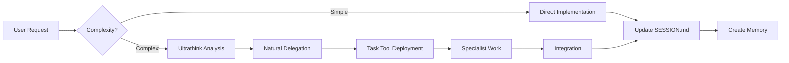

# Tool Configuration and Usage Guide

This document contains all MCP tool configurations, usage patterns, and the unified delegation-first workflow using the built-in Task tool.

## 🎯 Quick Navigation

- **[Core Tools Overview](#core-tools-overview)** - Essential tools for development
- **[Task Tool - Orchestration Foundation](#task-tool---orchestration-foundation)** - Built-in delegation
- **[MCP Integration Pattern](#mcp-integration-pattern)** - Standard tool usage
- **[Serena MCP Integration](#serena-mcp-integration)** - Semantic code analysis
- **[TaskMaster Integration](#taskmaster-integration)** - Project planning
- **[Tool Selection Guide](#tool-selection-guide)** - When to use what
- **[Anti-Patterns](#anti-patterns-to-avoid)** - What NOT to do

## Core Tools Overview

### Built-in Tools (Always Available)

```yaml
File Operations:
  - Read: View file contents
  - Write: Create new files
  - Edit/MultiEdit: Modify existing files
  - Bash: Execute commands
  - Grep/Glob: Search patterns
  - LS: List directories

Task Tool:
  - Purpose: Deploy specialists for complex work
  - Type: Built-in (NOT MCP)
  - Key Feature: Enables unified workflow
```

### MCP Tools (Project-Specific)

```yaml
Serena:
  - Purpose: Semantic code analysis
  - Strengths: Understanding relationships, intelligent refactoring
  - Project: Use full path to avoid errors

TaskMaster:
  - Purpose: Project planning and tracking
  - Strengths: Task dependencies, progress tracking
  - Integration: Syncs with TodoWrite/TodoRead

Context7:
  - Purpose: Latest documentation lookup
  - Usage: Single topics for best results
  - Example: "React hooks", not "React"
```

## Task Tool - Intelligent Sequential Processing

### What It Is

The **Task tool** is a built-in Claude capability (not MCP) that enables intelligent delegation to specialist agents. It processes TaskMaster subtasks sequentially with value-based deployment decisions.

### Core Philosophy

Process TaskMaster subtasks one at a time with intelligent specialist deployment based on value-add analysis, not keywords. Every task in TaskMaster has subtasks, making this approach natural and effective.

### How It Works

1. **Read Task Structure**
   - Get task from TaskMaster
   - Review all subtasks
   - Identify dependencies
   - Plan sequential approach

2. **Sequential Processing**
   For each subtask:
   - Quick ultrathink analysis (5-10 seconds)
   - Assess specialist value-add
   - Deploy if significant improvement expected
   - Complete before moving to next

3. **Intelligent Deployment Decision**
   ```yaml
   Subtask Analysis Process:
     Current: "7.2: Implement Header Component"
     
     Ultrathink considers:
       - Required expertise domains
       - Quality improvement with specialist
       - Time/value tradeoff
       - User patterns from past decisions
     
     Decision thresholds:
       >60% improvement → Auto-deploy specialist
       30-60% → Quick user suggestion
       <30% → Handle directly
   ```

4. **Context Package per Subtask**
   ```yaml
   Specialist Context:
     subtask_info:
       id: "7.2"
       title: "Implement Header Component"
       description: [Full description from TaskMaster]
     
     focus: "Foundation branding, navigation UX"
     files: ["/components/", "/styles/theme.ts"]  # Max 3 relevant files
     constraints: "15 minutes, use design system"
     shared_state:
       session: "Current SESSION.md section"
       previous_work: "7.1 completion notes"
       testing_required: true
   ```

### Real Example Flow

```markdown
User: "Work on task 7"

AI: "Task 7: Core Layout Components (7 subtasks)
    Starting with 7.1: Create Semantic HTML Structure
    
    [Ultrathink: Basic HTML foundation, no specialist needed]
    Implementing semantic structure..."
    
    "Basic structure complete. Since this is foundational HTML,
    no testing checkpoint needed. Moving to next subtask."

AI: "Moving to 7.2: Implement Header Component
    
    [Ultrathink: Visual design, branding, UX patterns
     Specialist value-add: ~70% improvement]
    This involves design decisions. Deploying UI specialist..."
    
    [UI Specialist works with focused context]
    
    "📋 Ready for Your Testing:
    - Files: /components/Header.tsx, /styles/header.module.css
    - Run: pnpm dev
    - Test: Navigation, mobile menu, theme toggle"
    
    [Awaits user testing...]

AI: "Next: 7.5: Implement Accessibility Landmarks
    
    [Ultrathink: ARIA, keyboard nav, screen readers
     Specialist value-add: ~80% improvement]
    Critical for accessibility. Deploying A11y specialist..."
    
    [A11y Specialist implements]
    
    "📋 Ready for Your Testing:
    - Test with screen reader (NVDA/JAWS)
    - Check landmark navigation
    - Verify focus management"
```

### Progressive Learning System

The AI tracks and learns:
```yaml
Pattern Database:
  "Header Component" + UI Specialist: 
    outcomes: [excellent, excellent, good]
    avg_time: 12 minutes
    value_delivered: high
    
  "Basic HTML Structure" + Solo:
    outcomes: [good, good, excellent]
    avg_time: 8 minutes
    value_delivered: appropriate
    
Future Decision:
  Similar component → Likely deploy UI specialist
```

### User Testing Integration

The Task tool recognizes that the user performs all testing. Each specialist deployment includes testing checkpoints:

```yaml
Specialist Deployment with Testing:
  1. Deploy: UI specialist for Header Component
  2. Work: Specialist implements (10-15 min)
  3. Checkpoint: Create testing instructions
  4. Pause: Wait for user testing
  5. Iterate: Fix issues based on feedback
  6. Complete: Move to next subtask
```

#### Testing Checkpoint Creation

When a specialist completes implementation:
1. Specialist finishes the subtask work
2. AI reviews what was implemented
3. AI creates testing checkpoint with:
   - List of modified files
   - Specific test instructions
   - Known concerns or edge cases
   - Clear success criteria
4. Workflow pauses for user testing
5. User provides feedback
6. AI fixes issues or continues

#### Real Testing Flow Example

```markdown
AI: "The UI specialist has completed the Header Component.

✅ Implemented: 7.2 Header Component

📋 Ready for Your Testing:
- Files: /components/Header.tsx (new), /styles/theme.ts (modified)
- Run: pnpm dev
- Test focus: Responsive behavior, theme switching
- Specialist notes: 'Used CSS Grid for flexibility'

The specialist has returned. I'll wait for your test results before continuing."

User: "The desktop version is perfect but mobile menu doesn't close on route change"

AI: "Understood. Let me fix that issue before we continue to the next subtask..."
[Fixes issue]
"Ready for re-test. Same files updated."
```

### Future Parallel Support

While processing sequentially now, the system tracks:
```yaml
Parallel Opportunity Detected:
  Task: 7
  Independent Subtasks: [7.2, 7.3, 7.4, 7.6]
  Reason: "No interdependencies found"
  Potential Time Saved: ~30 minutes
  Confidence: 85%
  
This data informs future system evolution.
```

## MCP Integration Pattern

### Standard Usage Flow

```bash
# 1. Check available tools for task
TaskMaster for planning
Serena for code analysis
Context7 for documentation

# 2. Use tools in logical order
Context7 → Research best practices
Serena → Analyze current code
TaskMaster → Plan implementation
Task → Deploy specialists if needed

# 3. Track everything
TodoWrite → Task breakdown
SESSION.md → Progress updates
```

### Tool Combination Examples

#### Research + Implementation
```
1. Context7: "Next.js app router"
2. Serena: Find current routing setup
3. Task: Deploy research + implementation agents
4. TodoWrite: Track all subtasks
```

#### Code Review Pattern
```
1. Serena: Find all auth-related code
2. Task: Deploy security specialist
3. SESSION.md: Document findings
4. MultiEdit: Apply fixes
```

## Serena MCP Integration

### Initial Serena Activation (First Time)

```bash
# Read instructions first
mcp__serena__initial_instructions

# Then activate with FULL PATH
mcp__serena__activate_project --project="/home/loucmane/dev/javascript/MomsBlog/blog"

# Perform onboarding
mcp__serena__onboarding
```

**Note**: The project name in Serena is "blog", not "MomsBlog". Always use the full path.

### Standard Session Starters with Serena

#### 1. **New Development Session** (Most Common)
```
Activate project /home/loucmane/dev/javascript/MomsBlog/blog, read all memories, and check SESSION.md for previous work.
Today I'm working on [specific task/feature].
```

#### 2. **Continuing Previous Work**
```
Activate project /home/loucmane/dev/javascript/MomsBlog/blog, read the most recent session memory and SESSION.md.
Let's continue where we left off.
```

#### 3. **TaskMaster Integration**
```
Activate project /home/loucmane/dev/javascript/MomsBlog/blog and read all memories.
Check TaskMaster for current task status, then help me work on task [ID].
```

### Serena Tools for This Project

#### Semantic Code Analysis
```bash
# Find components using theme
mcp__serena__find_symbol --name_path="theme" --substring_matching=true

# Show package relationships
mcp__serena__get_symbols_overview --relative_path="packages"

# Find type usage across packages
mcp__serena__search_for_pattern --substring_pattern="Animal.*type"
```

#### Intelligent Refactoring
```bash
# Update component to standards
mcp__serena__replace_symbol_body --name_path="Button" --relative_path="components/Button.tsx"

# Fix import order
mcp__serena__find_symbol --name_path="import" --include_kinds=[15]
```

### Serena Memory Management

#### Create Session Memory
```bash
# Format: session_YYYY-MM-DD_description
mcp__serena__write_memory \
  --memory_name="session_$(date +%Y-%m-%d)_unified_workflow_design" \
  --content="[session details]"
```

#### List and Read Memories
```bash
# See all memories
mcp__serena__list_memories

# Read specific memory
mcp__serena__read_memory --memory_file_name="session_2025-01-06_orchestration.md"
```

## TaskMaster Integration

### Checking Task Status

```bash
# ALWAYS run get_tasks first
mcp__taskmaster-ai__get_tasks --projectRoot="/home/loucmane/dev/javascript/MomsBlog/blog"

# Then get specific task details
mcp__taskmaster-ai__get_task --id="7" --projectRoot="/home/loucmane/dev/javascript/MomsBlog/blog"
```

### Updating Task Progress

```bash
# Mark task complete
mcp__taskmaster-ai__set_task_status \
  --id="7" \
  --status="done" \
  --projectRoot="/home/loucmane/dev/javascript/MomsBlog/blog"

# Update task with new info
mcp__taskmaster-ai__update_task \
  --id="7" \
  --prompt="Added authentication with OAuth2" \
  --projectRoot="/home/loucmane/dev/javascript/MomsBlog/blog"
```

### Creating New Tasks

```bash
# Add task with AI
mcp__taskmaster-ai__add_task \
  --prompt="Add search functionality with performance optimization" \
  --projectRoot="/home/loucmane/dev/javascript/MomsBlog/blog"

# Expand task to subtasks
mcp__taskmaster-ai__expand_task \
  --id="8" \
  --num="5" \
  --projectRoot="/home/loucmane/dev/javascript/MomsBlog/blog"
```

## Tool Selection Guide

### When to Use Which Tool

**For Code Navigation & Understanding**:
- **Quick file search** → Glob/Grep tools
- **Find specific symbol (class/function)** → Serena `find_symbol`
- **See file structure** → Serena `get_symbols_overview`
- **Find who uses a function** → Serena `find_referencing_symbols`
- **Search code patterns** → Serena `search_for_pattern`

**For Code Editing**:
- **Replace entire function/class** → Serena `replace_symbol_body`
- **Add new function/import** → Serena `insert_before/after_symbol`
- **Small edits within functions** → Serena `replace_regex` (with wildcards!)
- **Multiple edits in one file** → MultiEdit tool
- **Complex refactoring** → Agent tool

**For Project Memory**:
- **Save session knowledge** → Serena `write_memory`
- **Check what we know** → Serena `list_memories` + `read_memory`
- **Project onboarding** → Serena `onboarding`
- **Think about progress** → Serena thinking tools

**For Analysis & Planning**:
- **Code review** → Zen `codereview`
- **Debug issues** → Zen `debug`
- **Architecture decisions** → Zen `thinkdeep`
- **Task breakdown** → TodoWrite + TaskMaster

**Serena's Superpowers**:
- **Semantic understanding** - Knows code structure, not just text
- **Smart refactoring** - Updates all references automatically
- **Minimal reading** - Only reads what's needed, not entire files
- **Project memory** - Remembers important context between sessions
- **Intelligent regex** - Uses wildcards for efficient replacements

### Intelligent Decision Framework

When working on TaskMaster tasks, the AI uses intelligent analysis rather than keyword matching:

| Subtask Type | Analysis Focus | Typical Specialist Value-Add |
|--------------|----------------|------------------------------|
| UI Components | Design patterns, UX, branding | 60-80% improvement |
| Security Features | Vulnerabilities, best practices | 80-90% improvement |
| Performance Work | Optimization, profiling | 50-70% improvement |
| Accessibility | ARIA, keyboard nav, standards | 70-85% improvement |
| Basic Config | Setup, boilerplate | 10-20% improvement |
| Research Tasks | Unknown tech, evaluation | 60-75% improvement |

### Sequential Processing Examples

For non-TaskMaster work:

| User Says | AI Response | Tool Flow |
|-----------|-------------|-----------|
| "Fix auth bug" | Analyzes impact → deploys security specialist if critical | Read → Ultrathink → Task (if needed) → Edit |
| "Work on task 7" | Gets subtasks → processes sequentially | TaskMaster → Sequential subtask processing |
| "Add search feature" | Breaks down → assesses each part | TodoWrite → Context7 → Implementation |
| "Optimize images" | Evaluates scope → specialist for complex cases | Serena → Task (if performance critical) |

### Natural Language Understanding

The AI understands implicit needs:

When you say... | AI understands... | Likely action
---|---|---
"Make it look good" | UI/UX expertise needed | Deploy UI specialist
"Make it fast" | Performance optimization | Deploy performance specialist  
"Make it secure" | Security review critical | Deploy security specialist
"Make it accessible" | A11y compliance needed | Deploy accessibility specialist
"Just a quick fix" | Simple change | Handle directly

## Tool Usage Best Practices

### Always Explain Complex Tool Usage

Before using Task or complex MCP tools:
```
"I'd like to use the Task tool to deploy specialists. They will:
- Research best OAuth libraries (10 min)
- Implement chosen solution (15 min)
- Review security implications (10 min)
Is that okay?"
```

### Context Optimization

```yaml
Good Context Package:
  files: ["/lib/auth.ts", "/api/oauth/*"]  # 2-3 files max
  focus: "Token storage and CSRF"          # Specific area
  constraints: "15 minutes, use Auth0"     # Clear bounds
  shared_docs: ["SESSION.md", "auth-tracker.md"]

Bad Context Package:
  files: ["/**/*.ts"]                      # Too broad
  focus: "Fix authentication"              # Too vague
  constraints: "Make it work"              # No bounds
```

### Progress Visibility

Always maintain visibility through:
1. **TodoWrite** - Before starting any work
2. **SESSION.md** - Real-time progress updates
3. **Emoji indicators** - Quick status at a glance
4. **Time tracking** - Respect 30-minute limits

## Anti-Patterns to Avoid

### ❌ Parallel Overwhelm
```
Wrong: Deploying 5 specialists simultaneously for subtasks
Right: Processing subtasks sequentially with focused attention
```

### ❌ Keyword-Only Decisions
```
Wrong: "I see 'auth' so deploying security specialist"
Right: "This auth work involves [analysis], specialist would improve quality by 70%"
```

### ❌ Context Overload
```
Wrong: Giving specialist entire codebase
Right: Giving specialist 3 relevant files for current subtask
```

### ❌ Skipping Subtasks
```
Wrong: Jumping to interesting subtasks out of order
Right: Sequential processing respects dependencies
```

### ❌ Value Ignorance
```
Wrong: Deploying specialist for 10% improvement
Right: Handling directly when value-add is minimal
```

### ❌ Learning Waste
```
Wrong: Not tracking what worked/didn't work
Right: Building pattern database for future decisions
```

## Troubleshooting

### Serena Activation Issues
```bash
# If "project not found"
- Use full absolute path
- Check .serena/ exists
- Try deactivating and reactivating

# If "no memories found"
- Normal for new projects
- Create first memory after work
```

### Task Tool Not Working
```bash
# Task tool is built-in, so if issues:
- Check you're in Claude interface
- Ensure prompt is clear
- Break down complex requests
```

### TaskMaster Connection
```bash
# If "project not initialized"
mcp__taskmaster-ai__initialize_project \
  --projectRoot="/home/loucmane/dev/javascript/MomsBlog/blog"
```

## Tool Harmony

The best development flow uses tools in harmony:



Remember: Tools serve the workflow, not the other way around. The unified approach means all tools work together toward the same goal, tracked in the same places, creating a seamless development experience.

## 📚 See Also

- **[WORKFLOWS.md](WORKFLOWS.md)** - Complete development workflows
- **[CONVENTIONS.md](CONVENTIONS.md)** - Code and communication standards
- **[CLAUDE-NEW.md](CLAUDE-NEW.md)** - Quick navigation hub
- **[PROJECT-BLOG.md](PROJECT-BLOG.md)** - Project-specific configurations
- **[BUILDING-BETTER.md](BUILDING-BETTER.md)** - Meta-process documentation

---

The magic isn't in the tools - it's in how they work together. One workflow, many specialists, unified success.