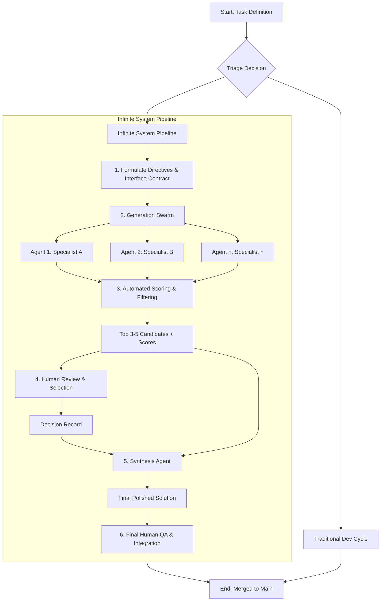
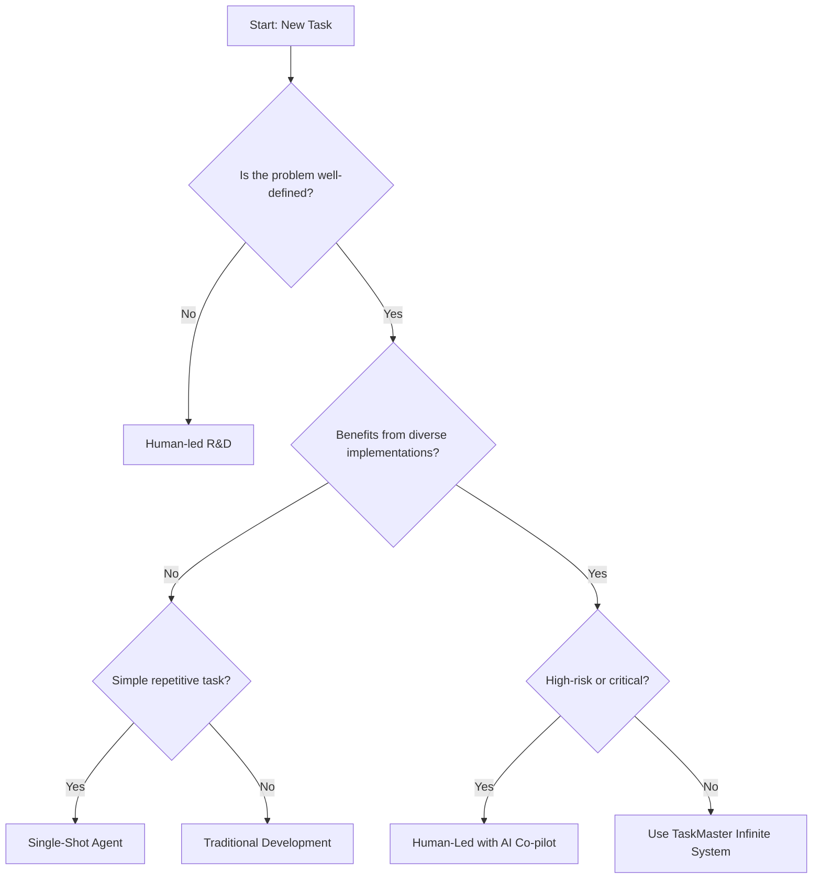

# TaskMaster Infinite System: Parallel Implementation Exploration

## Overview

The TaskMaster Infinite System leverages the `infinite.md` command to generate multiple high-quality implementation approaches for each TaskMaster task in parallel. This system transforms task implementation from a single-path approach to a comprehensive exploration of architectural possibilities.

## Core Concept

Instead of implementing a task once and hoping for the best approach, we:
1. Generate 3-10 parallel implementations using different architectural patterns
2. Automatically score and filter them
3. Have human reviewers select the best elements
4. Use a Synthesis Agent to combine the best parts into a superior final solution

## The Solution Foundry Pipeline



## When to Use the Infinite System

### Triage Decision Tree



### Ideal Use Cases
- **Component Libraries**: Exploring different API designs and patterns
- **Algorithm Implementation**: Comparing performance vs readability trade-offs
- **Architecture Decisions**: Evaluating different structural approaches
- **Creative UI/UX**: Discovering innovative interaction patterns

### Not Suitable For
- Emergency bug fixes
- Simple CRUD operations
- Highly regulated code with strict compliance requirements
- Deep legacy system modifications

## Task Categorization

| Task Type | Iterations | Example |
|-----------|------------|---------|
| Simple | 1-3 | Basic utility functions |
| Complex | 3-5 | Layout components, state management |
| Research | 5-10 | New architectural patterns |
| Creative | Infinite | Revolutionary UI concepts |

## Creating Task Specifications

### Template Structure

```markdown
# TaskMaster Task [ID]: [Title] - Implementation Exploration Spec

## Task Context
**Original Requirement**: [What the task asks for]
**Success Criteria**: [Measurable outcomes]
**Dependencies**: [What this relies on]
**Constraints**: [Technical or business limitations]

## Implementation Dimensions
Choose 3-5 orthogonal approaches to explore:

### Architecture Patterns
- [ ] Component composition (compound components)
- [ ] Render props pattern
- [ ] Higher-order components
- [ ] Hooks-based architecture
- [ ] State machines
- [ ] Event-driven architecture

### Technology Choices
- [ ] CSS-in-JS vs CSS modules vs Tailwind
- [ ] Client-side vs Server-side rendering
- [ ] REST vs GraphQL vs tRPC
- [ ] Different state management solutions

### Performance Strategies
- [ ] Code splitting approaches
- [ ] Memoization strategies
- [ ] Bundle size optimization
- [ ] Runtime performance vs DX

## TWES Context Loading (MANDATORY)
```yaml
required_docs:
  - /docs/ai/shared-context/themes/four-themes.md
  - /docs/ai/shared-context/standards/performance.md
  - /docs/ai/shared-context/standards/accessibility.md
  - /docs/ai/shared-context/patterns/common-patterns.md
```

## Quality Requirements
- Each iteration must be production-ready
- Full TypeScript support with proper types
- Comprehensive error handling
- Performance benchmarks included
- Accessibility WCAG 2.1 AA compliant

## Interface Contract
[See Enhanced Interface Contract section below]

## Innovation Directives
Provide specific, user-centric directives for each agent...
```

## Enhanced Interface Contract

The Interface Contract ensures consistency across all parallel implementations. It covers four dimensions:

### 1. Functional Contract (API)
```yaml
functional:
  ComponentName:
    props:
      - name: "propName"
        type: "string | number"
        required: true
        description: "What this prop does"
    methods:
      - name: "methodName"
        params: ["param1: string", "param2?: number"]
        returns: "Promise<void>"
```

### 2. Behavioral Contract (User Interactions)
```yaml
behavioral:
  - description: "All interactive elements must be keyboard accessible"
    testCase: "User can navigate using Tab/Shift+Tab"
  - description: "Loading states must be indicated within 100ms"
    testCase: "Spinner appears after 100ms of API call"
```

### 3. Visual Contract (Design System)
```yaml
visual:
  - description: "Must use only theme CSS variables for colors"
    enforcement: "No hex codes or rgb() values allowed"
  - description: "Minimum touch target of 44px"
    enforcement: "All interactive elements >= 44x44px"
```

### 4. Accessibility Contract
```yaml
accessibility:
  - description: "Proper ARIA labels for all interactive elements"
    enforcement: "Automated axe-core testing"
  - description: "Focus indicators visible and high contrast"
    enforcement: "4.5:1 contrast ratio minimum"
```

## Innovation Directives

### Shift from Abstract to User-Centric

❌ **Bad**: "Create a form component using innovative patterns"

✅ **Good**: 
```
Directive for Agent 'form-accessibility-expert':
"You are building a form component for users with motor impairments 
who struggle with precise mouse movements. Your innovation should 
focus on making form interactions more forgiving and accessible. 
Consider larger click targets, intelligent field grouping, and 
error prevention rather than error correction. The form should 
feel assistive without being patronizing."
```

### Example Agent Specializations

1. **Performance Specialist**: "Optimize for mobile devices on 3G connections"
2. **Accessibility Champion**: "Ensure screen reader users have a delightful experience"
3. **DX Expert**: "Make the API so intuitive that docs are barely needed"
4. **Maintenance Master**: "Optimize for long-term maintainability and debugging"
5. **Innovation Explorer**: "Push boundaries while maintaining usability"

## Running the Infinite Command

### Basic Usage
```bash
cd /path/to/project
infinite specs/task-7-layout.md output/task-7 5
```

### With Innovation Level
```bash
infinite specs/task-7-layout.md output/task-7 5 --innovation=adventurous
```

### Innovation Levels
- `conservative`: Proven patterns, minimal risk
- `standard`: Balance of established and modern approaches
- `adventurous`: Explore emerging patterns
- `experimental`: Push boundaries (use with caution)

## Automated Scoring

Each implementation is automatically scored on:

| Metric | Weight | How It's Measured |
|--------|--------|-------------------|
| Performance | 25% | Lighthouse scores, bundle size |
| Accessibility | 25% | Axe-core results, keyboard nav |
| Code Quality | 20% | Complexity, test coverage |
| Compliance | 20% | Interface contract adherence |
| Innovation | 10% | Uniqueness vs other iterations |

## Decision Record Template

After automated scoring, human reviewers use this template:

```markdown
# Decision Record: [Task ID/Name]

**Reviewer**: [Name]
**Date**: [YYYY-MM-DD]
**Task Goal**: [One-sentence summary]

## Selected Candidates for Synthesis

| Candidate | Key Strengths | Selection Rationale |
|-----------|---------------|---------------------|
| agent-02-api | Superior API design, intuitive props | Best DX |
| agent-03-a11y | Robust accessibility, ARIA implementation | Most inclusive |
| agent-01-perf | Smallest bundle, fastest runtime | Best performance |

## Synthesis Directives

1. **Base Structure**: Use file organization from `agent-02-api`
2. **API Surface**: Implement props interface from `agent-02-api`
3. **Core Logic**: Use performance optimizations from `agent-01-perf`
4. **Accessibility**: Integrate all a11y features from `agent-03-a11y`
5. **Documentation**: Combine best examples from all three

## Rejected Concepts & Learnings

- `agent-04-complex`: Over-engineered, violated simplicity principle
- `agent-05-experimental`: Interesting but too risky for production
```

## The Synthesis Agent

The Synthesis Agent combines the best parts based on the Decision Record:

### Synthesis Prompt Template
```
You are the Synthesis Agent. Your task is to create a single, 
production-ready implementation by combining the best elements 
from the selected candidates according to the Decision Record.

Inputs:
1. decision_record.md - Human's specific instructions
2. interface_contract.yaml - Requirements to meet
3. Source code from selected agents

Execute the synthesis directives precisely. Resolve conflicts, 
refactor for consistency, and ensure 100% contract compliance.
```

## Example: Task 7 (Layout Components)

### 1. Triage Decision
- Well-defined? ✅ (Clear interface contract)
- Benefits from exploration? ✅ (Many valid approaches)
- High-risk? ❌ (UI components, not critical path)
- **Decision**: Use Infinite System

### 2. Agent Directives
```yaml
agents:
  - id: "pragmatist"
    directive: "Focus on performance and tree-shaking. Simple, efficient code."
  - id: "api-designer"
    directive: "Create the most intuitive DX. Self-documenting props."
  - id: "a11y-champion"
    directive: "Perfect accessibility. All ARIA roles and keyboard nav."
  - id: "innovator"
    directive: "Explore container queries and new CSS features."
  - id: "maintainer"
    directive: "Optimize for debugging and long-term maintenance."
```

### 3. Automated Scoring Results

| Agent | Perf | A11y | Quality | Compliance | Innovation | Total |
|-------|------|------|---------|------------|------------|-------|
| pragmatist | 98 | 75 | 85 | 95 | 20 | 82.4 |
| api-designer | 80 | 85 | 95 | 90 | 60 | 84.0 |
| a11y-champion | 85 | 100 | 90 | 100 | 40 | 88.0 |
| innovator | 70 | 80 | 80 | 85 | 95 | 79.5 |
| maintainer | 90 | 85 | 100 | 95 | 30 | 85.5 |

### 4. Human Decision
Top 3 candidates: a11y-champion, maintainer, api-designer
- Use a11y-champion's accessibility features
- Use api-designer's prop interface
- Use maintainer's code organization

### 5. Synthesized Output
```tsx
// Clean file structure from maintainer
// Intuitive API from api-designer  
// Perfect accessibility from a11y-champion

export const Stack = React.forwardRef<HTMLDivElement, StackProps>(
  ({ children, gap, direction = 'vertical', align, justify, role, ...props }, ref) => {
    // Maintainer's debug-friendly variable names
    const stackDirection = direction === 'vertical' ? 'column' : 'row';
    const gapValue = `var(--spacing-${gap})`;
    
    // API designer's intuitive prop mapping
    const className = cn(
      'flex',
      `flex-${stackDirection}`,
      `gap-${gap}`,
      align && `items-${align}`,
      justify && `justify-${justify}`
    );
    
    // A11y champion's comprehensive accessibility
    return (
      <div
        ref={ref}
        className={className}
        role={role}
        aria-orientation={direction}
        {...props}
      >
        {children}
      </div>
    );
  }
);

Stack.displayName = 'Stack'; // Maintainer's debugging enhancement
```

## Best Practices

### Do's
- ✅ Create clear, measurable interface contracts
- ✅ Provide specific, user-centric innovation directives
- ✅ Use automated scoring to filter before human review
- ✅ Document learnings in the pattern library
- ✅ Treat the Synthesis Agent as a skilled team member

### Don'ts
- ❌ Use for emergency fixes or time-critical tasks
- ❌ Generate more than 10 iterations (diminishing returns)
- ❌ Skip the triage decision tree
- ❌ Ignore the automated scoring results
- ❌ Synthesize without a clear Decision Record

## Integration with TWES

The TaskMaster Infinite System is fully integrated with TWES:

1. **Mandatory Context Loading**: Every spec must load relevant TWES docs
2. **Pattern Compliance**: All implementations checked against established patterns
3. **Theme Adherence**: Visual contracts enforce theme system usage
4. **Performance Standards**: Automated scoring includes TWES performance metrics
5. **Documentation Standards**: Rationale.md follows TWES documentation patterns

## Measuring Success

Track these metrics to evaluate the system's effectiveness:

1. **Time to Decision**: How long from task start to synthesis?
2. **Implementation Quality**: Post-deployment bug rate
3. **Pattern Discovery**: New patterns added to library
4. **Developer Satisfaction**: Team feedback on final solutions
5. **Reuse Rate**: How often are discovered patterns reused?

## Future Enhancements

1. **Learning System**: Feed successful patterns back into directive generation
2. **Visual Regression Testing**: Automated screenshot comparison
3. **Performance Benchmarking**: Automated runtime performance tests
4. **Pattern Recognition**: AI identifies common successful patterns
5. **Automatic Synthesis**: For simple cases, skip human review

## Conclusion

The TaskMaster Infinite System transforms how we approach implementation by:
- Exploring the solution space systematically
- Combining the best of human judgment and AI generation
- Building a library of proven patterns
- Ensuring consistency while encouraging innovation

Used wisely, it produces superior solutions while building organizational knowledge.