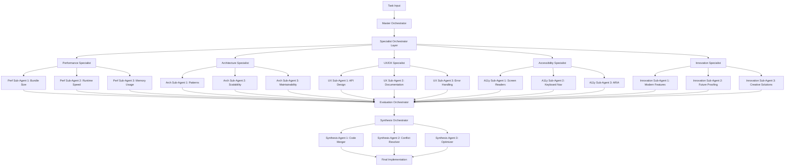

# TaskMaster Infinite Orchestrated System

An advanced multi-agent orchestration system for exploring and synthesizing optimal task implementations.

## System Architecture



## Agent Hierarchy and Responsibilities

### Level 1: Master Orchestrator
**Role**: Strategic planning and resource allocation

```yaml
Master_Orchestrator:
  responsibilities:
    - Analyze task complexity
    - Determine specialist allocation
    - Set quality thresholds
    - Monitor overall progress
    - Coordinate between specialist layers
  
  decisions:
    - How many specialists to activate
    - Time/resource allocation per specialist
    - Evaluation criteria weights
    - Final approval of synthesis
```

### Level 2: Specialist Orchestrators
Each specialist manages a domain of expertise:

#### Performance Specialist Orchestrator
```yaml
Performance_Specialist:
  focus: "Optimizing for speed, size, and efficiency"
  
  sub_agents:
    bundle_optimizer:
      directive: "Minimize bundle size through code splitting, tree shaking"
      deliverable: "Optimized build configuration and component structure"
    
    runtime_optimizer:
      directive: "Maximize runtime performance, minimize re-renders"
      deliverable: "Performance-optimized implementation"
    
    memory_optimizer:
      directive: "Minimize memory footprint and prevent leaks"
      deliverable: "Memory-efficient patterns and cleanup strategies"
```

#### Architecture Specialist Orchestrator
```yaml
Architecture_Specialist:
  focus: "Creating scalable, maintainable structures"
  
  sub_agents:
    pattern_architect:
      directive: "Apply best-fit architectural patterns"
      deliverable: "Pattern-based implementation"
    
    scalability_engineer:
      directive: "Design for growth and extension"
      deliverable: "Scalable component architecture"
    
    maintainability_expert:
      directive: "Optimize for long-term maintenance"
      deliverable: "Self-documenting, modular code"
```

#### UX/DX Specialist Orchestrator
```yaml
UX_DX_Specialist:
  focus: "Developer and user experience excellence"
  
  sub_agents:
    api_designer:
      directive: "Create intuitive, self-explanatory APIs"
      deliverable: "Elegant component interface"
    
    documentation_writer:
      directive: "Generate comprehensive, example-rich docs"
      deliverable: "Complete documentation package"
    
    error_experience:
      directive: "Design helpful error handling and recovery"
      deliverable: "Robust error management system"
```

#### Accessibility Specialist Orchestrator
```yaml
Accessibility_Specialist:
  focus: "Universal access and WCAG compliance"
  
  sub_agents:
    screen_reader_expert:
      directive: "Optimize for screen reader experience"
      deliverable: "Screen reader-friendly implementation"
    
    keyboard_navigator:
      directive: "Perfect keyboard-only interaction"
      deliverable: "Complete keyboard navigation system"
    
    aria_specialist:
      directive: "Implement comprehensive ARIA support"
      deliverable: "Properly annotated accessible markup"
```

#### Innovation Specialist Orchestrator
```yaml
Innovation_Specialist:
  focus: "Exploring cutting-edge possibilities"
  
  sub_agents:
    modern_features:
      directive: "Leverage latest web platform features"
      deliverable: "Modern API implementation"
    
    future_proofer:
      directive: "Anticipate future needs and changes"
      deliverable: "Forward-compatible design"
    
    creative_solver:
      directive: "Find unconventional solutions"
      deliverable: "Novel approach to requirements"
```

### Level 3: Evaluation Orchestrator
**Role**: Comprehensive quality assessment

```yaml
Evaluation_Orchestrator:
  responsibilities:
    - Collect all sub-agent outputs
    - Run automated scoring
    - Identify conflicts and synergies
    - Rank solutions by criteria
    - Generate compatibility matrix
  
  evaluation_agents:
    compatibility_checker:
      task: "Verify all outputs can work together"
    
    conflict_identifier:
      task: "Find incompatible approaches"
    
    synergy_finder:
      task: "Identify complementary solutions"
    
    scorer:
      task: "Score each output against criteria"
```

### Level 4: Synthesis Orchestrator
**Role**: Intelligent combination of best solutions

```yaml
Synthesis_Orchestrator:
  responsibilities:
    - Plan optimal combination strategy
    - Resolve conflicts between approaches
    - Maintain coherent architecture
    - Optimize final output
  
  synthesis_agents:
    code_merger:
      task: "Combine code from multiple sources"
      approach: "AST-aware merging with conflict resolution"
    
    conflict_resolver:
      task: "Harmonize incompatible approaches"
      approach: "Find middle ground or choose best"
    
    optimizer:
      task: "Polish and optimize final code"
      approach: "Remove redundancy, improve performance"
```

## Execution Flow

### Phase 1: Task Analysis
```markdown
Master Orchestrator receives task and:
1. Analyzes complexity and requirements
2. Determines which specialists to activate
3. Allocates resources (iterations, time)
4. Sets success criteria
```

### Phase 2: Specialist Exploration
```markdown
Each Specialist Orchestrator:
1. Receives domain-specific requirements
2. Deploys 3-5 sub-agents with focused directives
3. Manages parallel exploration
4. Collects and validates outputs
5. Reports back to Master
```

### Phase 3: Comprehensive Evaluation
```markdown
Evaluation Orchestrator:
1. Receives all sub-agent outputs (~15-25 implementations)
2. Runs compatibility analysis
3. Scores against multiple criteria
4. Identifies best elements from each
5. Creates synthesis recommendation
```

### Phase 4: Intelligent Synthesis
```markdown
Synthesis Orchestrator:
1. Receives evaluation report
2. Plans combination strategy
3. Deploys synthesis agents
4. Produces final implementation
5. Validates against original requirements
```

## Communication Protocols

### Inter-Orchestrator Messages
```typescript
interface OrchestratorMessage {
  from: OrchestratorRole;
  to: OrchestratorRole;
  type: 'request' | 'response' | 'status' | 'result';
  payload: {
    taskId: string;
    content: any;
    metadata: {
      timestamp: Date;
      priority: 'high' | 'normal' | 'low';
      dependencies?: string[];
    };
  };
}
```

### Sub-Agent Directives
```typescript
interface SubAgentDirective {
  agentId: string;
  specialization: string;
  parentOrchestrator: string;
  
  directive: {
    primaryGoal: string;
    constraints: string[];
    outputFormat: OutputSpec;
    evaluationCriteria: Criteria[];
  };
  
  context: {
    taskSpec: TaskSpecification;
    interfaceContract: InterfaceContract;
    relatedWork: Implementation[];
  };
}
```

## Advantages Over Simple Parallel Generation

1. **Depth**: Each aspect gets deep, specialized exploration
2. **Coordination**: Orchestrators ensure compatibility
3. **Intelligence**: Multi-level evaluation and synthesis
4. **Scalability**: Can handle complex tasks with many dimensions
5. **Learning**: System improves through orchestrator communication

## Implementation Command

Create a new orchestrated command that manages this entire flow:

```bash
# New command structure
orchestrate-task \
  --task-id 7 \
  --specialists "performance,architecture,ux,accessibility,innovation" \
  --depth 3 \
  --synthesis-strategy "best-of-breed" \
  --output-dir .taskmaster/infinite/orchestrated/task-7
```

## Example: Task 7 with Orchestration

### Master Orchestrator Plan
```yaml
task_analysis:
  complexity: "medium-high"
  dimensions: ["performance", "api-design", "accessibility", "patterns"]
  
specialist_allocation:
  performance: 3 sub-agents
  architecture: 3 sub-agents
  ux_dx: 4 sub-agents  # Extra focus on API design
  accessibility: 3 sub-agents
  innovation: 2 sub-agents  # Less critical for layout components

success_criteria:
  bundle_size: "< 5KB"
  api_intuitiveness: "self-documenting"
  accessibility_score: "100"
  pattern_compliance: "follows established patterns"
```

### Sample Specialist Output
```typescript
// From Performance → Bundle Optimizer Sub-Agent
export const Stack = /*#__PURE__*/ forwardRef((props, ref) => {
  // Minimal runtime, maximum tree-shaking
  const { children, gap = 0, ...rest } = props;
  return h('div', {
    ref,
    style: { '--gap': gap },
    className: 'stack',
    ...rest
  }, children);
});

// From UX/DX → API Designer Sub-Agent  
export const Stack = forwardRef<HTMLDivElement, StackProps>(
  ({ children, gap, direction = 'vertical', align, justify, ...props }, ref) => {
    // Rich, intuitive API with great defaults
    return (
      <div ref={ref} className={stackStyles({ gap, direction, align, justify })} {...props}>
        {children}
      </div>
    );
  }
);
```

### Evaluation Report
```yaml
evaluation_summary:
  total_implementations: 15
  
  top_performers:
    bundle_size: "perf-bundle-optimizer"
    api_design: "ux-api-designer"
    accessibility: "a11y-aria-specialist"
    patterns: "arch-pattern-architect"
  
  conflicts_identified:
    - id: "api-vs-bundle"
      description: "Rich API increases bundle size"
      resolution: "Use build-time optimization"
  
  recommended_synthesis:
    base: "ux-api-designer"  # Best overall structure
    optimizations:
      - source: "perf-bundle-optimizer"
        elements: ["tree-shaking setup", "minimal runtime"]
      - source: "a11y-aria-specialist"
        elements: ["ARIA attributes", "keyboard handling"]
```

### Final Synthesized Result
The Synthesis Orchestrator produces a final implementation that combines:
- Intuitive API from UX specialist
- Bundle optimizations from Performance specialist
- Accessibility features from A11y specialist
- Clean patterns from Architecture specialist

## Next Steps

1. Build the orchestration command infrastructure
2. Define communication protocols between orchestrators
3. Create templates for each orchestrator role
4. Implement evaluation scoring system
5. Test with increasingly complex tasks

This orchestrated approach provides the depth and sophistication needed for complex tasks while maintaining the parallel exploration benefits of the original system.