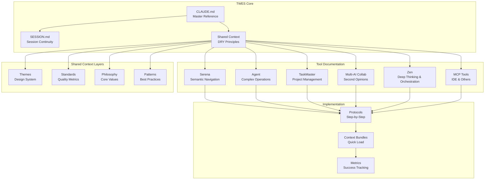

# Total Workflow Excellence System (TWES) - Visual Map

> 📋 **Navigation**: See [TWES Index](./TWES-INDEX.md) for complete table of contents with descriptions of all documents

## System Overview



## Quick Reference Matrix

| Tool | Best For | Not For | Key Commands |
|------|----------|---------|--------------|
| **Serena** | • Semantic code navigation<br>• Cross-package tracing<br>• Refactoring workflows | • File operations<br>• Non-code files<br>• Running commands | `find_symbol`, `find_referencing_symbols`, `replace_symbol_body` |
| **Agent** | • Complex documents<br>• Multi-step operations<br>• Research & synthesis | • Simple edits<br>• When you need control<br>• Quick searches | `Task` with detailed prompts |
| **TaskMaster** | • Project planning<br>• Task tracking<br>• Complexity analysis | • Simple todos<br>• Personal notes<br>• Non-dev tasks | `get_tasks`, `set_task_status`, `expand_task` |
| **Multi-AI Collab** | • Code review<br>• Architecture advice<br>• Creative solutions | • Primary development<br>• Simple questions<br>• Time-critical tasks | `ask_gemini`, `gemini_code_review` |
| **Zen** | • Deep thinking<br>• Multi-AI orchestration<br>• Code review & debugging | • Simple queries<br>• Quick fixes<br>• When speed matters | `thinkdeep`, `codereview`, `precommit` |
| **MCP Tools** | • IDE diagnostics<br>• Library docs<br>• Code execution | • File operations<br>• Project management<br>• Complex workflows | Various `mcp__*` commands |

## Context Inheritance Flow

```
shared-context/
    ├── themes/warm-minimalism.md ─────┐
    ├── standards/performance.md ───────┤
    ├── philosophies/development.md ────┼─── Inherited by ───→ tool-specific/
    ├── patterns/monorepo.md ───────────┤                          ├── for-serena/
    └── discovered-patterns/ 🔬 ────────┘                          ├── for-agent/
        ├── component-conventions.md                                ├── for-taskmaster/
        ├── performance-code-splitting.tsx                          ├── for-multi-ai-collab/
        └── add-blog-feature-guide.md                              ├── for-zen/
                                                                   └── for-mcp-tools/
```

## Success Criteria Dashboard

### 🎯 Target Metrics
- ⏱️ **Context Load**: <30 seconds
- ✅ **First-Attempt Success**: >90%
- 🔧 **Error Recovery**: <2 minutes  
- 🤖 **AI Tool Success**: >95%
- 👥 **New Dev Productivity**: <2 hours

### 📊 Current Status
- [ ] Phase 1: Foundation (In Progress)
- [ ] Phase 2: Core Systems
- [ ] Phase 3: Intelligence
- [ ] Phase 4: Optimization

## Quick Start Commands

```bash
# Check TWES documentation
ls docs/ai/

# View shared context
cat docs/ai/shared-context/README.md

# Run TaskMaster
mcp__taskmaster-ai__get_tasks --projectRoot $(pwd)

# Use Agent for complex operations (replaces Claude Code Bridge)
# See: docs/ai/for-agent/CLAUDE-BRIDGE-MIGRATION.md

# Get second opinion
mcp__multi-ai-collab__gemini_code_review --code "$(cat file.ts)"

# Test TWES effectiveness
cat docs/ai/twes-tests/workflows/quick-test-guide.md
```

## TWES Testing Framework

### 🧪 Test Your Documentation
```bash
# Quick test
cd docs/ai/twes-tests/
cat scenarios/task-04-shadcn-installation.md

# Run test with Gemini
mcp__multi-ai-collab__gemini_think_deep --topic "$(cat scenarios/[scenario].md)"

# Check results
ls results/
```

### 📊 Current Test Coverage
- **Basic Tasks**: 85% confidence ✅
- **Advanced Tasks**: Testing in progress 🔄
- **Edge Cases**: Pending ⏳

See `/docs/ai/twes-tests/` for full testing framework.

## Documentation Freshness

| Document | Last Updated | Status |
|----------|--------------|--------|
| CLAUDE.md | Today | 🟢 Current |
| Shared Context | Today | 🟢 Current |
| Tool Docs | Today | 🟢 Current |
| Protocols | Pending | 🟡 In Development |
| Metrics | Pending | 🟡 In Development |

## Feedback Loop

```
Error Occurs → Document Solution → Update Matrix → Prevent Recurrence
     ↑                                                      ↓
     ←────────────── Continuous Improvement ←──────────────
```

## Emergency Contacts

- **System Issues**: Check `/docs/troubleshooting/`
- **Task Questions**: Run `mcp__taskmaster-ai__get_task --id [ID]`
- **Design Questions**: See `/docs/ai/shared-context/themes/`
- **Performance Issues**: Review `/docs/ai/shared-context/standards/performance.md`