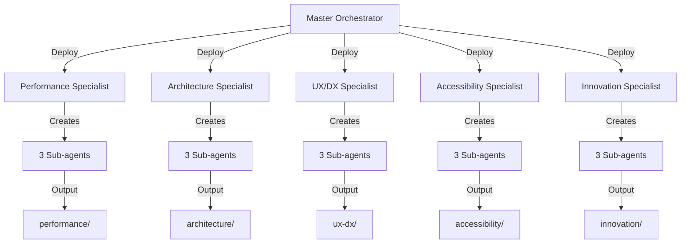

# Task 7 Specialist Orchestrator Deployment Plan

## Overview
- **Task ID**: 7
- **Title**: Build Core Layout Components
- **Master Orchestrator**: Deployed at 2025-06-25 14:14:07
- **Total Specialists**: 5 (all requested)
- **Sub-agents per Specialist**: 3
- **Execution Strategy**: Parallel deployment

## Contract Validation Summary

All 4 contracts have been validated and contain:

1. **Interface Contract** ✓
   - Header component API with sticky, logo, navItems props
   - Footer component API with sections, socialLinks, trustSignals
   - MainLayout wrapper API with headerProps, footerProps, aside support
   - TypeScript interfaces extending HTML attributes
   - forwardRef pattern requirement

2. **Behavior Contract** ✓
   - Responsive navigation with mobile Sheet component
   - Sticky header behavior with smooth transitions
   - Skip navigation for accessibility
   - Social links with proper security attributes
   - Semantic HTML landmark structure
   - Keyboard navigation requirements
   - 44px touch targets for mobile

3. **Integration Contract** ✓
   - File location: packages/web/src/components/layout/
   - Import order convention (React → External → Monorepo → Local → Types)
   - shadcn/ui Sheet component for mobile nav
   - ThemeSwitcher from @minniewinnie/ui
   - Testing setup with coverage requirements
   - Bundle monitoring and optimization

4. **Constraints Contract** ✓
   - 98+ Lighthouse scores requirement
   - Bundle size limits: Header 15KB, Footer 20KB, MainLayout 5KB
   - WCAG 2.1 AA compliance mandatory
   - 44px minimum touch targets
   - Four theme support (light, dark, contrast, gentle)
   - React.forwardRef pattern required
   - TypeScript strict mode

## Specialist Deployment Instructions

### 1. Performance Specialist Orchestrator
**Branch**: `feat/007-perf-implementation`
**Focus**: Optimize for 98+ Lighthouse scores and bundle size constraints

**Key Objectives**:
- Implement code splitting for non-critical components
- Optimize bundle sizes (total < 40KB)
- Ensure zero CLS (Cumulative Layout Shift)
- Implement lazy loading for Footer
- Use React.memo for static components
- Add performance monitoring hooks

**Sub-agent Distribution**:
1. Bundle Optimization Agent
2. Runtime Performance Agent  
3. Progressive Enhancement Agent

### 2. Architecture Specialist Orchestrator
**Branch**: `feat/007-arch-implementation`
**Focus**: Clean component structure and monorepo integration

**Key Objectives**:
- Implement proper file structure in packages/web/src/components/layout/
- Create barrel exports in index.ts
- Define TypeScript interfaces extending HTMLAttributes
- Ensure proper import order conventions
- Create shared types for navigation and footer
- Implement forwardRef pattern consistently

**Sub-agent Distribution**:
1. Component Structure Agent
2. Type System Agent
3. Integration Patterns Agent

### 3. UX/DX Specialist Orchestrator
**Branch**: `feat/007-ux-implementation`
**Focus**: Developer experience and user interaction patterns

**Key Objectives**:
- Implement intuitive component APIs
- Create comprehensive prop interfaces
- Ensure smooth animations and transitions
- Implement responsive breakpoints
- Create usage examples and patterns
- Optimize for developer productivity

**Sub-agent Distribution**:
1. API Design Agent
2. Animation & Interaction Agent
3. Developer Documentation Agent

### 4. Accessibility Specialist Orchestrator
**Branch**: `feat/007-a11y-implementation`
**Focus**: WCAG 2.1 AA compliance and inclusive design

**Key Objectives**:
- Implement skip navigation links
- Ensure 44px touch targets throughout
- Add proper ARIA landmarks and labels
- Implement keyboard navigation with focus management
- Test with screen readers
- Ensure 4.5:1 color contrast ratios

**Sub-agent Distribution**:
1. ARIA Implementation Agent
2. Keyboard Navigation Agent
3. Screen Reader Optimization Agent

### 5. Innovation Specialist Orchestrator
**Branch**: `feat/007-innovation-implementation`
**Focus**: Advanced features and progressive enhancement

**Key Objectives**:
- Implement four-theme system with smooth transitions
- Add motion preference detection
- Create advanced loading states
- Implement smart prefetching
- Add performance hints
- Create future-proof component patterns

**Sub-agent Distribution**:
1. Theme System Agent
2. Progressive Features Agent
3. Future Patterns Agent

## Deployment Sequence

## Communication Protocol

1. Each specialist will:
   - Create their own worktree branch
   - Log progress to orchestration.log
   - Update orchestration-state.json
   - Generate implementation in their output directory
   - Create summary report when complete

2. Master Orchestrator will:
   - Monitor progress via state file
   - Coordinate synthesis after all complete
   - Handle any conflicts or issues
   - Generate final consolidated implementation

## Success Criteria

Each specialist must deliver:
1. Complete implementation following all contracts
2. Test coverage meeting requirements (90%+)
3. Documentation and examples
4. Performance benchmarks
5. Accessibility audit results
6. Summary report with key decisions

## Risk Mitigation

- **Conflict Resolution**: If implementations conflict, prioritize accessibility > performance > UX
- **Bundle Size**: If over budget, performance specialist has override authority
- **Timeline**: 30 minute timeout per specialist, with progress checkpoints every 10 minutes
- **Failure Handling**: If a specialist fails, others continue; synthesis adapts to available implementations

## Next Steps

1. Deploy all 5 specialist orchestrators in parallel
2. Monitor progress via orchestration.log
3. Update state file as specialists report in
4. Begin synthesis phase once all complete
5. Generate final implementation combining best aspects