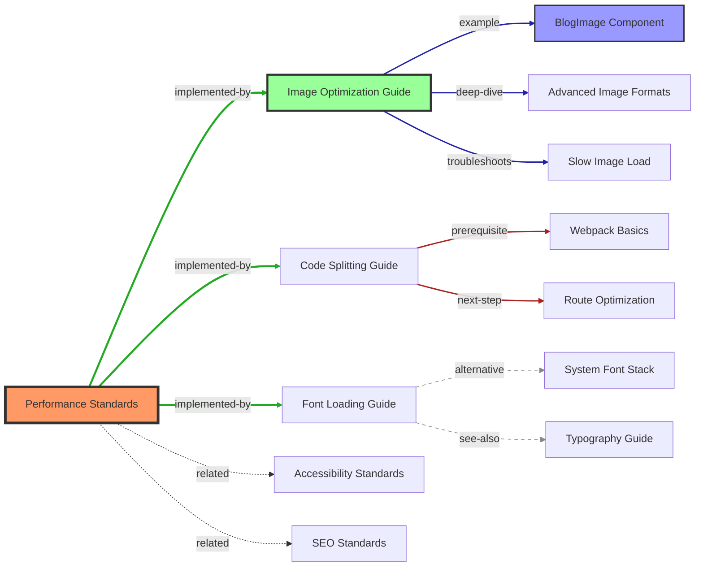

# Living Documentation Network Specification

## Core Challenge
Build an intelligent, self-maintaining network of documentation connections that evolves based on developer navigation patterns, strengthens useful paths, and ensures no documentation exists in isolation. The network should feel alive, anticipating developer needs and guiding them efficiently.

## Output Requirements

**Output Type**: File Set (multiple interconnected files)

**Directory Structure**:
```
/docs/network/v[iteration_number]/
├── network-map.md               # Main network visualization
├── visualizations/              # Network graphs and charts
│   ├── full-network.svg         # Complete documentation graph
│   ├── section-maps/            # Per-section networks
│   │   ├── ai-docs-network.svg
│   │   ├── dev-docs-network.svg
│   │   └── architecture-network.svg
│   └── journey-flows/           # Common navigation paths
│       ├── new-developer.svg
│       ├── bug-fixing.svg
│       └── feature-implementation.svg
├── analysis/                    # Network health data
│   ├── connection-strength.json # Link usage metrics
│   ├── orphan-documents.md     # Disconnected docs
│   ├── redundancy-report.md    # Duplicate content
│   └── navigation-metrics.json  # Path analytics
├── paths/                       # Optimized journeys
│   ├── quickstart-paths.md     # Fast-track guides
│   ├── learning-paths.md       # Educational sequences
│   └── troubleshooting-paths.md # Problem-solving routes
├── updates/                     # Network modifications
│   ├── new-connections.md      # Added links
│   ├── removed-connections.md  # Pruned links
│   ├── strengthened-paths.md   # Reinforced routes
│   └── changelog.md            # All changes summary
└── tests/                       # Navigation testing
    ├── path-validation.ts       # Journey tests
    ├── link-checker.ts          # Broken link detection
    └── user-scenarios.json      # Test scenarios
```

## File Set Templates

### 1. Main Network Map (`network-map.md`)
```markdown
# Documentation Network Map v[iteration]

## Network Overview
- **Total Documents**: [count]
- **Total Connections**: [count]
- **Network Health**: [score]/100
- **Orphan Rate**: [%]
- **Redundancy Index**: [score]
- **Evolution Stage**: [1-6]

## Quick Navigation
- 🗺️ [Visualizations](./visualizations/) - Network graphs
- 📊 [Analysis](./analysis/) - Health metrics
- 🛤️ [Paths](./paths/) - Optimized journeys
- 🔄 [Updates](./updates/) - Recent changes
- 🧪 [Tests](./tests/) - Validation tools

## Key Metrics
| Metric | Current | Target | Status |
|--------|---------|--------|---------|
| Avg Path Length | [hops] | ≤3 | [✅/❌] |
| Orphan Docs | [count] | 0 | [✅/❌] |
| Dead Links | [count] | 0 | [✅/❌] |
| Success Rate | [%] | >90% | [✅/❌] |

## Network Visualization


## Evolution Summary
[Key improvements in this iteration]
```

### 2. Visualization Files (`visualizations/`)

#### Network Graph Generator (`generate-network.ts`)
```typescript
/**
 * Generates network visualizations from documentation structure
 * @output SVG files showing document relationships
 */

interface NetworkNode {
  id: string;
  path: string;
  type: 'standard' | 'guide' | 'reference' | 'example';
  connections: Connection[];
}

interface Connection {
  to: string;
  type: SemanticLinkType;
  strength: number; // 0-100 based on usage
  context?: string; // Optional contextual description
  bidirectional?: boolean; // True if relationship goes both ways
}

enum SemanticLinkType {
  // Hierarchical relationships
  PARENT = "parent",              // Contains/owns this document
  CHILD = "child",                // Is contained by parent
  
  // Sequential relationships
  PREREQUISITE = "prerequisite",  // [[prerequisite: setup.md]]
  NEXT_STEP = "next-step",        // [[next: deployment.md]]
  PREVIOUS_STEP = "previous-step", // [[previous: testing.md]]
  
  // Implementation relationships
  IMPLEMENTS = "implements",      // [[implements: standard-xyz.md]]
  IMPLEMENTED_BY = "implemented-by", // [[implemented-by: blog-component.md]]
  
  // Reference relationships
  SEE_ALSO = "see-also",         // [[see_also: performance.md]]
  DEEP_DIVE = "deep-dive",       // [[deep_dive: implementation-details.md]]
  EXAMPLE = "example",           // [[example: blog-post-card.tsx]]
  
  // Comparison relationships
  ALTERNATIVE = "alternative",    // [[alternative: other-approach.md]]
  SUPERSEDES = "supersedes",     // [[supersedes: old-guide.md]]
  SUPERSEDED_BY = "superseded-by", // [[superseded-by: new-guide.md]]
  
  // Problem-solving relationships
  TROUBLESHOOTS = "troubleshoots", // [[troubleshoots: common-errors.md]]
  SOLVES = "solves",             // [[solves: performance-issue.md]]
  CAUSED_BY = "caused-by",       // [[caused-by: configuration.md]]
  
  // Conceptual relationships
  EXPLAINS = "explains",         // [[explains: concept.md]]
  EXPLAINED_BY = "explained-by", // [[explained-by: theory.md]]
  RELATED = "related",           // [[related: similar-topic.md]]
}

export function generateNetworkVisualization(
  nodes: NetworkNode[]
): string {
  // Returns SVG markup for network graph
  // Nodes sized by importance
  // Connections styled by semantic type:
  //   - Solid lines: prerequisite, next-step
  //   - Dashed lines: see-also, related
  //   - Thick lines: implements, implemented-by
  //   - Dotted lines: supersedes, alternative
  //   - Arrow styles indicate directionality
  // Colors by document type
  // Labels show link context on hover
}
```

### 3. Analysis Files (`analysis/`)

#### Connection Strength (`connection-strength.json`)
```json
{
  "timestamp": "2024-01-15T10:00:00Z",
  "connections": [
    {
      "from": "/docs/standards/performance.md",
      "to": "/docs/guides/image-optimization.md",
      "type": "implemented-by",
      "strength": 95,
      "context": "Image optimization guide shows how to achieve 98+ Lighthouse scores",
      "bidirectional": true,
      "usage": {
        "clicksPerMonth": 1234,
        "uniqueUsers": 567,
        "successRate": 0.89
      }
    },
    {
      "from": "/docs/guides/quick-start.md",
      "to": "/docs/setup/environment.md",
      "type": "next-step",
      "strength": 87,
      "context": "After quick start, set up your development environment",
      "usage": {
        "clicksPerMonth": 892,
        "uniqueUsers": 445,
        "successRate": 0.92
      }
    },
    {
      "from": "/docs/troubleshooting/slow-builds.md",
      "to": "/docs/guides/performance-optimization.md",
      "type": "solves",
      "strength": 73,
      "context": "Performance optimization guide provides solutions for slow builds",
      "usage": {
        "clicksPerMonth": 234,
        "uniqueUsers": 187,
        "successRate": 0.78
      }
    }
  ],
  "semanticGroups": {
    "prerequisites": [
      ["/docs/intro.md", "/docs/concepts.md", "/docs/setup.md"]
    ],
    "implementation-chains": [
      ["/docs/standards/accessibility.md", "/docs/guides/aria-patterns.md", "/docs/examples/accessible-form.tsx"]
    ],
    "troubleshooting-paths": [
      ["/docs/errors/404.md", "/docs/troubleshooting/routing.md", "/docs/guides/next-routing.md"]
    ]
  },
  "strongestPaths": [
    {
      "path": ["README", "setup", "first-feature"],
      "linkTypes": ["next-step", "next-step"],
      "usage": 0.82,
      "avgTime": 12.5
    }
  ]
}
```

#### Orphan Report (`orphan-documents.md`)
```markdown
# Orphaned Documents Report

## Completely Isolated (No connections)
1. `/docs/archive/old-setup.md` - No incoming or outgoing links
2. `/docs/internal/notes.md` - Referenced nowhere

## Low Connectivity (1-2 connections)
1. `/docs/guides/advanced-caching.md` - Only linked from performance.md
   - Missing: [[prerequisite]] links to basic caching concepts
   - Missing: [[example]] links to implementation code
   - Suggest: Add as [[deep_dive]] from main caching guide
   
2. `/docs/reference/error-codes.md` - Needs more integration
   - Missing: [[troubleshoots]] links from error pages
   - Missing: [[explained-by]] link to error handling guide
   - Suggest: Add [[see_also]] from debugging guides

## Semantic Link Gaps
### Documents missing prerequisites
- `/docs/advanced/custom-renderers.md` - No [[prerequisite]] links
- `/docs/guides/migration-v2.md` - Missing [[prerequisite: v1-overview.md]]

### Documents missing next steps
- `/docs/setup/installation.md` - No [[next-step]] defined
- `/docs/tutorials/first-post.md` - Missing [[next-step: styling-guide.md]]

### Superseded documents still linked
- `/docs/old/webpack-config.md` - Should have [[superseded-by: next-config.md]]
- `/docs/legacy/class-components.md` - Missing [[superseded-by: hooks-guide.md]]

## Recommendations
- Delete: old-setup.md (outdated, no [[superseded-by]])
- Connect: Add semantic links to error-codes.md
- Enhance: Add [[deep_dive]] links to advanced-caching
- Update: Mark legacy docs with [[superseded-by]] links
```

### 4. Path Files (`paths/`)

#### Quickstart Paths (`quickstart-paths.md`)
```markdown
# Quickstart Navigation Paths

## 🚀 Zero to First Feature (20 minutes)


### Optimized Path Links
1. [README](/README.md) → Quick project overview
2. [Setup Guide](/docs/getting-started.md) → Essential setup only
3. [Environment Config](/docs/setup/env.md) → Copy-paste .env
4. [First Component](/docs/guides/first-component.md) → BlogPost tutorial
5. [Local Testing](/docs/testing/quick-test.md) → Verify it works
6. ✅ Feature shipped!

### Common Detours to Avoid
- ❌ Don't read architecture docs yet
- ❌ Skip advanced configuration
- ❌ Ignore optimization guides for now
```

### 5. Update Files (`updates/`)

#### Changelog (`changelog.md`)
```markdown
# Network Evolution Changelog v[iteration]

## Connections Added (12)
- performance.md → new-image-guide.md (implements)
- setup.md → troubleshooting.md (fallback)
- [10 more connections...]

## Connections Strengthened (8)
- README → setup.md: 72 → 87 strength (+15)
- standards.md → examples.md: 45 → 73 strength (+28)
- [6 more reinforcements...]

## Connections Removed (3)
- old-api.md → deprecated.md (broken link)
- [2 more removals...]

## Documents Reorganized (5)
- Moved: /guides/advanced/* → /reference/advanced/*
- Merged: intro.md + overview.md → getting-started.md
- [3 more reorganizations...]
```

### 6. Test Files (`tests/`)

#### Path Validation (`path-validation.ts`)
```typescript
import { validatePath } from '@/network-validator';

describe('Critical User Journeys', () => {
  it('new developer can reach first feature', async () => {
    const journey = await simulateJourney('new-developer');
    expect(journey.success).toBe(true);
    expect(journey.steps).toBeLessThanOrEqual(6);
    expect(journey.time).toBeLessThan(30); // minutes
  });
  
  it('debugging path leads to solution', async () => {
    const journey = await simulateJourney('debug-error');
    expect(journey.foundSolution).toBe(true);
    expect(journey.deadEnds).toBe(0);
  });
});
```

## Evolution Stages

### Stage 1: Basic Linking (Foundation)
- Create bidirectional links
- Map parent-child relationships
- Identify orphaned documents
- Build initial connection graph
- **Implement semantic link notation**

**Semantic Link Notation in Markdown**:
```markdown
# Performance Standards

## Prerequisites
[[prerequisite: /docs/concepts/web-vitals.md]]
[[prerequisite: /docs/tools/lighthouse.md]]

## Overview
This document defines our performance standards...

## Implementation Guides
[[implemented-by: /docs/guides/image-optimization.md]]
[[implemented-by: /docs/guides/code-splitting.md]]

## Deep Dive Topics
[[deep_dive: /docs/advanced/performance-budgets.md]]
[[deep_dive: /docs/advanced/render-optimization.md]]

## See Also
[[see_also: /docs/standards/accessibility.md]] - Related standards
[[see_also: /docs/monitoring/performance-tracking.md]] - How to measure

## Troubleshooting
[[troubleshoots: /docs/errors/slow-page-load.md]]
[[troubleshoots: /docs/errors/high-cls-score.md]]
```

**Automatic Link Inference**:
```typescript
interface LinkInferenceEngine {
  // Detects semantic links in markdown
  extractSemanticLinks(content: string): Connection[];
  
  // Infers link type from context
  inferLinkType(from: string, to: string): SemanticLinkType;
  
  // Validates bidirectional relationships
  validateBidirectional(links: Connection[]): ValidationResult;
  
  // Suggests missing reciprocal links
  suggestReciprocals(links: Connection[]): Connection[];
}
```

**Success Metrics**:
- Zero orphaned documents
- Average 5+ semantic connections per doc
- All workflows connected with appropriate link types
- 90% of links have semantic types

### Stage 2: Smart Linking (Intelligence)
- AI-suggested connections
- Context-aware link text
- Relevance scoring
- Duplicate content detection

**Intelligence Features**:
```typescript
interface SmartLinker {
  // Suggests missing connections
  suggestLinks(doc: Document): SuggestedLink[];
  
  // Scores connection relevance
  scoreRelevance(from: Document, to: Document): number;
  
  // Generates link context
  createLinkText(connection: Connection): string;
  
  // Detects similar content
  findDuplicates(doc: Document): Duplicate[];
}
```

### Stage 3: Dynamic Network (Adaptation)
- Usage-based strength adjustment
- Popular path optimization
- Weak connection pruning
- Seasonal pattern recognition

**Dynamic Behaviors**:
```typescript
interface DynamicNetwork {
  // Strengthens used connections
  reinforcePath(path: Path): void;
  
  // Weakens unused connections
  decayConnection(connection: Connection): void;
  
  // Optimizes common journeys
  createShortcuts(pattern: NavigationPattern): void;
  
  // Adapts to usage patterns
  evolveTopology(usage: UsageData): void;
}
```

### Stage 4: Predictive Navigation (Anticipation)
- Next-document prediction
- Preemptive link suggestions
- Context-aware recommendations
- Journey optimization

**Prediction System**:
```typescript
interface NavigationPredictor {
  // Predicts next document need
  predictNext(current: Document, context: Context): Document[];
  
  // Suggests related reading
  recommendRelated(history: Document[]): Document[];
  
  // Identifies missing steps
  findGaps(journey: Journey): MissingStep[];
  
  // Personalizes paths
  optimizeForUser(user: UserProfile): PersonalizedNetwork;
}
```

### Stage 5: Self-Organizing Network (Autonomy)
- Automatic reorganization
- Content clustering
- Path optimization
- Redundancy elimination

**Self-Organization**:
```typescript
interface SelfOrganizer {
  // Clusters related content
  formClusters(documents: Document[]): Cluster[];
  
  // Optimizes information architecture
  reorganize(network: Network): OptimizedNetwork;
  
  // Merges redundant content
  consolidate(similar: Document[]): MergedDocument;
  
  // Creates navigation hubs
  identifyHubs(network: Network): Hub[];
}
```

### Stage 6: Conscious Network (Sentience)
- Understands developer intent
- Anticipates information needs
- Provides contextual guidance
- Learns from every interaction

**Consciousness Features**:
```typescript
interface ConsciousNetwork {
  // Understands why developer is here
  inferIntent(behavior: UserBehavior): Intent;
  
  // Provides contextual help
  offerGuidance(situation: Situation): Guidance;
  
  // Learns from patterns
  evolveUnderstanding(interactions: Interaction[]): Knowledge;
  
  // Anticipates problems
  preventIssues(context: Context): PreventiveAction[];
}
```

## Connection Quality Metrics

### Strength Calculation
```typescript
interface ConnectionStrength {
  usageFrequency: number;      // Clicks per month (0-40)
  successRate: number;          // Led to solution (0-30)
  developerRating: number;      // User feedback (0-20)
  semanticRelevance: number;    // Content similarity (0-10)
  
  total: number;                // Combined score (0-100)
}
```

### Quality Indicators
- **High-Value Paths**: >80 strength score
- **Weak Links**: <20 strength score
- **Critical Paths**: Used by >50% of developers
- **Dead Ends**: No successful outcomes

## Blog-Specific Network Focus

### Content Creation Paths
```
Content Strategy → MDX Setup → Component Library → 
Publishing Workflow → SEO Optimization → Performance Check
```

### Performance Optimization Paths
```
Performance Standards → Measurement Tools → 
Common Issues → Optimization Techniques → Validation
```

### Feature Implementation Paths
```
Feature Idea → Architecture Decision → Implementation Guide → 
Testing Strategy → Deployment Process → Monitoring
```

## Navigation Testing System

### A/B Testing Framework
```typescript
interface NavigationTest {
  // Test different connection strategies
  testVariant(variant: NetworkVariant): TestResult;
  
  // Measure navigation efficiency
  measureEfficiency(path: Path): EfficiencyMetrics;
  
  // Track user satisfaction
  collectFeedback(journey: Journey): Feedback;
  
  // Optimize based on results
  applyWinner(test: TestResult): void;
}
```

### Test Scenarios
1. **New Developer Onboarding**: Time to first successful feature
2. **Bug Investigation**: Time to find solution
3. **Feature Implementation**: Completeness of journey
4. **Performance Optimization**: Finding all relevant docs

## Redundancy Detection & Resolution

### Detection Algorithm
```typescript
interface RedundancyDetector {
  // Finds similar content
  detectSimilar(threshold: number): SimilarityGroup[];
  
  // Identifies duplicate information
  findDuplicates(): Duplicate[];
  
  // Suggests consolidation
  proposeConsolidation(group: SimilarityGroup): ConsolidationPlan;
  
  // Maintains single source of truth
  establishCanonical(documents: Document[]): CanonicalDoc;
}
```

### Resolution Actions
- **Merge**: Combine highly similar documents
- **Reference**: Link to canonical source
- **Specialize**: Differentiate similar docs
- **Deprecate**: Remove outdated versions

## Reference Decay Prevention

### Decay Detection
```typescript
interface DecayMonitor {
  // Detects broken links
  findBrokenLinks(): BrokenLink[];
  
  // Identifies outdated references
  findOutdated(): OutdatedReference[];
  
  // Tracks document staleness
  measureFreshness(doc: Document): FreshnessScore;
  
  // Suggests updates
  recommendUpdates(): UpdatePlan[];
}
```

### Prevention Strategies
- Automated link checking
- Version-aware references
- Redirect management
- Update notifications
- Content freshness tracking

## Human Feedback Integration

### Feedback Mechanisms
```typescript
interface NetworkFeedback {
  // "Was this link helpful?"
  rateConnection(connection: Connection): Rating;
  
  // "What were you looking for?"
  captureIntent(location: Document): Intent;
  
  // "Did you find what you needed?"
  trackSuccess(journey: Journey): Success;
  
  // "What's missing?"
  reportGap(context: Context): Gap;
}
```

### Feedback Actions
- Strengthen helpful connections
- Weaken unhelpful links
- Create missing connections
- Improve link context
- Optimize path order

## Network Health Monitoring

### Health Metrics
```typescript
interface NetworkHealth {
  connectivity: number;        // No orphans (0-25)
  efficiency: number;         // Short paths (0-25)
  redundancy: number;         // Low duplication (0-25)
  freshness: number;          // Updated content (0-25)
  
  overall: number;            // Total health (0-100)
}
```

### Health Alerts
- Orphaned document detected
- Circular reference found
- High redundancy area
- Stale content cluster
- Navigation bottleneck

## Implementation Examples

### Example: Performance Documentation Network with Semantic Links


### Semantic Link Benefits

**For Navigation**:
- **Clear Intent**: Users know why they're following a link
- **Better Context**: Link type sets expectations
- **Reduced Confusion**: No ambiguous "related" links
- **Efficient Paths**: Skip irrelevant connections

**For Maintenance**:
- **Automatic Validation**: Detect missing reciprocal links
- **Smart Updates**: Update superseded documents automatically
- **Relationship Integrity**: Ensure bidirectional links stay in sync
- **Evolution Tracking**: See how relationships change over time

### Example: Learning Path Optimization
```markdown
## Optimized Path: "Implement Blog Feature"

### Before (8 documents, 45min average)
README → Architecture → Setup → Conventions → 
Components → Patterns → Testing → Deployment

### After (5 documents, 20min average)
Quick Start → Blog Feature Guide → Component Examples → 
Testing Checklist → Deploy

### Optimization Method
- Removed redundant information
- Created focused guides
- Added practical examples
- Streamlined workflow
```

## Success Criteria

### Per Evolution Stage
1. **Stage 1**: Zero orphaned documents
2. **Stage 2**: 90% relevant connections
3. **Stage 3**: 50% reduction in navigation time
4. **Stage 4**: 80% accurate predictions
5. **Stage 5**: 30% content consolidation
6. **Stage 6**: 95% developer satisfaction

### Overall Goals
- Every document reachable in ≤3 hops
- 90% of journeys successful
- 50% reduction in documentation time
- Zero broken or circular references
- Self-maintaining network

## File Set Evolution Patterns

### How Network File Sets Evolve

#### Stage 1 → Stage 2 Evolution
**From**: Static link mapping
**To**: Usage-based intelligence with semantic types

```
v1/network-map.md → v2/visualizations/full-network.svg
                 → v2/analysis/connection-strength.json
                 → v2/paths/common-journeys.md

v1/analysis/basic-links.json → v2/analysis/semantic-connections.json
                            → v2/analysis/link-type-usage.json
                            → v2/visualizations/semantic-graph.svg
```

#### Stage 2 → Stage 3 Evolution
**From**: Manual analysis
**To**: Dynamic adaptation

```
v2/analysis/static-metrics.json → v3/analysis/real-time-analytics.ts
                                → v3/visualizations/live-network.tsx
                                → v3/updates/auto-pruning.log
```

#### Stage 3 → Stage 4 Evolution
**From**: Reactive updates
**To**: Predictive guidance

```
v3/paths/documented-paths.md → v4/paths/ai-suggested-paths.md
                            → v4/tests/journey-prediction.ts
                            → v4/analysis/user-intent-model.json
```

#### Stage 4 → Stage 5 Evolution
**From**: Assisted navigation
**To**: Self-organizing structure

```
v4/network-map.md → v5/network-map-generator.ts
                 → v5/analysis/cluster-detection.ts
                 → v5/updates/auto-reorganization.md
```

#### Stage 5 → Stage 6 Evolution
**From**: Intelligent network
**To**: Conscious documentation

```
v5/analysis/patterns.json → v6/analysis/intent-engine.ts
                         → v6/paths/personalized-journeys.tsx
                         → v6/network-consciousness.ts
```

### File Set Synergy

The network files work together as a system:

```yaml
network-map.md: Central hub and overview
visualizations/: Visual representation of connections
analysis/: Data driving the evolution
paths/: Optimized navigation routes
updates/: Change tracking and history
tests/: Validation of network effectiveness
```

### Inter-File Dependencies

```typescript
// In network-map.md
<!-- Generated from ./analysis/connection-strength.json -->
<!-- Visualized in ./visualizations/full-network.svg -->

// In tests/path-validation.ts
import { journeys } from '../paths/common-journeys';
import { metrics } from '../analysis/navigation-metrics';

// In updates/changelog.md
<!-- Auto-generated from git diff of all network files -->
```

### Evolution Metrics Across File Sets

Each iteration tracks improvement across all files:

```json
{
  "iteration": 3,
  "improvements": {
    "orphanReduction": "12 → 3 documents",
    "pathOptimization": "8 → 5 steps average",
    "connectionStrength": "+23% average",
    "newVisualizations": 4,
    "testsAdded": 12
  }
}
```

Generate a living documentation network that guides developers naturally through information, strengthening successful paths and eliminating confusion through evolving, interconnected file sets.