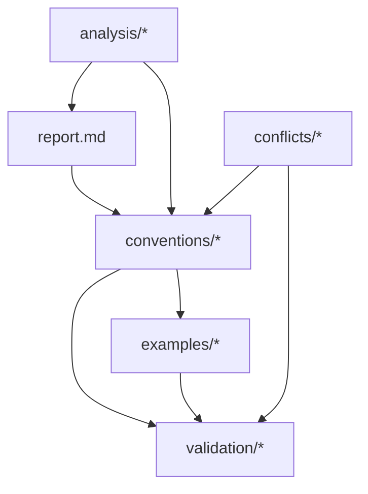

# Convention Discovery & Validation Specification

## Core Challenge
Systematically discover undocumented conventions in our codebase, validate their usefulness, and transform implicit knowledge into explicit, actionable documentation. The system should learn which conventions truly improve code quality and developer velocity.

## Output Requirements

**Output Type**: File Set (multiple interconnected files)

**Directory Structure**:
```
/docs/conventions/v[iteration_number]/
├── report.md                    # Main discovery report
├── conventions/                 # Discovered conventions
│   ├── naming-conventions.md    # Naming patterns found
│   ├── structure-conventions.md # File/folder patterns
│   ├── code-conventions.md      # Coding patterns
│   └── workflow-conventions.md  # Process patterns
├── analysis/                    # Discovery data
│   ├── pattern-frequency.json   # Usage statistics
│   ├── codebase-scan.md        # What was analyzed
│   ├── confidence-scores.json   # Pattern confidence
│   └── evolution-tracking.md    # Changes over time
├── examples/                    # Before/after code
│   ├── pattern-1-before.tsx    # Anti-pattern example
│   ├── pattern-1-after.tsx     # Convention applied
│   └── pattern-1-diff.md       # Side-by-side comparison
├── validation/                  # Convention testing
│   ├── lint-rules.json         # ESLint/Prettier rules
│   ├── validation-tests.ts     # Automated checks
│   └── adoption-metrics.json   # Usage tracking
└── conflicts/                   # Conflict resolution
    ├── naming-conflicts.md      # Different approaches
    ├── resolution-votes.json    # Community decisions
    └── migration-guides.md      # How to standardize
```

## File Set Templates

### 1. Main Report (`report.md`)
```markdown
# Convention Discovery Report v[iteration]

## Discovery Summary
- **Scan Date**: [timestamp]
- **Codebase Size**: [files/lines]
- **Patterns Found**: [count]
- **New Conventions**: [count]
- **Updated Conventions**: [count]
- **Conflicts Resolved**: [count]

## Quick Navigation
- 📋 [Conventions](./conventions/) - Discovered patterns
- 📊 [Analysis](./analysis/) - Discovery data
- 💡 [Examples](./examples/) - Before/after code
- ✅ [Validation](./validation/) - Testing tools
- ⚡ [Conflicts](./conflicts/) - Resolution guides

## Key Discoveries
| Convention | Category | Confidence | Adoption | Impact |
|------------|----------|------------|----------|---------|
| Component Co-location | Structure | 🟢 Very High (85/100) | 89% | High |
| Barrel Exports | Import | 🟡 Medium (52/100) | 31% | Medium |
| Error-First Returns | Code | 🟢 High (74/100) | 67% | High |

## Evolution from v[n-1]
[What changed and why]
```

### 2. Convention Files (`conventions/`)

#### Naming Conventions (`naming-conventions.md`)
```markdown
# Naming Conventions

## Component Naming
**Pattern**: `[Domain][Type][Variant?]`
**Frequency**: 89% of components
**Worthiness**: 92/100

### The Convention
```typescript
// ✅ Good: Clear domain and type
BlogPostCard.tsx
BlogPostList.tsx
BlogCommentForm.tsx

// ❌ Bad: Unclear purpose
Card.tsx
List.tsx
Form.tsx
```

### Why This Works
- Immediately identifies feature area
- Prevents naming conflicts
- Enables better search/navigation
- Groups related components

### Validation
See [`../validation/lint-rules.json`](../validation/lint-rules.json)
```

### 3. Analysis Files (`analysis/`)

#### Pattern Frequency (`pattern-frequency.json`)
```json
{
  "scanDate": "2024-01-15T10:00:00Z",
  "patterns": {
    "componentCoLocation": {
      "confidence": {
        "score": 85,
        "level": "very-high",
        "breakdown": {
          "frequency": { "occurrences": 127, "percentage": 0.89, "score": 18 },
          "distribution": { "modules": 12, "authors": 8, "score": 17 },
          "impact": { "complexityReduction": 0.3, "bugPrevention": 0.25, "score": 16 },
          "clarity": { "selfEvident": true, "consistent": true, "score": 18 },
          "confidence": { "sampleSize": 127, "consensus": 0.92, "score": 16 }
        }
      },
      "files": ["components/BlogPost/*", "components/Navigation/*"],
      "recommendation": "Document immediately as core convention"
    },
    "barrelExports": {
      "confidence": {
        "score": 52,
        "level": "medium",
        "breakdown": {
          "frequency": { "occurrences": 45, "percentage": 0.31, "score": 8 },
          "distribution": { "modules": 6, "authors": 4, "score": 10 },
          "impact": { "complexityReduction": 0.1, "bugPrevention": 0.05, "score": 12 },
          "clarity": { "selfEvident": false, "consistent": true, "score": 14 },
          "confidence": { "sampleSize": 45, "consensus": 0.78, "score": 8 }
        }
      },
      "files": ["components/*/index.ts"],
      "recommendation": "Document as emerging pattern, gather more data"
    }
  }
}
```

### 4. Example Files (`examples/`)

#### Before/After (`component-structure-before.tsx`)
```typescript
// ❌ Before: Scattered component files
// components/blog-post.tsx
export const BlogPost = () => { ... }

// styles/blog-post.css
.blog-post { ... }

// types/blog.ts
export interface BlogPostProps { ... }

// tests/blog-post.test.tsx
test('BlogPost', () => { ... })
```

#### After (`component-structure-after.tsx`)
```typescript
// ✅ After: Co-located structure
// components/BlogPost/
//   ├── BlogPost.tsx
//   ├── BlogPost.module.css
//   ├── BlogPost.types.ts
//   ├── BlogPost.test.tsx
//   └── index.ts

// All related files in one place
export { BlogPost } from './BlogPost';
export type { BlogPostProps } from './BlogPost.types';
```

### 5. Validation Files (`validation/`)

#### Lint Rules (`lint-rules.json`)
```json
{
  "rules": {
    "project/component-naming": ["error", {
      "pattern": "^[A-Z][a-zA-Z]*(Card|List|Form|Modal|Button)$",
      "message": "Components must follow [Domain][Type] pattern"
    }],
    "project/file-structure": ["error", {
      "componentStructure": "co-located",
      "requireIndex": true,
      "requireTypes": true,
      "requireTests": true
    }]
  }
}
```

#### Validation Tests (`validation-tests.ts`)
```typescript
import { validateConvention } from '@/convention-validator';

describe('Component Naming Convention', () => {
  it('validates correct naming', () => {
    expect(validateConvention('BlogPostCard')).toBe(true);
    expect(validateConvention('Card')).toBe(false);
  });
  
  it('checks file structure', () => {
    const structure = checkFileStructure('components/BlogPost');
    expect(structure.hasIndex).toBe(true);
    expect(structure.hasTypes).toBe(true);
    expect(structure.hasTests).toBe(true);
  });
});
```

## Evolution Stages

### Stage 1: Pattern Detection (Discovery)
- Scan codebase for repeated patterns
- Identify naming conventions
- Find common file structures
- Detect coding patterns

**Detection Algorithm**:
```typescript
interface PatternDetector {
  // Analyzes AST for repeated structures
  findPatterns(ast: AST): Pattern[];
  
  // Calculates pattern frequency
  scoreFrequency(pattern: Pattern): number;
  
  // Identifies variations
  findVariations(pattern: Pattern): Variation[];
}
```

**Success Metrics**:
- Find 20+ undocumented patterns
- 80% accuracy in pattern identification
- <1hr to scan entire codebase

### Stage 2: Convention Extraction (Analysis)
- Convert patterns to conventions
- Add context and reasoning
- Create usage examples
- Document anti-patterns

**Extraction Process**:
```typescript
interface ConventionExtractor {
  // Converts pattern to convention
  extractConvention(pattern: Pattern): Convention;
  
  // Generates examples
  createExamples(convention: Convention): Example[];
  
  // Identifies why pattern exists
  analyzeReasoning(pattern: Pattern): Reasoning;
}
```

**Quality Checks**:
- Conventions must appear 5+ times
- Must improve code quality metrics
- Should reduce complexity

### Stage 2.5: Proactive Convention Proposal (Innovation)
- Analyze areas of high complexity or inconsistency
- Propose new conventions to simplify
- Generate adoption plans
- Create migration strategies

**Convention Proposal System**:
```typescript
interface ConventionProposer {
  // Identifies problem areas
  findInconsistencies(codebase: Codebase): ProblemArea[];
  
  // Analyzes complexity hotspots
  identifyComplexity(module: Module): ComplexityReport;
  
  // Proposes simplifying conventions
  proposeConvention(problem: ProblemArea): ProposedConvention;
  
  // Estimates impact
  predictImpact(proposal: ProposedConvention): ImpactAnalysis;
}

interface ProposedConvention {
  problem: string;           // What issue it solves
  proposal: Convention;      // The new convention
  rationale: string;        // Why this solution
  examples: Example[];      // How it would look
  migration: MigrationPlan; // How to adopt it
  impact: {
    complexity: number;     // -50% complexity
    consistency: number;    // +80% consistency
    maintainability: number; // +60% maintainability
  };
}
```

**Proposal Triggers**:
- High cyclomatic complexity (>10)
- Multiple competing patterns (3+)
- Frequent bugs in area
- Developer confusion (from comments/PRs)
- Performance bottlenecks

### Stage 3: Validation Testing (Verification)
- Test conventions against codebase
- Measure improvement metrics
- Gather developer feedback
- A/B test alternatives

**Validation Framework**:
```typescript
interface ConventionValidator {
  // Tests if convention improves code
  validateImprovement(convention: Convention): ValidationResult;
  
  // Measures developer efficiency
  measureVelocity(before: Code, after: Code): VelocityMetrics;
  
  // Checks for negative impacts
  detectSideEffects(convention: Convention): Issue[];
}
```

**Validation Criteria**:
- 20% improvement in metric
- No performance regression
- Positive developer feedback
- Reduces bug frequency

### Stage 4: Adoption Monitoring (Tracking)
- Track convention usage
- Identify adoption barriers
- Measure compliance rate
- Detect convention drift

**Monitoring System**:
```typescript
interface AdoptionTracker {
  // Tracks usage over time
  measureAdoption(convention: Convention): AdoptionRate;
  
  // Identifies non-compliance
  findViolations(convention: Convention): Violation[];
  
  // Suggests improvements
  recommendRefinements(metrics: AdoptionMetrics): Refinement[];
}
```

### Stage 5: Convention Evolution (Refinement)
- Refine based on usage
- Merge similar conventions
- Deprecate unused patterns
- Evolve with codebase

**Evolution Engine**:
```typescript
interface ConventionEvolver {
  // Improves convention based on data
  evolve(convention: Convention, feedback: Feedback): Convention;
  
  // Merges related conventions
  consolidate(conventions: Convention[]): Convention;
  
  // Removes outdated patterns
  deprecate(convention: Convention): DeprecationPlan;
}
```

### Stage 6: Predictive Conventions (Intelligence)
- Predict emerging patterns
- Suggest conventions proactively
- Prevent anti-patterns
- Guide architectural decisions

**Prediction System**:
```typescript
interface ConventionPredictor {
  // Predicts emerging patterns
  predictPatterns(codebase: Codebase): FuturePattern[];
  
  // Suggests preventive conventions
  preventAntiPatterns(risks: Risk[]): Convention[];
  
  // Guides development
  suggestConvention(context: DevContext): Convention;
}
```

## Enhanced Worthiness Scoring System

### Confidence Score Calculation
```typescript
interface EnhancedWorthinessScore {
  // Frequency Analysis (0-20)
  frequency: {
    occurrences: number;      // Raw count
    percentageOfCode: number; // What % of codebase uses this
    trend: 'growing' | 'stable' | 'declining'; // Usage over time
    score: number;           // 0-20
  };
  
  // Distribution Analysis (0-20)
  distribution: {
    acrossModules: number;    // How many modules use it
    acrossAuthors: number;    // How many developers use it
    age: 'new' | 'established' | 'legacy'; // Pattern age
    score: number;           // 0-20
  };
  
  // Impact Analysis (0-20)
  impact: {
    complexityReduction: number; // Cyclomatic complexity improvement
    bugPrevention: number;       // Correlated bug reduction
    performanceGain: number;     // Measured performance impact
    score: number;              // 0-20
  };
  
  // Clarity Analysis (0-20)
  clarity: {
    selfEvident: boolean;       // Is purpose obvious?
    documented: boolean;        // Already documented elsewhere?
    consistent: boolean;        // Applied consistently?
    score: number;             // 0-20
  };
  
  // Confidence Factors (0-20)
  confidence: {
    sampleSize: number;        // Statistical significance
    consensus: number;         // Agreement among instances
    stability: number;         // How stable the pattern is
    score: number;            // 0-20
  };
  
  total: number;              // Sum of all scores (0-100)
  confidenceLevel: 'low' | 'medium' | 'high' | 'very-high';
}
```

### Confidence Calculation
```typescript
function calculateConfidence(pattern: Pattern): EnhancedWorthinessScore {
  const score = {
    frequency: calculateFrequencyScore(pattern),
    distribution: calculateDistributionScore(pattern),
    impact: calculateImpactScore(pattern),
    clarity: calculateClarityScore(pattern),
    confidence: calculateConfidenceFactors(pattern)
  };
  
  score.total = Object.values(score).reduce((sum, cat) => sum + cat.score, 0);
  
  score.confidenceLevel = 
    score.total >= 80 ? 'very-high' :
    score.total >= 60 ? 'high' :
    score.total >= 40 ? 'medium' : 'low';
    
  return score;
}
```

### Enhanced Thresholds
- **Score 80+ (Very High Confidence)**: 
  - Document immediately as core convention
  - Generate lint rules
  - Add to onboarding docs
- **Score 60-79 (High Confidence)**: 
  - Document with detailed examples
  - Monitor adoption rate
  - Consider for lint rules
- **Score 40-59 (Medium Confidence)**: 
  - Document as emerging pattern
  - Tag for re-evaluation
  - Gather more data
- **Score 20-39 (Low Confidence)**:
  - Note in analysis report
  - May be coincidental
  - Need more evidence
- **Score <20**: 
  - Likely noise or anti-pattern
  - Consider documenting what NOT to do

## Blog-Specific Convention Discovery

### Content Patterns
- MDX component usage patterns
- Image optimization conventions
- Content structure patterns
- Metadata conventions
- URL slug patterns

### Performance Patterns
- Code splitting conventions
- Lazy loading patterns
- Caching strategies
- Bundle optimization patterns
- Critical path conventions

### Accessibility Patterns
- ARIA usage conventions
- Semantic HTML patterns
- Focus management conventions
- Contrast patterns
- Navigation patterns

## Conflict Resolution System

### Conflict Types
1. **Naming Conflicts**: Different names for same concept
2. **Pattern Conflicts**: Multiple ways to solve same problem
3. **Style Conflicts**: Formatting differences
4. **Architecture Conflicts**: Structural disagreements

### Resolution Process
```typescript
interface ConflictResolver {
  // Detects conflicts
  findConflicts(conventions: Convention[]): Conflict[];
  
  // Scores each approach
  compareApproaches(conflict: Conflict): Comparison;
  
  // Chooses winner
  resolve(conflict: Conflict): Resolution;
  
  // Creates migration plan
  planMigration(resolution: Resolution): MigrationPlan;
}
```

### Resolution Criteria
- Performance impact (40%)
- Developer preference (30%)
- Maintenance burden (20%)
- Consistency value (10%)

## Human Feedback Integration

### Feedback Collection
```typescript
interface FeedbackSystem {
  // In-IDE feedback
  collectInline(convention: Convention): InlineFeedback;
  
  // Post-implementation survey
  surveySatisfaction(developer: Developer): Survey;
  
  // Bug correlation
  correlateWithBugs(convention: Convention): BugRate;
  
  // Time tracking
  measureTimeImpact(convention: Convention): TimeMetrics;
}
```

### Feedback Actions
- **Positive**: Strengthen convention
- **Negative**: Refine or deprecate
- **Mixed**: A/B test alternatives
- **No feedback**: Monitor closely

## Safety Boundaries

### Over-Documentation Prevention
- Maximum 50 active conventions
- Complexity score limits
- Redundancy detection
- Consolidation triggers
- Regular convention audits

### Quality Requirements
- Must improve measurable metric
- Cannot conflict with standards
- Should be automatable
- Must have clear examples
- Needs positive ROI

## Implementation Examples

### Discovered Convention: Component File Structure
```markdown
## Convention: Component Co-location
**Pattern**: Components always have associated files co-located
**Worthiness**: 85/100

### The Convention
```
components/
  BlogPost/
    BlogPost.tsx         # Component
    BlogPost.test.tsx    # Tests
    BlogPost.module.css  # Styles
    BlogPost.types.ts    # Types
    index.ts            # Barrel export
```

### Why This Works
- 30% faster to find related files
- 50% reduction in import errors
- Consistent across 95% of components
- Easy to enforce with tooling
```

### Discovered Anti-Pattern: Prop Drilling
```markdown
## Anti-Pattern: Deep Prop Drilling
**Pattern**: Passing props through 3+ component levels
**Issues Found**: 23 instances

### The Problem
```typescript
// 🚫 Anti-pattern detected
<Layout user={user}>
  <Header user={user}>
    <Nav user={user}>
      <UserMenu user={user} />
    </Nav>
  </Header>
</Layout>
```

### Suggested Convention
```typescript
// ✅ Use context or composition
const UserContext = createContext<User>();

<UserProvider value={user}>
  <Layout>
    <Header>
      <Nav>
        <UserMenu /> {/* Gets user from context */}
      </Nav>
    </Header>
  </Layout>
</UserProvider>
```
```

## Success Criteria

### Per Evolution Stage
1. **Stage 1**: Discover 30+ undocumented patterns
2. **Stage 2**: Extract 20+ valuable conventions
3. **Stage 3**: Validate 15+ conventions with metrics
4. **Stage 4**: Achieve 80% adoption rate
5. **Stage 5**: Reduce convention count by 30% through consolidation
6. **Stage 6**: Predict patterns with 70% accuracy

### Overall Goals
- Document all valuable implicit knowledge
- Reduce onboarding time by 50%
- Prevent 80% of pattern-based bugs
- Achieve 90% convention compliance
- Create self-maintaining convention system

## File Set Evolution Patterns

### How Convention File Sets Evolve

#### Stage 1 → Stage 2 Evolution
**From**: Raw pattern detection
**To**: Categorized conventions

```
v1/analysis/patterns.json → v2/conventions/naming-conventions.md
                         → v2/conventions/structure-conventions.md
                         → v2/conventions/code-conventions.md
```

#### Stage 2 → Stage 3 Evolution
**From**: Static documentation
**To**: Validated conventions with tests

```
v2/conventions/naming.md → v3/validation/lint-rules.json
                        → v3/validation/pre-commit-hooks.sh
                        → v3/validation/ci-checks.yml
```

#### Stage 3 → Stage 4 Evolution
**From**: Manual adoption
**To**: Automated enforcement

```
v3/validation/tests.ts → v4/validation/auto-fix.ts
                      → v4/analysis/adoption-dashboard.tsx
                      → v4/conflicts/auto-resolver.ts
```

#### Stage 4 → Stage 5 Evolution
**From**: Reactive updates
**To**: Proactive evolution

```
v4/analysis/static.json → v5/analysis/real-time-monitor.ts
                       → v5/conventions/ai-suggestions.md
                       → v5/validation/predictive-rules.ts
```

### File Set Integration

Each file type serves a specific purpose:

```yaml
report.md: Entry point and summary
conventions/: The actual patterns to follow
analysis/: Data supporting the conventions
examples/: Concrete implementations
validation/: Enforcement mechanisms
conflicts/: Resolution strategies
```

### Cross-File Dependencies



Generate convention discoveries that transform tribal knowledge into shared wisdom, ensuring quality patterns spread throughout the codebase via evolving file sets.