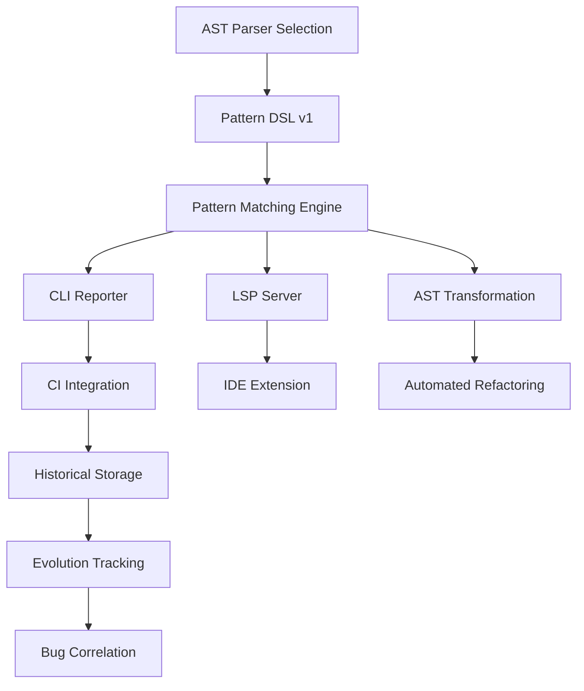

# Strategic Implementation Plan for Living Pattern Catalog

**Date**: 2025-06-12  
**Strategic Advisor**: Gemini 2.5 Pro  
**Purpose**: Phased implementation strategy for a major engineering initiative

## Executive Summary

The Living Pattern Catalog implementation follows a strategic evolution from **Auditor** → **Advisor** → **Assistant** → **Strategist**. This phased approach ensures incremental value delivery every 2 weeks while managing the complexity of a 3-6 month major engineering project. The core philosophy prioritizes proving value early and building momentum for more complex features.

## The Four-Phase Evolution

### Phase 1: The Auditor (MVP - Weeks 1-4)
**Goal**: Create visibility into current pattern usage

**Core Features**:
1. Basic AST parsing using existing tools
2. Simple Pattern DSL (YAML) for structural matching
3. CLI runner (`npx find-patterns`)
4. Text/JSON report output

**Deliverable**: Command-line tool that answers "Where are we using Pattern X?"

**Value**: Architects and tech leads can quantitatively assess pattern adoption and find legacy code.

### Phase 2: The Advisor (Weeks 5-8)
**Goal**: Integrate into developer workflow with proactive guidance

**Core Features**:
1. CI integration (non-blocking PR comments)
2. Initial quality scoring (1-2 dimensions)
3. Basic evolution tracking (historical data storage)
4. TWES documentation integration

**Deliverable**: Automated PR advisor that helps developers learn patterns during code review

**Value**: Improved code consistency, time-series data collection for analysis

### Phase 3: The Assistant (Weeks 9-16)
**Goal**: Make pattern adherence effortless with IDE integration

**Core Features**:
1. VS Code extension with real-time feedback
2. One-click refactoring for safe patterns
3. Enhanced DSL with transformation support
4. Preview changes for trust building

**Deliverable**: IDE-native experience that reduces friction in using patterns

**Value**: Dramatic adoption increase, significant time savings in writing and reviewing code

### Phase 4: The Strategist (Weeks 17-24)
**Goal**: Provide data-driven insights on code health impact

**Core Features**:
1. Bug correlation analysis with issue tracker
2. Pattern relationship mapping
3. Anti-pattern detection
4. Comprehensive dashboards

**Deliverable**: Strategic insights proving that patterns reduce bugs

**Value**: ROI justification, data-driven architectural decisions

## Technical Dependencies & Critical Path

**Critical Path Blockers**:
1. AST Parser selection (blocks everything)
2. Pattern DSL → Matching Engine
3. Historical Storage → Evolution Tracking → Bug Correlation

## Risk Assessment & Mitigation

### Highest Risk: Type-Aware AST Performance
**Risk**: Full type-aware parsing of large monorepo could be prohibitively slow
**Mitigation**:
- Use TypeScript Compiler API directly (source of truth)
- Implement incremental & cached parsing from day one
- Design for file-by-file processing
- Graceful degradation to structural matching when type info unavailable

### High Risk: Automated Refactoring Safety
**Risk**: Bugs in refactoring could corrupt code and destroy trust
**Mitigation**:
- Start with provably safe transformations (renames, imports)
- Mandatory human review with diff preview
- Comprehensive test suite for each refactoring rule
- No silent changes ever

### Medium Risk: Developer Adoption
**Risk**: Complex DSL or noisy output leads to tool abandonment
**Mitigation**:
- Co-design DSL with pilot developer group
- Excellent documentation with examples in TWES
- Implement suppress mechanism (`// pattern-catalog-ignore: reason`)
- Start with high-value, low-noise patterns

## Team Structure: The Pod Model

### 2-3 Person Engineering Pod

**Role 1: Language & Compiler Lead**
- Owns AST parsing, type system integration
- Pattern matching engine development
- DSL design and implementation
- Refactoring logic

**Role 2: Tooling & Infrastructure Engineer**
- CLI development and CI/CD integration
- Performance optimization and caching
- Data storage and analytics
- IDE extension and LSP implementation

**Role 3: Product Champion/Analyst** (can be shared)
- Pattern identification and curation
- Success metrics and ROI analysis
- Stakeholder communication
- Bug correlation studies

### Development Structure
- **2-week sprints** aligned with phases
- **Embedded champions** from product teams
- **Continuous feedback loops**

## Incremental Value Delivery Schedule

### Weeks 1-2 (Sprint 1)
**Deliverable**: Working PoC that parses files and identifies one hardcoded pattern  
**Value**: Technology viability proven

### Weeks 3-4 (Sprint 2)
**Deliverable**: CLI v1 with YAML DSL, finding 2-3 real patterns  
**Value**: First real codebase insights

### Week 5 (Sprint 3)
**Deliverable**: CI integration with informational PR comments  
**Value**: Developer awareness begins

### Week 6 (Sprint 4)
**Deliverable**: PR comments link to TWES documentation  
**Value**: Actionable guidance provided

### Week 7 (Sprint 5)
**Deliverable**: First quality score ("Adherence") displayed  
**Value**: Qualitative assessment begins

### Week 8+ 
Continue with 2-week increments, each adding tangible features

## Technology Choices: Build vs Leverage

### Leverage (Don't Build)
- **AST Parsing**: `@typescript-eslint/parser` or TypeScript API
- **CLI Framework**: `yargs` or `oclif`
- **IDE Integration**: VS Code API + Language Server Protocol
- **Refactoring Engine**: TypeScript Compiler Transformation API

### Build (Core Value)
- **Pattern Matching Logic**: Core differentiator
- **Pattern DSL Interpreter**: Unique to our needs
- **Quality Scoring Algorithm**: Custom business logic
- **Evolution Tracking System**: Specific to our workflow

**Principle**: Build the logic, leverage the plumbing

## Success Metrics by Phase

### Phase 1: Auditor
- **Primary**: 10+ valuable patterns defined
- **Secondary**: 80%+ codebase coverage
- **Outcome**: Baseline pattern adherence report

### Phase 2: Advisor
- **Primary**: Increasing pattern adherence score trend
- **Secondary**: 50% reduction in pattern-related PR comments
- **Outcome**: Measurable consistency improvement

### Phase 3: Assistant
- **Primary**: 20+ automated refactorings per week
- **Secondary**: 80%+ developer IDE extension adoption
- **Outcome**: Developer time savings documented

### Phase 4: Strategist
- **Primary**: Statistically significant bug-pattern correlation
- **Secondary**: 90% reduction in identified anti-patterns
- **Outcome**: Executive-ready ROI report

## Scope Management

### Phase 1 Scope (MVP)
✅ Basic AST parsing  
✅ Simple pattern matching  
✅ CLI tool  
✅ Text reports  
❌ Quality scoring  
❌ IDE integration  
❌ Refactoring  

### Defer to Phase 2+
- Advanced quality dimensions
- Web dashboards
- Cross-file patterns
- Performance optimizations

### Defer to v2.0 (Future)
- GUI pattern builder
- Multi-language support
- Predictive analysis
- Cross-repository analysis
- AI-powered pattern suggestions

## Implementation Principles

1. **Start Simple**: MVP must work end-to-end before adding features
2. **User-Centric**: Every feature must reduce developer friction
3. **Data-Driven**: Decisions based on metrics, not opinions
4. **Trust First**: Never break code or give false positives
5. **Incremental Value**: Ship something useful every 2 weeks

## Critical Success Factors

1. **Week 1 Decision**: AST parser selection sets foundation
2. **Month 1 Proof**: Working CLI shows feasibility
3. **Month 2 Adoption**: Developers using PR comments
4. **Month 3 Trust**: First successful refactorings
5. **Month 6 Victory**: Bug correlation proven

## Next Steps

1. **Form the Pod**: Identify 2-3 engineers with required skills
2. **Technology Spike**: Week 1 AST parser evaluation
3. **Pattern Workshop**: Co-design first 5 patterns with developers
4. **Sprint 0**: Set up infrastructure and development environment
5. **Stakeholder Buy-in**: Present phased plan with clear value propositions

## Conclusion

This strategic plan transforms a daunting 6-month project into manageable 2-week sprints, each delivering tangible value. By evolving from Auditor to Strategist, we build momentum, prove value incrementally, and ultimately deliver a system that fundamentally improves code quality through data-driven pattern management.

The key insight: **Start with visibility (Auditor), add guidance (Advisor), reduce friction (Assistant), then prove impact (Strategist)**. This progression ensures that even if the project is paused at any phase, significant value has been delivered.