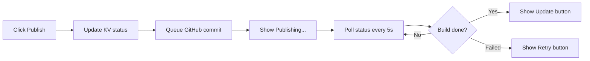

# Admin Dashboard - Simple Implementation Plan

## Philosophy
"Make it work like the tools they already know, but better."

## Core Experience

### 1. The Dashboard (Apple Notes Style)
```
[+ New Post]  [🔍 Search...]

● My Latest Rescue Story
  Updated 5 minutes ago

○ Draft: Emergency Appeal
  Updated 2 hours ago  

● Happy Adoption Day!
  Published 3 days ago
```

- **Green dot (●)**: Published
- **Gray dot (○)**: Draft
- **One-click** to edit any post
- **Search** filters as you type
- **No clutter**: Just titles and status

### 2. The Editor (Google Docs Feel)
```
[← Back]                    [Preview]  [Publish]

Title of Your Post
_________________________________________________

Start writing or type / for options...

[Automatic save indicator: "All changes saved"]
```

- **BlockNote.js** with slash commands
- **Floating toolbar** for bold/italic/link
- **Drag & drop images** anywhere
- **Paste images** from clipboard
- **Auto-save** every 10 seconds

### 3. The Magic Publish Button

**For Drafts:**
```
[Publish] (green button)
```

**For Published Posts:**
```
[Update] (blue button)
Last published 2 hours ago
```

**While Publishing:**
```
[Publishing...] (disabled with spinner)
```

**If Failed:**
```
[Retry] (red button)
Error: Build failed
```

## Implementation Decisions

### 1. Simplified Architecture

**Frontend:**
- Next.js 15 App Router
- shadcn/ui components
- BlockNote.js editor
- SWR for data fetching

**Backend:**
- Vercel KV for all post data
- Vercel Blob for images
- GitHub App for commits
- Magic link auth (Resend)

### 2. Data Model (One Source of Truth)
```typescript
// Vercel KV: post:{id}
{
  id: string;
  title: string;
  slug: string; // Auto-generated, editable
  status: 'draft' | 'publishing' | 'published' | 'failed';
  blocks: BlockNoteJSON;
  featuredImage?: string;
  publishedAt?: Date;
  updatedAt: Date;
  version: number; // For conflict detection
}
```

### 3. Smart Defaults

**Slug Generation:**
- Auto-generated from title as you type
- Editable before first publish
- Soft-locked after publish (with warning)

**Image Handling:**
- Drag, drop, paste - it just works
- Auto-optimize to WebP
- Generate 3 sizes for responsive
- Simple alt text field (no AI for v1)

**Conflict Prevention:**
- Simple version check on save
- "This was edited elsewhere" message
- No complex merging needed

### 4. Publishing Flow



### 5. What We're NOT Building (v1)

- ❌ Template system → Use "Duplicate Post" instead
- ❌ Media library → Paste images directly
- ❌ AI alt text → Manual field is fine
- ❌ Notes feature → Just type in the editor
- ❌ Revision history → Git is the history
- ❌ Categories/tags → Just search
- ❌ SEO panel → Auto-generate meta
- ❌ Analytics → Link to Vercel dashboard

## User Flows

### Publishing First Post
1. Click "New Post"
2. Type title (slug auto-generates)
3. Write content with / commands
4. Drag in an image
5. Click "Publish"
6. See "Publishing..." (about 60s)
7. Done! Post is live

### Editing Published Post
1. Click post from dashboard
2. Make changes (auto-saves)
3. Click "Update"
4. Changes go live

### Handling Images
1. Copy image from anywhere
2. Paste in editor (Cmd+V)
3. Image uploads in background
4. Add alt text inline
5. Continue writing

## Technical Implementation

### Phase 1: Foundation (Week 1)
- [ ] Set up Next.js routes
- [ ] Configure NextAuth + Resend
- [ ] Basic Vercel KV integration
- [ ] Dashboard list view

### Phase 2: Editor (Week 2)
- [ ] BlockNote.js integration
- [ ] Auto-save to KV
- [ ] Image upload flow
- [ ] Basic publish button

### Phase 3: Publishing (Week 3)
- [ ] GitHub App setup
- [ ] Async publish queue
- [ ] Status polling
- [ ] Error handling

### Phase 4: Polish (Week 4)
- [ ] Preview system
- [ ] Duplicate post
- [ ] Search functionality
- [ ] Mobile responsive

## Success Metrics

**User Experience:**
- Publish first post in <3 minutes
- Zero training required
- Works on phone for quick edits
- Never lose work (auto-save)

**Technical:**
- <500ms to load dashboard
- <3s to upload 5MB image
- 99% publish success rate
- <1s auto-save latency

## Why This Works

1. **Familiar Patterns**: Like Google Docs + Apple Notes
2. **No Jargon**: No "commits", "MDX", "frontmatter"
3. **Fast Feedback**: See exactly what's happening
4. **Forgiving**: Auto-save, version check, retry options
5. **Just Enough**: Every feature has clear value

---

This is our MVP. Ship it, get feedback, iterate.