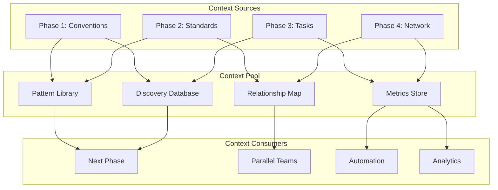

# Context Sharing Protocol for Documentation Evolution

## Overview

This protocol ensures seamless knowledge transfer between phases, maximizing the value of discoveries and preventing duplicate work.

## 🔄 Context Flow Architecture



## 📦 Context Package Structure

### Standard Context Package
```
context-package/
├── metadata.json           # Package metadata and version
├── discoveries/           # Key findings and patterns
│   ├── patterns.json      # Discovered patterns with confidence
│   ├── antipatterns.json  # Things to avoid
│   └── innovations.json   # New approaches found
├── artifacts/             # Reusable outputs
│   ├── templates/         # Document templates
│   ├── examples/          # Code examples
│   └── schemas/           # Data structures
├── relationships/         # Connection data
│   ├── dependencies.json  # What depends on what
│   ├── conflicts.json     # Conflicting patterns
│   └── synergies.json     # Complementary patterns
└── metrics/              # Measurable outcomes
    ├── coverage.json      # Documentation coverage
    ├── quality.json       # Quality scores
    └── usage.json         # Usage patterns
```

### Metadata Schema
```json
{
  "version": "1.0.0",
  "phase": "convention-discovery",
  "created": "2024-01-17T10:00:00Z",
  "team": ["developer1", "developer2"],
  "summary": "Discovered 47 patterns with 85% average confidence",
  "next_phase_recommendations": [
    "Focus on component patterns with <70% confidence",
    "Address theme system inconsistencies first"
  ]
}
```

## 🚀 Phase-Specific Context

### Phase 1 → Phase 2 Context
```yaml
what_to_share:
  - All discovered patterns with confidence scores
  - Pattern usage frequency and distribution
  - Inconsistency hotspots requiring standards
  - Proposed conventions needing validation
  - Anti-patterns to address in examples

how_to_package:
  primary_file: "discovered-conventions.json"
  supporting_files:
    - "confidence-map.json"
    - "pattern-distribution.html"
    - "inconsistency-report.md"

usage_by_phase_2:
  - Prioritize gap analysis by confidence scores
  - Create examples for low-confidence patterns first
  - Focus migrations on high-impact inconsistencies
```

### Phase 2 → Phase 3 Context
```yaml
what_to_share:
  - Canonical examples organized by category
  - Migration complexity scores
  - Common implementation pitfalls
  - Performance optimization patterns
  - Theme integration patterns

how_to_package:
  primary_directory: "canonical-examples/"
  index_file: "example-catalog.json"
  categories:
    - "components/"
    - "themes/"
    - "performance/"
    - "content/"

usage_by_phase_3:
  - Base task guides on canonical examples
  - Include migration steps in guides
  - Warn about identified pitfalls
  - Create performance checklists
```

### Phase 3 → Phase 4 Context
```yaml
what_to_share:
  - Task guide index with categories
  - Common workflow patterns
  - Troubleshooting decision trees
  - TaskMaster integration points
  - Success metrics from guides

how_to_package:
  primary_file: "task-guide-index.json"
  workflow_maps: "workflows/"
  integration_data: "taskmaster/templates.json"

usage_by_phase_4:
  - Create semantic links between related guides
  - Build navigation paths for workflows
  - Connect troubleshooting to solutions
  - Generate learning paths
```

### Phase 4 → Continuous Evolution
```yaml
what_to_share:
  - Complete documentation graph
  - Link quality metrics
  - Search patterns and misses
  - Navigation success rates
  - Content gaps identified

how_to_package:
  graph_data: "documentation-graph.json"
  metrics: "network-metrics.json"
  insights: "evolution-insights.md"

usage_by_automation:
  - Monitor graph health
  - Auto-generate missing links
  - Suggest new content based on gaps
  - Optimize navigation paths
```

## 📋 Context Handoff Checklist

### Before Handoff
- [ ] Run context export command
- [ ] Validate context package completeness
- [ ] Document key insights in summary
- [ ] Tag important patterns for next phase
- [ ] Create handoff presentation (15 min)

### During Handoff
- [ ] Present key discoveries (10 min)
- [ ] Highlight critical patterns
- [ ] Explain edge cases found
- [ ] Share success strategies
- [ ] Q&A and clarification (5 min)

### After Handoff
- [ ] Confirm context package received
- [ ] Available for questions (2 days)
- [ ] Monitor next phase startup
- [ ] Share additional discoveries
- [ ] Update protocol if needed

## 🔧 Context Commands

### Export Context
```bash
# Full context export
/infinite-documentation mode=[current-mode] export_context=true output_dir=/context-export

# Selective export
/infinite-documentation mode=[current-mode] export_context=patterns,examples output_dir=/context-export

# With insights
/infinite-documentation mode=[current-mode] export_context=true include_insights=true
```

### Import Context
```bash
# Import from previous phase
/infinite-documentation mode=[new-mode] context=/path/to/context-package

# Import specific elements
/infinite-documentation mode=[new-mode] context=/path/to/context-package use=patterns,relationships

# Validate context
/infinite-documentation mode=[new-mode] context=/path/to/context-package validate=true
```

### Query Context
```bash
# Check available context
ls -la /docs/evolution/orchestration/*/context-package/

# View context metadata
cat /docs/evolution/orchestration/phase1-conventions/context-package/metadata.json

# Search for patterns
grep -r "theme-system" /docs/evolution/orchestration/*/context-package/discoveries/
```

## 🎯 Context Quality Metrics

### Completeness Score
```yaml
calculation:
  - Required files present: 40%
  - Metadata complete: 20%
  - Discoveries documented: 20%
  - Relationships mapped: 10%
  - Metrics included: 10%

target: 90%
minimum: 80%
```

### Usefulness Score
```yaml
measurement:
  - Next phase productivity boost
  - Reduction in discovery time
  - Pattern reuse rate
  - Decision accuracy improvement

target: 
  - 30% productivity increase
  - 50% less discovery time
  - 80% pattern reuse
  - 90% decision accuracy
```

## 🚨 Common Context Issues

### Issue: Missing Patterns
**Symptom**: Next phase can't find expected patterns  
**Solution**: Run supplementary discovery
```bash
/infinite-documentation mode=convention analyze_missing=true patterns="component-layout,theme-usage"
```

### Issue: Conflicting Information
**Symptom**: Context contradicts current findings  
**Solution**: Reconciliation process
```bash
/infinite-documentation mode=reconcile context1=/path1 context2=/path2 output=/reconciled
```

### Issue: Stale Context
**Symptom**: Context doesn't match current codebase  
**Solution**: Refresh context
```bash
/infinite-documentation mode=[original-mode] refresh_context=true base=/original-context
```

## 📊 Context Analytics

### Track Context Usage
```sql
-- Pseudo-query for context usage
SELECT 
  phase,
  context_element,
  usage_count,
  value_rating
FROM context_usage
WHERE phase = 'current'
ORDER BY usage_count DESC;
```

### Measure Context Impact
```yaml
before_context:
  discovery_time: 8_hours
  pattern_accuracy: 70%
  decision_confidence: 60%

after_context:
  discovery_time: 3_hours
  pattern_accuracy: 95%
  decision_confidence: 90%

impact:
  time_saved: 62.5%
  accuracy_gain: 35.7%
  confidence_gain: 50%
```

## 🔄 Continuous Improvement

### After Each Phase
1. Survey context usefulness (1-10 scale)
2. Identify missing context elements
3. Document context discoveries
4. Update this protocol
5. Share learnings

### Protocol Evolution
- Version control this document
- Track protocol effectiveness
- Incorporate team feedback
- Optimize for value delivery
- Reduce friction points

---

*Context is the lifeblood of efficient documentation evolution. Share generously, consume wisely.*