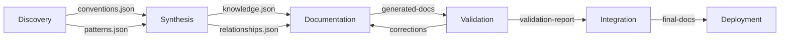

# Documentation Evolution Dashboard

## 📊 Current Status

### Phase Pipeline
```
┌─────────────────┐   ┌─────────────────┐   ┌─────────────────┐   ┌─────────────────┐   ┌─────────────────┐
│  1. Discovery   │ → │  2. Synthesis   │ → │ 3. Documentation│ → │ 4. Validation   │ → │ 5. Integration  │
│   🔄 PENDING    │   │   ⏸️ WAITING    │   │   ⏸️ WAITING    │   │   ⏸️ WAITING    │   │   ⏸️ WAITING    │
└─────────────────┘   └─────────────────┘   └─────────────────┘   └─────────────────┘   └─────────────────┘
```

### Quick Metrics
- **Files Analyzed**: 0
- **Conventions Found**: 0
- **Quality Score**: N/A
- **Execution Time**: N/A

## 🔄 Context Flow



## 📈 Quality Metrics

### Coverage
- **Documentation Coverage**: 0%
- **Convention Adherence**: 0%
- **Link Integrity**: 0%
- **Readability Score**: 0/100

### Trends
- Last 7 days: No data
- Last 30 days: No data

## 🚀 Quick Actions

### Start Evolution
```bash
# Run discovery phase
/infinite-documentation mode=convention output_dir=/docs/evolution count=1

# Run full orchestrated evolution
/infinite-documentation mode=orchestrated output_dir=/docs/evolution count=1
```

### Check Status
```bash
# View current phase status
cat docs/evolution/orchestration/context/context-manifest.json | jq '.phases | to_entries[] | select(.value.status != "pending")'

# View metrics
cat docs/evolution/orchestration/metrics/tracking-system.json | jq '.globalMetrics'
```

## 📋 Phase Details

### Phase 1: Convention Discovery
- **Status**: PENDING
- **Inputs**: Project source files
- **Outputs**: 
  - discovered-conventions.json
  - pattern-analysis.json
  - discovery-context.json
- **Next Run**: Ready to start

### Phase 2: Knowledge Synthesis
- **Status**: WAITING (requires Phase 1)
- **Inputs**: Convention and pattern data
- **Outputs**:
  - synthesized-knowledge.json
  - relationship-map.json
  - synthesis-context.json

### Phase 3: Document Generation
- **Status**: WAITING (requires Phase 2)
- **Inputs**: Synthesized knowledge
- **Outputs**:
  - Generated documentation files
  - doc-structure.json
  - documentation-context.json

### Phase 4: Quality Validation
- **Status**: WAITING (requires Phase 3)
- **Inputs**: Generated documents
- **Outputs**:
  - validation-report.json
  - correction-suggestions.json
  - validation-context.json

### Phase 5: Integration & Deployment
- **Status**: WAITING (requires Phase 4)
- **Inputs**: Validated documents
- **Outputs**:
  - integration-manifest.json
  - deployment-log.json
  - integration-context.json

## 🔍 Recent Activity

No activity yet. Run the evolution command to start.

## ⚙️ Configuration

- **Project Root**: `/home/loucmane/dev/javascript/MomsBlog/blog`
- **Documentation Root**: `/home/loucmane/dev/javascript/MomsBlog/blog/docs`
- **Output Directory**: `/home/loucmane/dev/javascript/MomsBlog/blog/docs/evolution`

## 📚 Resources

- [Evolution How-To Guide](../../ai/for-agentic-loops/documentation-evolution-howto.md)
- [Implementation Plan](../../ai/for-agentic-loops/documentation-evolution-implementation-plan.md)
- [Context Manifest](../context/context-manifest.json)
- [Metrics Tracking](../metrics/tracking-system.json)