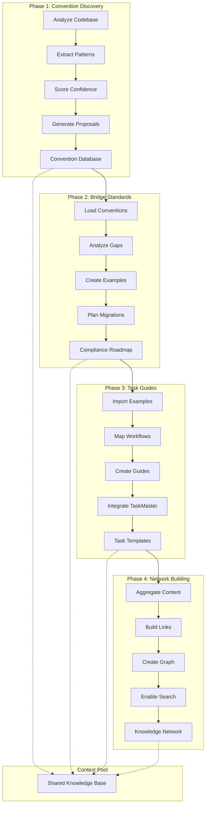
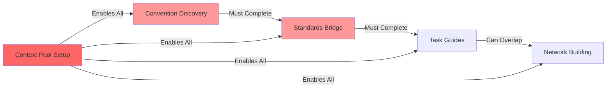

# Documentation Evolution Execution Timeline

## Visual Timeline Overview

```
Week 1: Foundation Building
├─ Day 1-3: Phase 1 - Convention Discovery
│  ├─ Day 1: Setup & Initial Analysis
│  ├─ Day 2: Deep Pattern Discovery  
│  └─ Day 3: Confidence Scoring & Proposals
│
└─ Day 4-7: Phase 2 - Bridge Standards
   ├─ Day 4-5: Gap Analysis & Compliance
   ├─ Day 6: Canonical Examples Creation
   └─ Day 7: Migration Planning

Week 2: Implementation Focus  
└─ Day 8-14: Phase 3 - Task-Based Guides
   ├─ Day 8-9: Core Workflow Guides
   ├─ Day 10-11: TaskMaster Integration
   ├─ Day 12-13: Interactive Elements
   └─ Day 14: Testing & Validation

Week 3: Network & Integration
├─ Day 15-20: Phase 4 - Network Building
│  ├─ Day 15-16: Semantic Link Creation
│  ├─ Day 17-18: Documentation Graph
│  └─ Day 19-20: Search & Discovery
│
└─ Day 21-24: Integration & Review
   ├─ Day 21-22: Integration Testing
   └─ Day 23-24: Quality Review

Week 4: Evolution & Automation
└─ Day 25-30: Continuous Evolution Setup
   ├─ Day 25-27: Feedback Incorporation
   └─ Day 28-30: Automation Implementation
```

## Phase Dependencies & Data Flow



## Daily Execution Schedule

### Week 1 Detail

#### Day 1: Convention Discovery Setup
```yaml
morning:
  - Team kickoff meeting (1hr)
  - Environment setup (30min)
  - Initial codebase scan

afternoon:
  - Run convention discovery on components
  - Document initial findings
  - Set up tracking dashboard

deliverables:
  - Initial pattern inventory
  - Discovery infrastructure ready
```

#### Day 2: Deep Pattern Analysis
```yaml
morning:
  - Analyze theme system patterns
  - Extract content management workflows
  - Identify performance patterns

afternoon:
  - Calculate confidence scores
  - Map pattern distribution
  - Identify inconsistencies

deliverables:
  - Complete pattern catalog
  - Confidence score matrix
```

#### Day 3: Proposals & Planning
```yaml
morning:
  - Generate convention proposals
  - Prioritize by impact
  - Review with team

afternoon:
  - Finalize Phase 1 outputs
  - Prepare context for Phase 2
  - Phase handoff meeting

deliverables:
  - Convention proposals document
  - Phase 1 completion report
```

#### Day 4-5: Standards Gap Analysis
```yaml
day_4:
  morning:
    - Load Phase 1 discoveries
    - Compare with standards
    - Identify discrepancies
  
  afternoon:
    - Document gap reasons
    - Create compliance matrix
    - Plan remediation

day_5:
  morning:
    - Deep dive critical gaps
    - Analyze migration complexity
    - Risk assessment
  
  afternoon:
    - Create compliance roadmap
    - Review with architects
    - Adjust based on feedback

deliverables:
  - Gap analysis report
  - Compliance roadmap
  - Risk matrix
```

#### Day 6: Canonical Examples
```yaml
morning:
  - Create component examples
  - Build theme integration samples
  - Performance pattern templates

afternoon:
  - Validate examples
  - Test in real scenarios
  - Document usage guidelines

deliverables:
  - 50+ canonical examples
  - Usage documentation
  - Validation results
```

#### Day 7: Migration Planning
```yaml
morning:
  - Design migration strategies
  - Create migration scripts
  - Test on sample code

afternoon:
  - Document migration guides
  - Phase 2 wrap-up
  - Handoff to Phase 3

deliverables:
  - Migration guide suite
  - Automation scripts
  - Phase 2 report
```

### Week 2-4 Summary

#### Week 2: Task Guide Creation
- Parallel teams for different guide categories
- Daily integration checkpoints
- Progressive TaskMaster integration
- End-of-week validation sprint

#### Week 3: Network Building
- Automated link generation
- Manual review and enhancement
- Search implementation
- Visualization creation

#### Week 4: Evolution Setup
- Feedback collection and incorporation
- Automation pipeline creation
- Team training
- Handoff to maintenance mode

## Resource Allocation Timeline

```
Team Member Allocation (% of time):

           Week 1   Week 2   Week 3   Week 4
Lead Dev    100%     75%      50%      25%
Dev 1        75%    100%      75%      25%
Dev 2        75%    100%      75%      25%
Dev 3        50%     75%     100%      50%
Architect    25%     25%      50%      75%
DevOps       10%     25%      50%     100%
```

## Checkpoint Schedule

### Daily Checkpoints (15 min)
- Progress against plan
- Blocker identification
- Context sharing needs

### Phase Checkpoints (2 hrs)
- Phase completion review
- Quality validation
- Context handoff ceremony
- Next phase planning

### Weekly Checkpoints (1 hr)
- Overall progress review
- Risk assessment update
- Resource reallocation
- Stakeholder update

## Parallel Execution Opportunities

### Week 1
- While Phase 1 runs discovery:
  - Set up Phase 2 tooling
  - Prepare example templates
  - Create validation frameworks

### Week 2  
- Split Phase 3 by domain:
  - Team A: Content workflows
  - Team B: Development workflows
  - Team C: Performance workflows

### Week 3
- While building network:
  - Start automation setup
  - Create monitoring dashboards
  - Prepare training materials

## Critical Path Items



## Risk Timeline

```yaml
week_1_risks:
  - Tool configuration delays
  - Larger codebase than expected
  - Team availability issues
  mitigation: Buffer time built into Day 3 & 7

week_2_risks:
  - Guide complexity underestimated
  - TaskMaster integration challenges
  - Content sensitivity concerns
  mitigation: Parallel teams, expert consultations

week_3_risks:
  - Network complexity explosion
  - Performance issues with large graphs
  - Search implementation delays
  mitigation: Incremental building, performance testing

week_4_risks:
  - Automation complexity
  - Change resistance
  - Maintenance handoff gaps
  mitigation: Progressive automation, training focus
```

## Success Celebration Points

### 🎉 Quick Wins (Days 1-7)
- First pattern discovered
- First canonical example created
- First migration completed

### 🎊 Major Milestones (Days 8-20)
- First task guide published
- TaskMaster integration live
- Documentation graph visualized

### 🏆 Victory Conditions (Days 21-30)
- 80% coverage achieved
- Automation pipeline running
- Team successfully using system

---

*This timeline ensures systematic progress while maintaining flexibility for discoveries and adjustments along the way.*