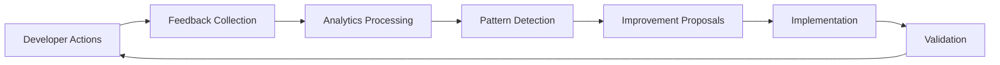

# Feedback & Analytics Systems

## Overview
Comprehensive feedback collection and analytics infrastructure for continuous improvement of bridge standards.

## Available Systems

### 📝 [Developer Feedback System](./developer-feedback-system.md)
- **In-Code Feedback**: Direct feedback markers in code
- **CLI Tool**: Quick feedback during development
- **PR Templates**: Structured feedback collection
- **Automated Collection**: Error pattern analysis
- **Response Process**: Bi-weekly review cycles

### 📊 [Usage Analytics Setup](./usage-analytics-setup.md)
- **Component Tracking**: Usage patterns and adoption rates
- **Performance Monitoring**: Real-time metrics collection
- **Build Analytics**: Bundle size and compilation metrics
- **Privacy-First**: Anonymized data with opt-out options
- **Dashboard**: Real-time visualization of metrics

### 📈 [Improvement Tracking](./improvement-tracking.md)
- **Lifecycle Management**: From proposal to validation
- **Impact Measurement**: Before/after comparisons
- **ROI Calculation**: Cost-benefit analysis
- **Pattern Detection**: Automated improvement suggestions
- **Knowledge Sharing**: Case studies and best practices

## Quick Start

### 1. Enable Feedback Collection
```bash
# Enable all feedback systems
pnpm config set bridge.feedback.enabled true

# Submit feedback via CLI
pnpm feedback --category=performance --message="Bundle size increased after migration"

# View feedback dashboard
pnpm dev:feedback-dashboard
```

### 2. View Analytics
```bash
# Start analytics dashboard
pnpm analytics:dashboard

# Export analytics report
pnpm analytics:export --format=pdf --range=30d

# Check current metrics
pnpm analytics:summary
```

### 3. Track Improvements
```bash
# View improvement tracker
pnpm improvements:dashboard

# Create new improvement proposal
pnpm improvements:propose

# Generate ROI report
pnpm improvements:roi --id=IMP-001
```

## Integration Points

### Development Workflow
1. **IDE Integration**: VS Code extension for quick feedback
2. **Git Hooks**: Automatic feedback collection on commit
3. **CI/CD**: Performance regression detection
4. **PR Process**: Feedback requirements in templates

### Data Flow


## Privacy & Compliance

### Data Collection Policy
- ✅ Component usage patterns
- ✅ Performance metrics
- ✅ Error patterns (anonymized)
- ❌ Source code
- ❌ Business logic
- ❌ User data

### Opt-Out Options
```bash
# Disable all analytics
pnpm config set bridge.analytics.enabled false

# Disable specific types
pnpm config set bridge.analytics.performance false
pnpm config set bridge.feedback.errors false
```

## Success Metrics

### Engagement
- **Target**: >30% developer participation
- **Response Time**: <48 hours for critical issues
- **Action Rate**: >70% feedback leads to action

### Impact
- **ROI**: >150% on implemented improvements
- **Time Saved**: >20 hours/month per team
- **Error Reduction**: >40% after improvements

## Support

- **Questions**: Use in-app feedback tool
- **Issues**: Create GitHub issue with `feedback` label
- **Dashboard Access**: Contact admin for permissions
- **Data Export**: Available via API or dashboard