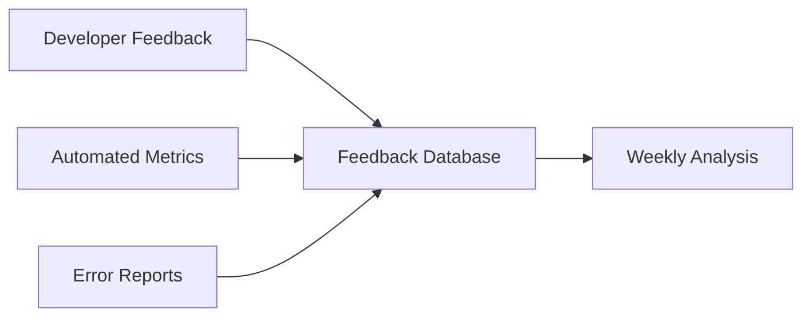

# Developer Feedback System

## Overview
Comprehensive feedback collection system to continuously improve bridge standards based on real-world usage.

## Feedback Channels

### 1. In-Code Feedback
```typescript
// Add feedback markers directly in code
import { provideFeedback } from '@/lib/bridge-feedback'

export const ComplexComponent = () => {
  // FEEDBACK: This pattern is cumbersome for simple cases
  provideFeedback({
    component: 'ComplexComponent',
    issue: 'Boilerplate overhead for accessibility',
    suggestion: 'Create simplified wrapper for common cases',
    severity: 'medium',
  })
  
  return <div>{/* component */}</div>
}
```

### 2. CLI Feedback Tool
```bash
# Quick feedback during development
pnpm feedback --category=performance --message="Bundle size increased significantly after migration"

# Detailed feedback with context
pnpm feedback:detailed
# Interactive prompts:
# - Category: [accessibility|performance|dx|other]
# - Severity: [low|medium|high|critical]
# - Component/Area: _____
# - Issue Description: _____
# - Suggested Solution: _____
# - Would you recommend this pattern? [y/n]
```

### 3. Pull Request Template
```markdown
## Bridge Standards Feedback

### What worked well?
<!-- Patterns that improved your workflow -->

### What was challenging?
<!-- Difficulties encountered during implementation -->

### Time Impact
- [ ] Saved time overall
- [ ] Neutral impact
- [ ] Increased development time

### Suggestions for v2
<!-- Improvements for next iteration -->
```

## Feedback Categories

### Developer Experience (DX)
```typescript
interface DXFeedback {
  category: 'dx'
  subcategory: 
    | 'setup'          // Initial configuration
    | 'learning-curve' // Understanding patterns
    | 'tooling'        // Development tools
    | 'debugging'      // Error messages, debugging
    | 'documentation'  // Docs clarity
  impact: 'blocking' | 'friction' | 'minor'
}
```

### Performance Impact
```typescript
interface PerformanceFeedback {
  category: 'performance'
  metrics: {
    before: number
    after: number
    metric: 'bundle-size' | 'lcp' | 'fcp' | 'tti'
  }
  cause?: string
  suggestion?: string
}
```

### Accessibility Patterns
```typescript
interface A11yFeedback {
  category: 'accessibility'
  pattern: string
  issue: 
    | 'too-complex'
    | 'missing-feature'
    | 'unclear-usage'
    | 'performance-impact'
  realWorldExample?: string
}
```

### Content Sensitivity
```typescript
interface ContentFeedback {
  category: 'content-sensitivity'
  scenario: string
  limitation?: string
  edgeCase?: string
  suggestion?: string
}
```

## Automated Feedback Collection

### 1. Performance Regression Detection
```typescript
// .bridge/feedback-config.ts
export const feedbackConfig = {
  performance: {
    autoReport: true,
    thresholds: {
      bundleSizeIncrease: 5, // % increase triggers feedback
      performanceDecrease: 10, // % decrease in score
    },
  },
}

// Automatic reporting in CI
if (metrics.bundleSize > baseline * 1.05) {
  autoSubmitFeedback({
    category: 'performance',
    severity: 'high',
    data: {
      baseline: baseline,
      current: metrics.bundleSize,
      increase: `${((metrics.bundleSize / baseline - 1) * 100).toFixed(1)}%`,
    },
  })
}
```

### 2. Error Pattern Analysis
```typescript
// Error boundary with feedback
export class BridgeErrorBoundary extends Component {
  componentDidCatch(error: Error, errorInfo: ErrorInfo) {
    // Analyze if error is related to bridge patterns
    if (this.isBridgeRelated(error)) {
      submitErrorFeedback({
        error: error.message,
        stack: error.stack,
        component: errorInfo.componentStack,
        pattern: this.detectPattern(error),
      })
    }
  }
}
```

### 3. Usage Analytics
```typescript
// Track pattern adoption
export const useAccessibilityPattern = (patternName: string) => {
  useEffect(() => {
    trackPatternUsage({
      pattern: patternName,
      component: getComponentName(),
      timestamp: Date.now(),
      version: BRIDGE_VERSION,
    })
  }, [patternName])
  
  // Return pattern implementation
  return patterns[patternName]
}
```

## Feedback Dashboard

### Real-time Metrics
```typescript
// api/feedback/dashboard.ts
export async function getFeedbackMetrics() {
  const last30Days = await db.feedback.aggregate({
    startDate: thirtyDaysAgo(),
    groupBy: ['category', 'severity'],
  })
  
  return {
    summary: {
      total: last30Days.total,
      critical: last30Days.critical,
      trending: calculateTrends(last30Days),
    },
    categories: {
      dx: analyzeDXFeedback(last30Days.dx),
      performance: analyzePerformance(last30Days.performance),
      accessibility: analyzeA11y(last30Days.accessibility),
    },
    recommendations: generateRecommendations(last30Days),
  }
}
```

### Visualization Components
```tsx
export const FeedbackDashboard = () => {
  const { data } = useFeedbackMetrics()
  
  return (
    <Dashboard>
      <MetricCard 
        title="Developer Satisfaction"
        value={data.summary.satisfaction}
        trend={data.summary.trend}
      />
      
      <CategoryBreakdown 
        data={data.categories}
        onDrillDown={(category) => showDetails(category)}
      />
      
      <IssueHeatmap 
        issues={data.issues}
        onSelect={(issue) => showResolution(issue)}
      />
      
      <RecommendationsList 
        items={data.recommendations}
        onImplement={(rec) => createTask(rec)}
      />
    </Dashboard>
  )
}
```

## Feedback Loop Process

### 1. Collection Phase (Ongoing)


### 2. Analysis Phase (Weekly)
```typescript
// Weekly analysis job
export const weeklyFeedbackAnalysis = async () => {
  const feedback = await collectWeeklyFeedback()
  
  const analysis = {
    topIssues: identifyTopIssues(feedback),
    patterns: detectPatterns(feedback),
    impact: calculateImpact(feedback),
    suggestions: consolidateSuggestions(feedback),
  }
  
  // Generate report
  await generateWeeklyReport(analysis)
  
  // Create action items
  await createActionItems(analysis.topIssues)
  
  // Notify stakeholders
  await notifyStakeholders(analysis)
}
```

### 3. Response Phase (Bi-weekly)
```yaml
response_process:
  review_meeting:
    frequency: bi-weekly
    attendees:
      - Tech Lead
      - Senior Developers
      - Product Owner
    agenda:
      - Review top feedback items
      - Prioritize improvements
      - Assign action items
      - Plan v2 features
  
  communication:
    - Send response to feedback submitters
    - Update documentation
    - Publish improvement roadmap
    - Share in team channels
```

## Integration with Development Workflow

### 1. IDE Integration
```json
// .vscode/settings.json
{
  "bridge.feedback.enabled": true,
  "bridge.feedback.shortcuts": {
    "quick": "cmd+shift+f",
    "detailed": "cmd+shift+d"
  },
  "bridge.feedback.autoCapture": {
    "errors": true,
    "performance": true,
    "buildTime": true
  }
}
```

### 2. Git Hooks
```bash
#!/bin/bash
# .husky/pre-push
# Collect feedback before push

if [ -f .bridge/feedback.json ]; then
  echo "📝 Submitting feedback collected during development..."
  pnpm feedback:submit --file=.bridge/feedback.json
  rm .bridge/feedback.json
fi
```

### 3. CI/CD Integration
```yaml
# .github/workflows/feedback.yml
name: Collect Bridge Feedback
on: [pull_request]

jobs:
  analyze:
    runs-on: ubuntu-latest
    steps:
      - name: Analyze Bridge Impact
        run: |
          pnpm analyze:bridge-impact
          pnpm feedback:auto-submit
      
      - name: Comment on PR
        uses: actions/github-script@v6
        with:
          script: |
            const feedback = require('./bridge-feedback.json')
            github.rest.issues.createComment({
              issue_number: context.issue.number,
              body: generateFeedbackSummary(feedback)
            })
```

## Feedback Response Templates

### Acknowledgment Template
```markdown
Subject: Thank you for your Bridge Standards feedback

Hi [Developer],

Thank you for taking the time to provide feedback on [specific issue].

**Your Feedback**: [summary]
**Status**: [Under Review | Planned for v2 | Implemented]
**Tracking**: [Issue #XXX]

We'll keep you updated on progress. Your input is invaluable in making 
these standards better for everyone.

Best,
Bridge Standards Team
```

### Implementation Update
```markdown
Subject: Your feedback has been implemented!

Hi [Developer],

Great news! Your suggestion about [feature] has been implemented in v1.X.

**What Changed**: [description]
**How to Use**: [brief example]
**Documentation**: [link]

Thanks for helping improve our development experience!
```

## Success Metrics

### Feedback Quality Metrics
- Response rate: >30% of active developers
- Actionable feedback: >70% includes suggestions
- Resolution time: <2 weeks for critical issues
- Satisfaction score: >4.0/5.0

### Impact Metrics
- Time-to-implementation reduction
- Error rate decrease
- Developer velocity improvement
- Pattern adoption rate

## Privacy and Data Handling

### Data Collection Policy
```typescript
const feedbackPolicy = {
  collected: [
    'Component names',
    'Performance metrics',
    'Error patterns',
    'Usage frequency',
  ],
  notCollected: [
    'Source code',
    'Business logic',
    'User data',
    'Credentials',
  ],
  retention: '90 days',
  anonymization: true,
}
```

### Opt-out Mechanism
```bash
# Disable all feedback collection
pnpm config set bridge.feedback.enabled false

# Disable specific types
pnpm config set bridge.feedback.performance false
pnpm config set bridge.feedback.errors false
```