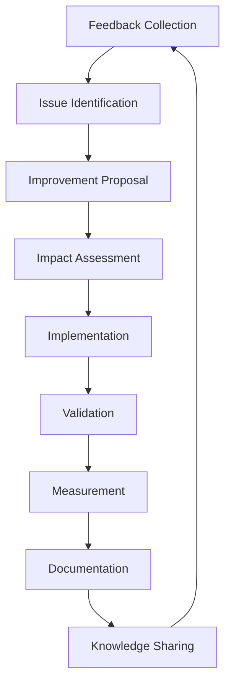

# Improvement Tracking System

## Overview
Systematic approach to tracking improvements, measuring impact, and demonstrating ROI of bridge standards implementation.

## Improvement Lifecycle



## Tracking Infrastructure

### 1. Improvement Database Schema
```typescript
// types/improvement-tracking.ts
interface Improvement {
  id: string
  title: string
  description: string
  category: 'performance' | 'accessibility' | 'dx' | 'security'
  status: 'proposed' | 'approved' | 'in-progress' | 'completed' | 'validated'
  
  // Origin
  source: {
    type: 'feedback' | 'metric' | 'incident' | 'audit'
    references: string[] // Feedback IDs, incident reports, etc.
    reportedBy: string[]
    frequency: number // How often this was reported
  }
  
  // Impact
  impact: {
    severity: 'low' | 'medium' | 'high' | 'critical'
    scope: 'component' | 'feature' | 'application' | 'ecosystem'
    estimatedUsers: number
    estimatedTimeSaved: number // hours per month
  }
  
  // Implementation
  implementation: {
    assignee: string
    startDate: Date
    targetDate: Date
    actualDate?: Date
    effort: number // story points or hours
    blockers?: string[]
  }
  
  // Validation
  validation: {
    tests: ValidationTest[]
    metrics: MetricTarget[]
    signoff?: {
      by: string
      date: Date
      notes: string
    }
  }
  
  // Results
  results?: {
    metrics: MetricResult[]
    feedback: string[]
    adoption: AdoptionMetrics
    roi: ROICalculation
  }
}
```

### 2. Improvement Tracker Component
```tsx
// components/improvements/tracker.tsx
export const ImprovementTracker = () => {
  const { improvements, filters, updateFilter } = useImprovements()
  
  return (
    <div className="improvement-tracker">
      <TrackerHeader 
        stats={calculateStats(improvements)}
        onCreateNew={() => openNewImprovement()}
      />
      
      <TrackerFilters 
        filters={filters}
        onChange={updateFilter}
      />
      
      <div className="grid gap-4">
        {improvements.map(improvement => (
          <ImprovementCard
            key={improvement.id}
            improvement={improvement}
            onUpdate={updateImprovement}
            onValidate={validateImprovement}
          />
        ))}
      </div>
      
      <ImprovementTimeline 
        improvements={improvements}
        view="gantt"
      />
    </div>
  )
}

const ImprovementCard = ({ improvement, onUpdate, onValidate }) => {
  const progress = calculateProgress(improvement)
  
  return (
    <Card className="improvement-card">
      <CardHeader>
        <div className="flex justify-between items-start">
          <div>
            <h3 className="font-semibold">{improvement.title}</h3>
            <p className="text-sm text-muted">{improvement.description}</p>
          </div>
          <StatusBadge status={improvement.status} />
        </div>
      </CardHeader>
      
      <CardContent>
        <div className="grid grid-cols-2 md:grid-cols-4 gap-4 mb-4">
          <MetricDisplay
            label="Impact"
            value={improvement.impact.severity}
            color={getImpactColor(improvement.impact.severity)}
          />
          <MetricDisplay
            label="Scope"
            value={improvement.impact.scope}
          />
          <MetricDisplay
            label="Progress"
            value={`${progress}%`}
            showProgress
          />
          <MetricDisplay
            label="Time Saved"
            value={`${improvement.impact.estimatedTimeSaved}h/mo`}
          />
        </div>
        
        {improvement.status === 'in-progress' && (
          <ProgressTracker
            tasks={improvement.validation.tests}
            metrics={improvement.validation.metrics}
          />
        )}
        
        {improvement.status === 'completed' && improvement.results && (
          <ResultsSummary results={improvement.results} />
        )}
      </CardContent>
      
      <CardFooter className="flex justify-between">
        <AssigneeDisplay assignee={improvement.implementation.assignee} />
        <div className="space-x-2">
          {improvement.status === 'proposed' && (
            <Button size="sm" onClick={() => onUpdate(improvement.id, { status: 'approved' })}>
              Approve
            </Button>
          )}
          {improvement.status === 'completed' && (
            <Button size="sm" onClick={() => onValidate(improvement.id)}>
              Validate
            </Button>
          )}
        </div>
      </CardFooter>
    </Card>
  )
}
```

## Automated Improvement Detection

### 1. Pattern Analysis Engine
```typescript
// lib/improvements/pattern-detector.ts
export class ImprovementPatternDetector {
  async detectPatterns(): Promise<DetectedPattern[]> {
    const [feedback, metrics, errors] = await Promise.all([
      getFeedbackData(),
      getMetricsData(),
      getErrorData(),
    ])
    
    const patterns = []
    
    // Detect performance patterns
    const performanceIssues = this.analyzePerformancePatterns(metrics)
    patterns.push(...performanceIssues.map(issue => ({
      type: 'performance',
      pattern: issue.pattern,
      frequency: issue.occurrences,
      impact: this.calculatePerformanceImpact(issue),
      suggestion: this.generatePerformanceSuggestion(issue),
    })))
    
    // Detect accessibility patterns
    const a11yIssues = this.analyzeAccessibilityPatterns(feedback)
    patterns.push(...a11yIssues.map(issue => ({
      type: 'accessibility',
      pattern: issue.pattern,
      frequency: issue.reports,
      impact: this.calculateA11yImpact(issue),
      suggestion: this.generateA11ySuggestion(issue),
    })))
    
    // Detect error patterns
    const errorPatterns = this.analyzeErrorPatterns(errors)
    patterns.push(...errorPatterns.map(error => ({
      type: 'stability',
      pattern: error.pattern,
      frequency: error.count,
      impact: this.calculateErrorImpact(error),
      suggestion: this.generateErrorSuggestion(error),
    })))
    
    return this.prioritizePatterns(patterns)
  }
  
  private analyzePerformancePatterns(metrics: MetricsData): PerformancePattern[] {
    const patterns = []
    
    // Bundle size regression
    if (metrics.bundleSize.trend > 5) { // 5% increase
      patterns.push({
        pattern: 'bundle-size-regression',
        occurrences: metrics.bundleSize.increases,
        components: metrics.bundleSize.largestContributors,
        severity: this.calculateSeverity(metrics.bundleSize.impact),
      })
    }
    
    // Render performance issues
    const slowComponents = metrics.components.filter(c => c.renderTime > 16) // >16ms
    if (slowComponents.length > 0) {
      patterns.push({
        pattern: 'slow-render',
        occurrences: slowComponents.length,
        components: slowComponents.map(c => c.name),
        severity: 'high',
      })
    }
    
    return patterns
  }
}
```

### 2. Automatic Improvement Proposals
```typescript
// lib/improvements/auto-proposer.ts
export const autoProposer = {
  async generateProposals(): Promise<Improvement[]> {
    const patterns = await patternDetector.detectPatterns()
    const proposals = []
    
    for (const pattern of patterns) {
      if (pattern.frequency > PROPOSAL_THRESHOLD) {
        const proposal = await this.createProposal(pattern)
        proposals.push(proposal)
      }
    }
    
    return proposals
  },
  
  async createProposal(pattern: DetectedPattern): Promise<Improvement> {
    const existingSolutions = await findSimilarSolutions(pattern)
    
    return {
      id: generateId(),
      title: this.generateTitle(pattern),
      description: this.generateDescription(pattern, existingSolutions),
      category: pattern.type,
      status: 'proposed',
      
      source: {
        type: 'metric',
        references: pattern.references,
        reportedBy: ['system'],
        frequency: pattern.frequency,
      },
      
      impact: {
        severity: pattern.impact.severity,
        scope: pattern.impact.scope,
        estimatedUsers: pattern.impact.affectedUsers,
        estimatedTimeSaved: this.estimateTimeSaved(pattern),
      },
      
      implementation: {
        assignee: 'unassigned',
        startDate: new Date(),
        targetDate: this.estimateCompletionDate(pattern),
        effort: this.estimateEffort(pattern),
      },
      
      validation: {
        tests: this.generateValidationTests(pattern),
        metrics: this.generateMetricTargets(pattern),
      },
    }
  },
}
```

## Impact Measurement

### 1. Before/After Comparison
```typescript
// lib/improvements/impact-measurement.ts
export class ImpactMeasurement {
  async measureImpact(improvement: Improvement): Promise<ImpactReport> {
    const baseline = await this.getBaseline(improvement)
    const current = await this.getCurrentMetrics(improvement)
    
    const impact = {
      performance: this.comparePerformance(baseline.performance, current.performance),
      accessibility: this.compareAccessibility(baseline.a11y, current.a11y),
      developerExperience: this.compareDX(baseline.dx, current.dx),
      userSatisfaction: this.compareUserMetrics(baseline.users, current.users),
    }
    
    return {
      improvement,
      baseline,
      current,
      impact,
      roi: this.calculateROI(improvement, impact),
      recommendations: this.generateRecommendations(impact),
    }
  }
  
  private comparePerformance(baseline: PerfMetrics, current: PerfMetrics) {
    return {
      bundleSize: {
        before: baseline.bundleSize,
        after: current.bundleSize,
        improvement: ((baseline.bundleSize - current.bundleSize) / baseline.bundleSize) * 100,
        target: 'met' as const,
      },
      loadTime: {
        before: baseline.loadTime,
        after: current.loadTime,
        improvement: ((baseline.loadTime - current.loadTime) / baseline.loadTime) * 100,
        target: current.loadTime < 3000 ? 'met' : 'missed',
      },
      lighthouse: {
        before: baseline.lighthouse,
        after: current.lighthouse,
        improvement: current.lighthouse - baseline.lighthouse,
        target: current.lighthouse >= 90 ? 'met' : 'missed',
      },
    }
  }
}
```

### 2. ROI Calculation
```typescript
// lib/improvements/roi-calculator.ts
export const roiCalculator = {
  calculate(improvement: Improvement, impact: ImpactMeasurement): ROICalculation {
    const costs = this.calculateCosts(improvement)
    const benefits = this.calculateBenefits(improvement, impact)
    
    return {
      costs: {
        development: costs.development,
        testing: costs.testing,
        deployment: costs.deployment,
        total: costs.total,
      },
      
      benefits: {
        timeSaved: benefits.developerTime,
        errorReduction: benefits.errorReduction,
        performanceGains: benefits.performance,
        userSatisfaction: benefits.userValue,
        total: benefits.total,
      },
      
      roi: {
        percentage: ((benefits.total - costs.total) / costs.total) * 100,
        paybackPeriod: costs.total / (benefits.total / 12), // months
        netValue: benefits.total - costs.total,
      },
      
      intangibles: [
        'Improved developer satisfaction',
        'Better code maintainability',
        'Enhanced team knowledge',
        'Reduced technical debt',
      ],
    }
  },
  
  calculateBenefits(improvement: Improvement, impact: ImpactMeasurement) {
    const hourlyRate = 75 // Average developer hourly rate
    
    const developerTime = 
      improvement.impact.estimatedTimeSaved * 
      improvement.impact.estimatedUsers * 
      hourlyRate
    
    const errorReduction = 
      (impact.impact.userSatisfaction.errorRate.improvement / 100) *
      ERROR_COST_PER_INCIDENT *
      MONTHLY_INCIDENTS
    
    const performanceValue = 
      (impact.impact.performance.loadTime.improvement / 100) *
      CONVERSION_RATE_IMPACT *
      MONTHLY_REVENUE
    
    return {
      developerTime,
      errorReduction,
      performance: performanceValue,
      userValue: this.calculateUserValue(impact),
      total: developerTime + errorReduction + performanceValue,
    }
  },
}
```

## Improvement Reports

### 1. Weekly Improvement Summary
```typescript
// lib/improvements/reporting.ts
export const improvementReporter = {
  async generateWeeklySummary(): Promise<WeeklySummary> {
    const improvements = await getWeeklyImprovements()
    
    return {
      overview: {
        proposed: improvements.filter(i => i.status === 'proposed').length,
        inProgress: improvements.filter(i => i.status === 'in-progress').length,
        completed: improvements.filter(i => i.status === 'completed').length,
        validated: improvements.filter(i => i.status === 'validated').length,
      },
      
      highlights: improvements
        .filter(i => i.status === 'validated')
        .map(i => ({
          title: i.title,
          impact: i.results?.roi.netValue || 0,
          timeSaved: i.results?.metrics.find(m => m.name === 'timeSaved')?.value || 0,
        }))
        .sort((a, b) => b.impact - a.impact)
        .slice(0, 3),
      
      metrics: {
        totalTimeSaved: this.calculateTotalTimeSaved(improvements),
        averageROI: this.calculateAverageROI(improvements),
        adoptionRate: this.calculateAdoptionRate(improvements),
      },
      
      upcoming: improvements
        .filter(i => i.status === 'approved' || i.status === 'in-progress')
        .map(i => ({
          title: i.title,
          targetDate: i.implementation.targetDate,
          assignee: i.implementation.assignee,
        })),
    }
  },
}
```

### 2. Improvement Dashboard
```tsx
// components/improvements/dashboard.tsx
export const ImprovementDashboard = () => {
  const { summary, timeline, insights } = useImprovementData()
  
  return (
    <div className="improvement-dashboard">
      <div className="grid grid-cols-1 md:grid-cols-4 gap-4 mb-6">
        <StatCard
          title="Active Improvements"
          value={summary.active}
          change={summary.activeChange}
          icon={<ActivityIcon />}
        />
        
        <StatCard
          title="Time Saved/Month"
          value={`${summary.timeSaved}h`}
          subtitle="Across all teams"
          icon={<ClockIcon />}
        />
        
        <StatCard
          title="Average ROI"
          value={`${summary.avgROI}%`}
          status={summary.avgROI > 100 ? 'success' : 'warning'}
          icon={<TrendingUpIcon />}
        />
        
        <StatCard
          title="Adoption Rate"
          value={`${summary.adoption}%`}
          subtitle="Of proposed improvements"
          icon={<UsersIcon />}
        />
      </div>
      
      <div className="grid grid-cols-1 lg:grid-cols-2 gap-6">
        <ImprovementTimeline data={timeline} />
        <ImpactHeatmap data={insights.impactMap} />
      </div>
      
      <div className="mt-6">
        <TopImprovements improvements={insights.topImprovements} />
      </div>
      
      <div className="grid grid-cols-1 lg:grid-cols-3 gap-6 mt-6">
        <CategoryBreakdown data={insights.byCategory} />
        <VelocityChart data={insights.velocity} />
        <BlockersList blockers={insights.blockers} />
      </div>
    </div>
  )
}
```

## Knowledge Sharing

### 1. Improvement Case Studies
```typescript
// lib/improvements/case-studies.ts
export const caseStudyGenerator = {
  async generateCaseStudy(improvement: Improvement): Promise<CaseStudy> {
    const impact = await measureImpact(improvement)
    const timeline = await getImprovementTimeline(improvement)
    const feedback = await collectFeedback(improvement)
    
    return {
      title: improvement.title,
      summary: this.generateSummary(improvement, impact),
      
      background: {
        problem: improvement.description,
        frequency: improvement.source.frequency,
        impact: improvement.impact,
      },
      
      solution: {
        approach: this.extractApproach(improvement),
        implementation: this.extractImplementation(improvement),
        challenges: timeline.blockers,
      },
      
      results: {
        metrics: impact.impact,
        roi: impact.roi,
        feedback: feedback.quotes,
      },
      
      lessonsLearned: this.extractLessons(improvement, feedback),
      
      reproducibility: {
        steps: this.generateReproductionSteps(improvement),
        prerequisites: this.identifyPrerequisites(improvement),
        timeEstimate: improvement.implementation.effort,
      },
    }
  },
}
```

### 2. Best Practices Documentation
```typescript
// Auto-generate best practices from successful improvements
export const bestPracticesGenerator = {
  async updateBestPractices() {
    const validatedImprovements = await getValidatedImprovements()
    
    const practices = validatedImprovements
      .filter(i => i.results?.roi.percentage > 150) // High ROI improvements
      .map(i => ({
        category: i.category,
        title: `Best Practice: ${i.title}`,
        description: this.extractBestPractice(i),
        example: this.extractExample(i),
        impact: i.results,
        prerequisites: this.extractPrerequisites(i),
      }))
    
    await updateDocumentation('best-practices', practices)
    await notifyTeams('New best practices available', practices)
  },
}
```

## Continuous Improvement Loop

### 1. Feedback Integration
```typescript
// lib/improvements/feedback-loop.ts
export const feedbackLoop = {
  async processImprovementFeedback(improvementId: string, feedback: Feedback) {
    const improvement = await getImprovement(improvementId)
    
    // Update improvement record
    await updateImprovement(improvementId, {
      results: {
        ...improvement.results,
        feedback: [...(improvement.results?.feedback || []), feedback.id],
      },
    })
    
    // Check if adjustment needed
    if (feedback.type === 'issue' || feedback.satisfaction < 3) {
      await createFollowUpImprovement({
        parent: improvementId,
        issue: feedback.description,
        priority: this.calculatePriority(feedback),
      })
    }
    
    // Update metrics
    await updateImprovementMetrics(improvementId, feedback)
  },
}
```

### 2. Automated Improvement Suggestions
```typescript
// Suggest improvements based on usage patterns
export const improvementSuggester = {
  async suggestNextImprovements(): Promise<Suggestion[]> {
    const [usage, feedback, performance] = await Promise.all([
      getUsagePatterns(),
      getFeedbackTrends(),
      getPerformanceTrends(),
    ])
    
    const suggestions = []
    
    // High-usage, low-satisfaction areas
    const painPoints = this.identifyPainPoints(usage, feedback)
    suggestions.push(...painPoints.map(p => ({
      type: 'pain-point',
      area: p.area,
      description: p.description,
      estimatedImpact: p.impact,
      suggestedSolution: p.solution,
    })))
    
    // Performance optimization opportunities
    const perfOpportunities = this.identifyPerfOpportunities(performance)
    suggestions.push(...perfOpportunities)
    
    // Pattern-based improvements
    const patterns = await patternDetector.detectPatterns()
    suggestions.push(...patterns.map(p => ({
      type: 'pattern',
      pattern: p.pattern,
      frequency: p.frequency,
      suggestion: p.suggestion,
    })))
    
    return this.prioritizeSuggestions(suggestions)
  },
}