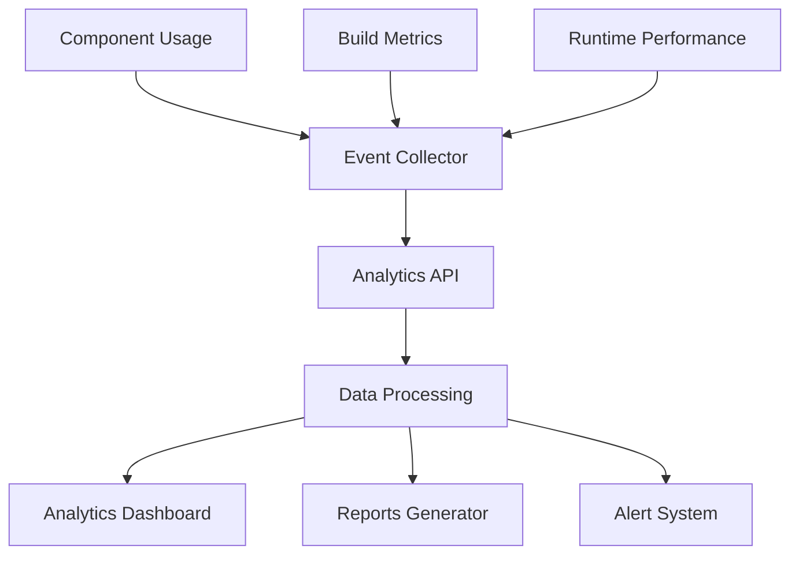

# Usage Analytics Setup

## Overview
Comprehensive analytics system to track bridge standards adoption, usage patterns, and impact on development workflow.

## Analytics Architecture

### Data Collection Pipeline


## Implementation Setup

### 1. Core Analytics Module
```typescript
// lib/analytics/bridge-analytics.ts
import { Analytics } from '@segment/analytics-next'

class BridgeAnalytics {
  private analytics: Analytics
  private sessionId: string
  private config: AnalyticsConfig
  
  constructor(config: AnalyticsConfig) {
    this.config = config
    this.sessionId = generateSessionId()
    
    if (config.enabled && !isCI()) {
      this.analytics = new Analytics({
        writeKey: process.env.BRIDGE_ANALYTICS_KEY,
        plugins: [
          privacyPlugin(),
          performancePlugin(),
          errorPlugin(),
        ],
      })
    }
  }
  
  track(event: BridgeEvent) {
    if (!this.shouldTrack()) return
    
    this.analytics.track({
      event: event.name,
      properties: {
        ...event.properties,
        sessionId: this.sessionId,
        bridgeVersion: BRIDGE_VERSION,
        environment: process.env.NODE_ENV,
        timestamp: Date.now(),
      },
      context: {
        library: {
          name: '@bridge/analytics',
          version: ANALYTICS_VERSION,
        },
      },
    })
  }
  
  private shouldTrack(): boolean {
    return (
      this.config.enabled &&
      !isCI() &&
      !isTest() &&
      hasConsent()
    )
  }
}

export const analytics = new BridgeAnalytics({
  enabled: process.env.NEXT_PUBLIC_ANALYTICS_ENABLED === 'true',
  debugMode: process.env.NODE_ENV === 'development',
})
```

### 2. Component Usage Tracking
```typescript
// hooks/use-track-component.ts
export function useTrackComponent(componentName: string) {
  const startTime = useRef(Date.now())
  const interactionCount = useRef(0)
  
  useEffect(() => {
    // Track component mount
    analytics.track({
      name: 'component_mounted',
      properties: {
        component: componentName,
        mountTime: Date.now() - startTime.current,
      },
    })
    
    return () => {
      // Track component unmount with usage data
      analytics.track({
        name: 'component_unmounted',
        properties: {
          component: componentName,
          sessionDuration: Date.now() - startTime.current,
          interactions: interactionCount.current,
        },
      })
    }
  }, [componentName])
  
  const trackInteraction = useCallback((action: string) => {
    interactionCount.current++
    analytics.track({
      name: 'component_interaction',
      properties: {
        component: componentName,
        action,
        interactionNumber: interactionCount.current,
      },
    })
  }, [componentName])
  
  return { trackInteraction }
}
```

### 3. Pattern Usage Analytics
```typescript
// lib/analytics/pattern-tracking.ts
export const patternAnalytics = {
  accessibility: {
    skipLink: (used: boolean) => {
      analytics.track({
        name: 'accessibility_pattern',
        properties: {
          pattern: 'skip_link',
          implemented: used,
          component: getCurrentComponent(),
        },
      })
    },
    
    ariaLive: (region: string, priority: 'polite' | 'assertive') => {
      analytics.track({
        name: 'accessibility_pattern',
        properties: {
          pattern: 'aria_live',
          region,
          priority,
          component: getCurrentComponent(),
        },
      })
    },
    
    focusManagement: (strategy: string) => {
      analytics.track({
        name: 'accessibility_pattern',
        properties: {
          pattern: 'focus_management',
          strategy,
          component: getCurrentComponent(),
        },
      })
    },
  },
  
  performance: {
    lazyLoad: (resourceType: string, savedBytes: number) => {
      analytics.track({
        name: 'performance_pattern',
        properties: {
          pattern: 'lazy_load',
          resourceType,
          savedBytes,
          component: getCurrentComponent(),
        },
      })
    },
    
    codeSpitting: (chunkName: string, chunkSize: number) => {
      analytics.track({
        name: 'performance_pattern',
        properties: {
          pattern: 'code_splitting',
          chunkName,
          chunkSize,
          impact: calculateImpact(chunkSize),
        },
      })
    },
  },
  
  contentSensitivity: {
    warningShown: (level: string, accepted: boolean) => {
      analytics.track({
        name: 'content_sensitivity',
        properties: {
          action: 'warning_shown',
          level,
          accepted,
          component: getCurrentComponent(),
        },
      })
    },
    
    preferenceSet: (preferences: ContentPreferences) => {
      analytics.track({
        name: 'content_sensitivity',
        properties: {
          action: 'preference_set',
          preferences,
        },
      })
    },
  },
}
```

## Build-Time Analytics

### 1. Webpack Plugin
```typescript
// webpack/bridge-analytics-plugin.ts
class BridgeAnalyticsPlugin {
  apply(compiler: Compiler) {
    compiler.hooks.done.tap('BridgeAnalyticsPlugin', (stats) => {
      const buildData = {
        duration: stats.endTime - stats.startTime,
        bundleSize: this.calculateBundleSize(stats),
        chunkCount: stats.compilation.chunks.size,
        assetCount: stats.compilation.assets.size,
        errors: stats.compilation.errors.length,
        warnings: stats.compilation.warnings.length,
        bridgeComponents: this.countBridgeComponents(stats),
      }
      
      // Send to analytics
      this.sendBuildAnalytics(buildData)
      
      // Save locally for comparison
      this.saveBuildMetrics(buildData)
    })
  }
  
  private countBridgeComponents(stats: Stats): ComponentMetrics {
    const modules = Array.from(stats.compilation.modules)
    
    return {
      total: modules.length,
      withAccessibility: modules.filter(m => 
        m.resource?.includes('use-accessibility')
      ).length,
      withPerformance: modules.filter(m => 
        m.resource?.includes('performance')
      ).length,
      withSensitivity: modules.filter(m => 
        m.resource?.includes('sensitivity')
      ).length,
    }
  }
}
```

### 2. Build Analytics Dashboard
```typescript
// pages/api/analytics/build-metrics.ts
export async function GET(request: Request) {
  const { searchParams } = new URL(request.url)
  const range = searchParams.get('range') || '7d'
  
  const metrics = await getBuildMetrics(range)
  
  return Response.json({
    summary: {
      avgBuildTime: average(metrics.map(m => m.duration)),
      avgBundleSize: average(metrics.map(m => m.bundleSize)),
      successRate: calculateSuccessRate(metrics),
      trend: calculateTrend(metrics),
    },
    timeline: metrics.map(m => ({
      date: m.timestamp,
      duration: m.duration,
      size: m.bundleSize,
      components: m.bridgeComponents,
    })),
    insights: generateBuildInsights(metrics),
  })
}
```

## Runtime Analytics

### 1. Performance Monitoring
```typescript
// lib/analytics/performance-monitor.ts
export const performanceMonitor = {
  initialize() {
    if (!supportsPerformanceObserver()) return
    
    // Track Largest Contentful Paint
    const lcpObserver = new PerformanceObserver((list) => {
      for (const entry of list.getEntries()) {
        analytics.track({
          name: 'performance_metric',
          properties: {
            metric: 'lcp',
            value: entry.startTime,
            element: entry.element?.tagName,
            url: window.location.pathname,
          },
        })
      }
    })
    lcpObserver.observe({ entryTypes: ['largest-contentful-paint'] })
    
    // Track First Input Delay
    const fidObserver = new PerformanceObserver((list) => {
      for (const entry of list.getEntries()) {
        analytics.track({
          name: 'performance_metric',
          properties: {
            metric: 'fid',
            value: entry.processingStart - entry.startTime,
            eventType: entry.name,
          },
        })
      }
    })
    fidObserver.observe({ entryTypes: ['first-input'] })
    
    // Track Cumulative Layout Shift
    let clsValue = 0
    const clsObserver = new PerformanceObserver((list) => {
      for (const entry of list.getEntries()) {
        if (!entry.hadRecentInput) {
          clsValue += entry.value
        }
      }
    })
    clsObserver.observe({ entryTypes: ['layout-shift'] })
    
    // Send CLS on page unload
    window.addEventListener('beforeunload', () => {
      analytics.track({
        name: 'performance_metric',
        properties: {
          metric: 'cls',
          value: clsValue,
        },
      })
    })
  },
}
```

### 2. Error Tracking
```typescript
// lib/analytics/error-tracking.ts
export const errorTracking = {
  captureException(error: Error, context?: ErrorContext) {
    const errorData = {
      message: error.message,
      stack: error.stack,
      type: error.name,
      url: window.location.href,
      timestamp: Date.now(),
      context: {
        ...context,
        userAgent: navigator.userAgent,
        viewport: {
          width: window.innerWidth,
          height: window.innerHeight,
        },
        bridgeVersion: BRIDGE_VERSION,
      },
    }
    
    // Check if error is bridge-related
    if (this.isBridgeError(error)) {
      errorData.bridgeComponent = this.extractComponent(error)
      errorData.pattern = this.extractPattern(error)
    }
    
    analytics.track({
      name: 'error_captured',
      properties: errorData,
    })
  },
  
  isBridgeError(error: Error): boolean {
    return (
      error.stack?.includes('@bridge') ||
      error.stack?.includes('use-accessibility') ||
      error.stack?.includes('content-sensitivity') ||
      error.message.includes('Bridge Standards')
    )
  },
}

// Global error handler
window.addEventListener('error', (event) => {
  errorTracking.captureException(event.error, {
    source: 'window.error',
  })
})

window.addEventListener('unhandledrejection', (event) => {
  errorTracking.captureException(
    new Error(event.reason),
    { source: 'unhandledRejection' }
  )
})
```

## Analytics Dashboard

### 1. Real-Time Dashboard Component
```tsx
// components/analytics/bridge-dashboard.tsx
export const BridgeAnalyticsDashboard = () => {
  const { data, isLoading } = useAnalytics({
    refreshInterval: 30000, // 30 seconds
  })
  
  if (isLoading) return <DashboardSkeleton />
  
  return (
    <div className="analytics-dashboard">
      <div className="grid grid-cols-1 md:grid-cols-2 lg:grid-cols-4 gap-4">
        <MetricCard
          title="Adoption Rate"
          value={`${data.adoption.percentage}%`}
          change={data.adoption.change}
          icon={<TrendingUpIcon />}
        />
        
        <MetricCard
          title="Avg Performance Score"
          value={data.performance.score}
          change={data.performance.change}
          status={getScoreStatus(data.performance.score)}
        />
        
        <MetricCard
          title="Accessibility Coverage"
          value={`${data.accessibility.coverage}%`}
          subtitle={`${data.accessibility.components} components`}
        />
        
        <MetricCard
          title="Error Rate"
          value={`${data.errors.rate}%`}
          change={data.errors.change}
          status={data.errors.rate < 1 ? 'good' : 'warning'}
        />
      </div>
      
      <div className="grid grid-cols-1 lg:grid-cols-2 gap-6 mt-6">
        <PatternUsageChart data={data.patterns} />
        <PerformanceTimeline data={data.performance.timeline} />
      </div>
      
      <div className="mt-6">
        <ComponentAdoptionTable data={data.components} />
      </div>
      
      <div className="grid grid-cols-1 lg:grid-cols-3 gap-6 mt-6">
        <TopIssues issues={data.topIssues} />
        <DeveloperActivity activity={data.activity} />
        <BuildMetrics metrics={data.buildMetrics} />
      </div>
    </div>
  )
}
```

### 2. Analytics API Endpoints
```typescript
// app/api/analytics/[metric]/route.ts
export async function GET(
  request: Request,
  { params }: { params: { metric: string } }
) {
  const { searchParams } = new URL(request.url)
  const timeRange = searchParams.get('range') || '7d'
  const groupBy = searchParams.get('groupBy') || 'day'
  
  const handlers: Record<string, MetricHandler> = {
    adoption: getAdoptionMetrics,
    performance: getPerformanceMetrics,
    accessibility: getAccessibilityMetrics,
    errors: getErrorMetrics,
    patterns: getPatternMetrics,
    components: getComponentMetrics,
  }
  
  const handler = handlers[params.metric]
  if (!handler) {
    return Response.json({ error: 'Invalid metric' }, { status: 400 })
  }
  
  const data = await handler({ timeRange, groupBy })
  
  return Response.json({
    metric: params.metric,
    timeRange,
    groupBy,
    data,
    generated: new Date().toISOString(),
  })
}
```

## Privacy and Compliance

### 1. Data Collection Notice
```tsx
// components/analytics/privacy-notice.tsx
export const AnalyticsPrivacyNotice = () => {
  const [consent, setConsent] = useAnalyticsConsent()
  
  if (consent !== null) return null
  
  return (
    <div className="fixed bottom-0 left-0 right-0 p-4 bg-background border-t">
      <div className="max-w-4xl mx-auto flex items-center justify-between">
        <div className="flex-1 mr-4">
          <p className="text-sm">
            We collect anonymous usage data to improve Bridge Standards.
            This includes component usage, performance metrics, and error patterns.
            No personal or business data is collected.
          </p>
          <Link href="/privacy/analytics" className="text-xs underline">
            Learn more about our analytics
          </Link>
        </div>
        
        <div className="flex gap-2">
          <Button
            variant="ghost"
            size="sm"
            onClick={() => setConsent(false)}
          >
            Opt Out
          </Button>
          <Button
            size="sm"
            onClick={() => setConsent(true)}
          >
            Accept
          </Button>
        </div>
      </div>
    </div>
  )
}
```

### 2. Data Retention Policy
```typescript
// lib/analytics/retention.ts
export const dataRetentionPolicy = {
  raw_events: 30, // days
  aggregated_daily: 90,
  aggregated_monthly: 365,
  
  async enforceRetention() {
    const cutoffDates = {
      raw: daysAgo(this.raw_events),
      daily: daysAgo(this.aggregated_daily),
      monthly: daysAgo(this.aggregated_monthly),
    }
    
    await Promise.all([
      deleteRawEvents({ before: cutoffDates.raw }),
      deleteDailyAggregates({ before: cutoffDates.daily }),
      deleteMonthlyAggregates({ before: cutoffDates.monthly }),
    ])
  },
}
```

## Export and Reporting

### 1. Automated Reports
```typescript
// lib/analytics/reporting.ts
export const reportGenerator = {
  async generateWeeklyReport() {
    const data = await gatherWeeklyData()
    
    const report = {
      summary: generateExecutiveSummary(data),
      adoption: analyzeAdoptionTrends(data),
      performance: analyzePerformanceImpact(data),
      issues: prioritizeIssues(data),
      recommendations: generateRecommendations(data),
    }
    
    // Send to stakeholders
    await emailReport(report, getStakeholders())
    
    // Save to reports directory
    await saveReport(report, 'weekly')
    
    // Update dashboard
    await updateDashboardSummary(report)
  },
  
  async generateMonthlyDeepDive() {
    const data = await gatherMonthlyData()
    
    return {
      trends: analyzeLongTermTrends(data),
      patterns: identifyUsagePatterns(data),
      roi: calculateROI(data),
      roadmap: suggestRoadmapItems(data),
    }
  },
}
```

### 2. Data Export API
```typescript
// app/api/analytics/export/route.ts
export async function POST(request: Request) {
  const { format, metrics, timeRange } = await request.json()
  
  const data = await gatherAnalyticsData({
    metrics,
    timeRange,
  })
  
  const formatters: Record<string, Formatter> = {
    csv: formatAsCSV,
    json: formatAsJSON,
    excel: formatAsExcel,
    pdf: formatAsPDF,
  }
  
  const formatted = await formatters[format](data)
  
  return new Response(formatted.content, {
    headers: {
      'Content-Type': formatted.mimeType,
      'Content-Disposition': `attachment; filename="bridge-analytics-${Date.now()}.${format}"`,
    },
  })
}