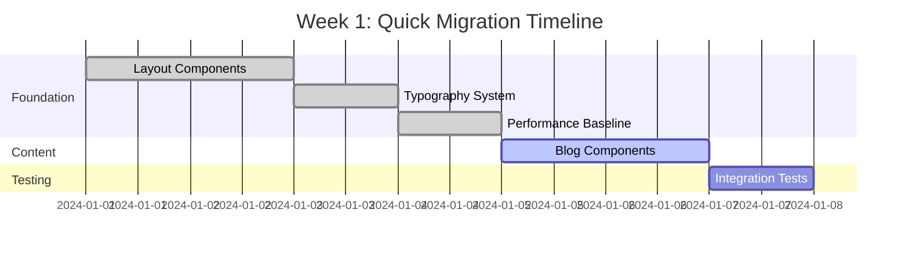
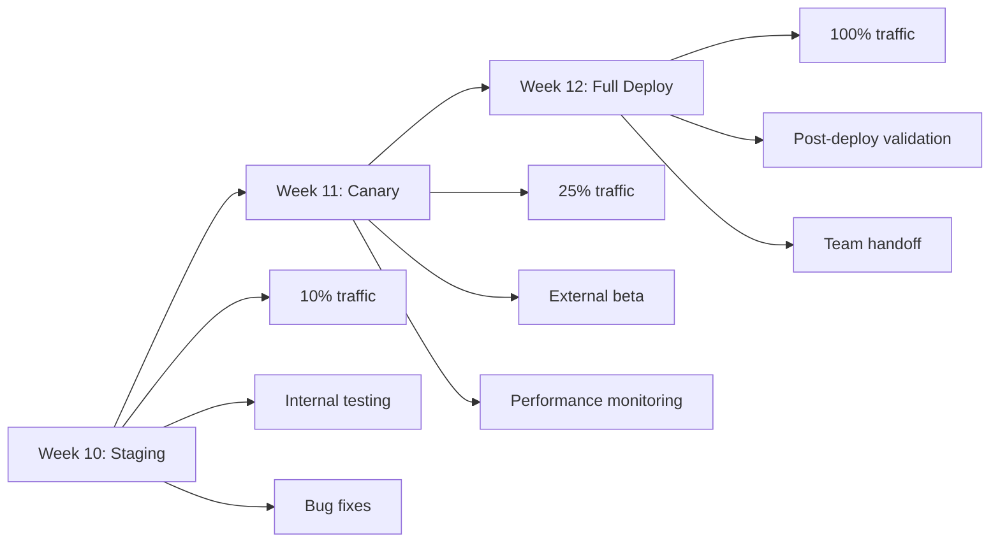
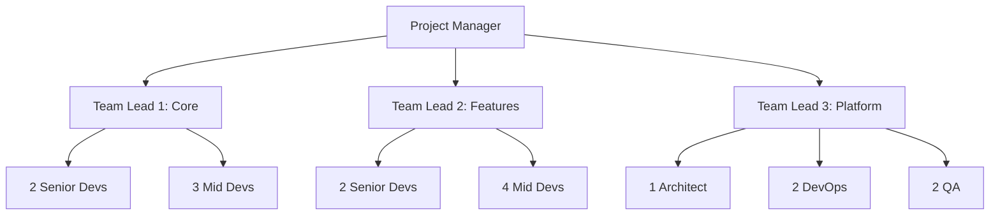

# Migration Timeline Templates

## Overview
This guide provides timeline templates for different migration scenarios, helping teams plan and execute bridge standards adoption effectively.

## Quick Migration (1-2 Weeks)
**Best for**: Small projects, MVPs, or single-feature applications

### Week 1: Core Implementation


#### Daily Breakdown
**Day 1-2: Foundation Setup**
- [ ] Install required dependencies
- [ ] Set up monitoring tools
- [ ] Configure build pipeline
- [ ] Implement base accessibility hooks

**Day 3: Typography & Colors**
- [ ] Migrate to accessible color system
- [ ] Implement responsive typography
- [ ] Validate contrast ratios
- [ ] Update theme configuration

**Day 4: Performance Setup**
- [ ] Add performance monitoring
- [ ] Configure bundle optimization
- [ ] Set up Lighthouse CI
- [ ] Establish baselines

**Day 5-6: Core Components**
- [ ] Migrate header/navigation
- [ ] Update blog post components
- [ ] Add content sensitivity
- [ ] Implement loading states

**Day 7: Testing & Validation**
- [ ] Run full test suite
- [ ] Perform accessibility audit
- [ ] Validate performance metrics
- [ ] Fix critical issues

### Week 2: Polish & Deploy
**Day 8-9: Remaining Components**
- [ ] Complete component migration
- [ ] Add error boundaries
- [ ] Implement fallbacks
- [ ] Update documentation

**Day 10: Final Testing**
- [ ] End-to-end testing
- [ ] User acceptance testing
- [ ] Performance validation
- [ ] Security review

**Day 11-12: Deployment**
- [ ] Stage deployment
- [ ] Monitor metrics
- [ ] Gradual rollout
- [ ] Full deployment

## Standard Migration (4 Weeks)
**Best for**: Medium-sized applications with moderate complexity

### Week-by-Week Overview
```yaml
timeline:
  week1:
    name: "Foundation & Planning"
    deliverables:
      - Migration plan approved
      - Development environment ready
      - Core components migrated
      - Initial tests passing
  
  week2:
    name: "Content & Features"
    deliverables:
      - All content components migrated
      - Media handling optimized
      - Accessibility score >90
      - Performance benchmarks met
  
  week3:
    name: "Interactive & Complex"
    deliverables:
      - Forms and inputs accessible
      - State management migrated
      - Third-party integrations updated
      - E2E tests comprehensive
  
  week4:
    name: "Optimization & Launch"
    deliverables:
      - Bundle size optimized
      - All metrics green
      - Documentation complete
      - Successfully deployed
```

### Detailed Week 1 Schedule
| Day | Morning (4h) | Afternoon (4h) | Validation |
|-----|-------------|----------------|------------|
| Mon | Project setup, tooling | Accessibility foundation | Setup checklist ✓ |
| Tue | Layout components | Navigation system | Component tests ✓ |
| Wed | Typography migration | Color system update | Contrast validation ✓ |
| Thu | Performance setup | Monitoring integration | Baseline metrics ✓ |
| Fri | Testing framework | Initial migration review | Week 1 retrospective |

### Detailed Week 2 Schedule
| Day | Morning (4h) | Afternoon (4h) | Validation |
|-----|-------------|----------------|------------|
| Mon | Blog post components | Content warnings | Sensitivity tests ✓ |
| Tue | Image optimization | Video components | Performance tests ✓ |
| Wed | Gallery components | Media loading | Lazy loading verified ✓ |
| Thu | Search functionality | Filter components | Accessibility audit ✓ |
| Fri | Integration testing | Bug fixes | Week 2 checkpoint |

### Detailed Week 3 Schedule
| Day | Morning (4h) | Afternoon (4h) | Validation |
|-----|-------------|----------------|------------|
| Mon | Form components | Validation system | Form a11y tests ✓ |
| Tue | State management | Context providers | State integrity ✓ |
| Wed | API integration | Error handling | Error scenarios ✓ |
| Thu | Third-party libs | Component polish | Integration tests ✓ |
| Fri | E2E test suite | Performance tuning | Full system test ✓ |

### Detailed Week 4 Schedule
| Day | Morning (4h) | Afternoon (4h) | Validation |
|-----|-------------|----------------|------------|
| Mon | Bundle optimization | Code splitting | Size targets met ✓ |
| Tue | Final testing | Bug fixes | All tests green ✓ |
| Wed | Documentation | Team training | Knowledge transfer ✓ |
| Thu | Staging deploy | Monitor & verify | Stage validation ✓ |
| Fri | Production deploy | Post-deploy check | Launch success ✓ |

## Enterprise Migration (8-12 Weeks)
**Best for**: Large applications, multiple teams, complex requirements

### Phase 1: Planning & Foundation (Weeks 1-2)
```typescript
// Week 1: Assessment & Planning
const week1Tasks = {
  monday: ['Audit current state', 'Identify dependencies'],
  tuesday: ['Create migration matrix', 'Risk assessment'],
  wednesday: ['Team allocation', 'Training plan'],
  thursday: ['Tooling setup', 'CI/CD configuration'],
  friday: ['Foundation components', 'Testing strategy'],
}

// Week 2: Core Infrastructure
const week2Tasks = {
  monday: ['Design system setup', 'Component library'],
  tuesday: ['Accessibility framework', 'Testing utilities'],
  wednesday: ['Performance monitoring', 'Analytics setup'],
  thursday: ['Content sensitivity system', 'User preferences'],
  friday: ['Documentation site', 'Team onboarding'],
}
```

### Phase 2: Component Migration (Weeks 3-6)
```yaml
migration_waves:
  wave1_foundation:
    duration: "Week 3"
    teams: ["Platform", "Design System"]
    components:
      - Layout system
      - Typography
      - Color system
      - Icons and assets
    
  wave2_content:
    duration: "Week 4"
    teams: ["Content", "Media"]
    components:
      - Blog components
      - Media players
      - Galleries
      - Content cards
  
  wave3_interactive:
    duration: "Week 5"
    teams: ["Product", "UX"]
    components:
      - Forms
      - Navigation
      - Search
      - Filters
  
  wave4_complex:
    duration: "Week 6"
    teams: ["Full Stack", "Backend"]
    components:
      - Data tables
      - Dashboards
      - Real-time features
      - API integrations
```

### Phase 3: Integration & Testing (Weeks 7-9)
| Week | Focus Area | Key Activities | Success Criteria |
|------|------------|----------------|------------------|
| 7 | Integration Testing | Cross-component testing, API validation, State management verification | 95% test coverage |
| 8 | Performance Optimization | Bundle optimization, Lazy loading, Caching strategies | Lighthouse score >95 |
| 9 | User Acceptance | Beta testing, Feedback collection, Issue resolution | <5 critical issues |

### Phase 4: Deployment & Stabilization (Weeks 10-12)


## Accelerated Timeline (3-5 Days)
**Best for**: Critical fixes, small scoped updates, emergency compliance

### Day 1: Assessment & Priority
```typescript
const day1Schedule = {
  "9:00-10:00": "Scope definition and requirements",
  "10:00-12:00": "Critical path identification",
  "13:00-15:00": "Set up automation and tooling",
  "15:00-17:00": "Begin highest priority components",
  "17:00-18:00": "Day 1 checkpoint and planning",
}

const criticalPath = [
  'Accessibility violations in header',
  'Performance issues in blog listing',
  'Missing content warnings',
  'Bundle size optimization',
]
```

### Day 2-3: Rapid Implementation
**Parallel Work Streams**:
```yaml
stream_a_accessibility:
  developer: "Senior Frontend"
  tasks:
    - Fix WCAG violations
    - Add ARIA labels
    - Keyboard navigation
    - Screen reader testing

stream_b_performance:
  developer: "Performance Engineer"
  tasks:
    - Image optimization
    - Code splitting
    - Bundle analysis
    - Caching setup

stream_c_content:
  developer: "Full Stack"
  tasks:
    - Content sensitivity
    - Warning components
    - User preferences
    - API updates
```

### Day 4: Testing & Validation
| Time | Activity | Owner | Outcome |
|------|----------|-------|---------|
| 9:00-10:00 | Automated test suite | QA Lead | All tests passing |
| 10:00-11:00 | Manual accessibility | A11y Expert | WCAG compliance |
| 11:00-12:00 | Performance validation | DevOps | Metrics achieved |
| 13:00-14:00 | Integration testing | Full Team | No regressions |
| 14:00-15:00 | User acceptance | Product | Approved |
| 15:00-16:00 | Deployment prep | DevOps | Ready to ship |

### Day 5: Deploy & Monitor
```bash
#!/bin/bash
# Deployment runbook

# 9:00 - Pre-deployment checks
./scripts/pre-deploy-validation.sh

# 10:00 - Deploy to staging
./scripts/deploy-staging.sh

# 11:00 - Smoke tests
./scripts/smoke-tests.sh

# 12:00 - Gradual production rollout
./scripts/canary-deploy.sh --percentage=10

# 14:00 - Increase traffic
./scripts/canary-deploy.sh --percentage=50

# 16:00 - Full deployment
./scripts/canary-deploy.sh --percentage=100

# 17:00 - Post-deployment validation
./scripts/post-deploy-checks.sh
```

## Resource Allocation Templates

### Small Team (2-4 developers)
```yaml
team_allocation:
  lead_developer:
    responsibilities:
      - Architecture decisions
      - Complex components
      - Code reviews
      - Deployment
    time_allocation: "75% coding, 25% review"
  
  frontend_developer:
    responsibilities:
      - Component migration
      - Testing
      - Documentation
    time_allocation: "90% coding, 10% docs"
  
  support_developer:
    responsibilities:
      - Bug fixes
      - Testing support
      - Build optimization
    time_allocation: "50% coding, 50% support"
```

### Medium Team (5-10 developers)
```typescript
interface TeamStructure {
  streams: {
    platform: Developer[]      // 2 devs
    components: Developer[]    // 3 devs
    testing: Developer[]       // 2 devs
    devops: Developer[]        // 1 dev
  }
  rotation: 'weekly' | 'biweekly'
  standups: 'daily' | 'twice-daily'
}
```

### Large Team (10+ developers)


## Risk Mitigation Timelines

### High-Risk Migrations
Add buffer time for:
- Complex state management: +2 days
- Third-party integrations: +3 days
- Legacy code refactoring: +1 week
- Multi-team coordination: +1 week

### Risk-Adjusted Timeline Formula
```typescript
const calculateTimeline = (baseWeeks: number, risks: Risk[]) => {
  const riskMultipliers = {
    high: 1.5,
    medium: 1.25,
    low: 1.1,
  }
  
  const totalMultiplier = risks.reduce((acc, risk) => 
    acc * riskMultipliers[risk.level], 1
  )
  
  return Math.ceil(baseWeeks * totalMultiplier)
}
```

## Milestone Tracking Template

### Weekly Status Report
```markdown
## Week [X] Status Report

### Completed This Week
- ✅ [List completed items]
- ✅ [With specific details]

### In Progress
- 🔄 [Current work items]
- 🔄 [With % complete]

### Blocked/Risks
- 🚫 [Blocking issues]
- ⚠️ [Identified risks]

### Next Week Plan
- 📋 [Planned items]
- 📋 [With assignments]

### Metrics
- Test Coverage: X%
- Lighthouse Score: X
- Components Migrated: X/Y
- Story Points: X/Y

### Timeline Status: [On Track | At Risk | Behind]
```

## Communication Cadence

### Daily Standup Template
```yaml
standup_format:
  duration: 15_minutes
  time: "9:00 AM"
  structure:
    - yesterday: "What was completed"
    - today: "What will be worked on"
    - blockers: "Any impediments"
    - metrics: "Key numbers update"
```

### Weekly Stakeholder Update
```typescript
const weeklyUpdate = {
  executive_summary: 'High-level progress',
  detailed_progress: {
    completed: ['List of deliverables'],
    upcoming: ['Next week focus'],
    risks: ['Current challenges'],
  },
  metrics_dashboard: 'Link to live dashboard',
  timeline_status: 'Visual timeline update',
  budget_status: 'Resource utilization',
}
```

## Success Criteria Checkpoints

### End of Each Phase
- [ ] All planned components migrated
- [ ] Test coverage >90%
- [ ] Zero critical accessibility issues
- [ ] Performance benchmarks met
- [ ] Documentation updated
- [ ] Team knowledge transfer complete
- [ ] Stakeholder sign-off received