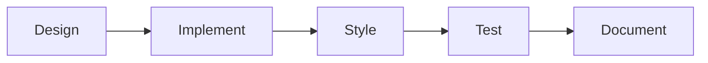

# TaskMaster Subtask Patterns

## Overview
Common subtask decomposition patterns for Mom's Blog development tasks, optimized for TaskMaster AI workflow management.

## Subtask Pattern Principles

### 1. Atomic Operations
Each subtask should be:
- **Single Responsibility**: One clear outcome
- **Independently Testable**: Has success criteria
- **Time-Boxed**: 15-60 minutes typically
- **Context-Free**: Can be understood standalone

### 2. Dependency Chains


## Common Subtask Patterns

### 1. Component Development Pattern
```yaml
pattern: component-development
subtasks:
  - name: Design Interface
    duration: 20m
    outputs:
      - TypeScript interface
      - Props documentation
    
  - name: Create Structure
    duration: 15m
    outputs:
      - Component file
      - Basic JSX structure
    
  - name: Add Logic
    duration: 30m
    outputs:
      - Event handlers
      - State management
      - Effects/hooks
    
  - name: Apply Styling
    duration: 25m
    outputs:
      - Tailwind classes
      - Theme integration
      - Responsive design
    
  - name: Ensure Accessibility
    duration: 20m
    outputs:
      - ARIA attributes
      - Keyboard navigation
      - Screen reader support
    
  - name: Write Tests
    duration: 30m
    outputs:
      - Unit tests
      - Integration tests
      - Accessibility tests
```

### 2. Performance Optimization Pattern
```yaml
pattern: performance-optimization
subtasks:
  - name: Baseline Measurement
    duration: 15m
    tools: [Lighthouse, WebPageTest]
    metrics: [LCP, FID, CLS, TTI]
    
  - name: Identify Bottlenecks
    duration: 20m
    analysis:
      - Bundle size
      - Render blocking resources
      - JavaScript execution time
    
  - name: Apply Optimizations
    duration: 45m
    techniques:
      - Code splitting
      - Lazy loading
      - Memoization
      - Asset optimization
    
  - name: Verify Improvements
    duration: 15m
    validation:
      - Re-run benchmarks
      - Compare metrics
      - Document gains
```

### 3. Content Management Pattern
```yaml
pattern: content-management
subtasks:
  - name: Content Structure
    duration: 15m
    deliverables:
      - MDX template
      - Frontmatter schema
      - Media requirements
    
  - name: Write Content
    duration: 45m
    guidelines:
      - Follow style guide
      - Apply SEO best practices
      - Include alt text
    
  - name: Media Optimization
    duration: 20m
    tasks:
      - Compress images
      - Generate responsive sizes
      - Create loading placeholders
    
  - name: Sensitivity Review
    duration: 15m
    checklist:
      - Apply content framework
      - Add content warnings
      - Verify accessibility
    
  - name: Publishing Setup
    duration: 10m
    steps:
      - Set publish date
      - Configure routing
      - Update sitemap
```

### 4. Bug Fix Pattern
```yaml
pattern: bug-fix
subtasks:
  - name: Reproduce Issue
    duration: 15m
    requirements:
      - Steps to reproduce
      - Expected vs actual behavior
      - Environment details
    
  - name: Isolate Root Cause
    duration: 30m
    techniques:
      - Binary search
      - Git bisect
      - Component isolation
    
  - name: Implement Fix
    duration: 25m
    approach:
      - Minimal change principle
      - Backward compatibility
      - Edge case handling
    
  - name: Add Regression Test
    duration: 20m
    coverage:
      - Unit test for fix
      - Integration test
      - E2E test if needed
    
  - name: Verify Resolution
    duration: 10m
    validation:
      - Original issue fixed
      - No new issues introduced
      - Performance unchanged
```

### 5. Feature Integration Pattern
```yaml
pattern: feature-integration
subtasks:
  - name: API Design
    duration: 30m
    outputs:
      - Endpoint definitions
      - Data schemas
      - Error handling
    
  - name: Backend Implementation
    duration: 45m
    includes:
      - Route handlers
      - Data validation
      - Security checks
    
  - name: Frontend Integration
    duration: 40m
    components:
      - API client
      - State management
      - UI components
    
  - name: Error Handling
    duration: 25m
    coverage:
      - Loading states
      - Error boundaries
      - Retry logic
    
  - name: End-to-End Testing
    duration: 30m
    scenarios:
      - Happy path
      - Error cases
      - Edge cases
```

## Subtask Dependencies

### Linear Dependencies
```javascript
{
  subtasks: [
    { id: "design", name: "Design Component" },
    { id: "implement", name: "Implement", dependsOn: ["design"] },
    { id: "style", name: "Style", dependsOn: ["implement"] },
    { id: "test", name: "Test", dependsOn: ["style"] }
  ]
}
```

### Parallel Dependencies
```javascript
{
  subtasks: [
    { id: "api", name: "Build API" },
    { id: "ui", name: "Build UI" },
    { id: "integrate", name: "Integrate", dependsOn: ["api", "ui"] }
  ]
}
```

### Complex Dependencies
```javascript
{
  subtasks: [
    { id: "research", name: "Research Solutions" },
    { id: "prototype", name: "Prototype", dependsOn: ["research"] },
    { id: "feedback", name: "Gather Feedback", dependsOn: ["prototype"] },
    { id: "refine", name: "Refine Design", dependsOn: ["feedback"] },
    { id: "implement", name: "Final Implementation", dependsOn: ["refine", "research"] }
  ]
}
```

## Time Estimation Guidelines

### Estimation Factors
1. **Complexity Multipliers**:
   - Simple (1x): Straightforward, well-documented
   - Medium (1.5x): Some unknowns, moderate complexity
   - Complex (2x): Many unknowns, high complexity

2. **Experience Adjustments**:
   - First time: +50% buffer
   - Familiar: Base estimate
   - Expert: -20% possible

3. **Integration Overhead**:
   - Standalone: No adjustment
   - Minor integration: +15%
   - Major integration: +30%

### Common Time Ranges
```yaml
quick_tasks:
  - Update text: 5-10m
  - Fix typo: 5m
  - Update config: 10-15m

standard_tasks:
  - Add component: 1-2h
  - Fix bug: 30m-2h
  - Write tests: 30m-1h

complex_tasks:
  - New feature: 2-8h
  - Performance optimization: 2-4h
  - Architecture change: 4-8h
```

## Subtask Quality Checklist

### Before Starting
- [ ] Clear success criteria defined
- [ ] Dependencies identified
- [ ] Required tools/access available
- [ ] Time estimate reasonable

### During Execution
- [ ] Following established patterns
- [ ] Documenting decisions
- [ ] Testing incrementally
- [ ] Communicating blockers

### After Completion
- [ ] Success criteria met
- [ ] Tests passing
- [ ] Documentation updated
- [ ] Knowledge transferred

## Integration with TaskMaster

### Creating Subtasks
```bash
# Add subtasks to existing task
taskmaster add-subtask --task-id 42 \
  --pattern "component-development" \
  --component "UserProfile"

# Generate subtasks from template
taskmaster expand-task --task-id 42 \
  --template "performance-optimization" \
  --target "HomePage"
```

### Tracking Progress
```bash
# Mark subtask complete
taskmaster complete-subtask --task-id 42.1

# View subtask dependencies
taskmaster show-dependencies --task-id 42

# Get time remaining
taskmaster estimate-remaining --task-id 42
```

### Bulk Operations
```bash
# Apply pattern to multiple tasks
taskmaster apply-pattern --pattern "bug-fix" \
  --tasks "100,101,102"

# Generate subtasks for all pending features
taskmaster expand-all --category "feature" \
  --pattern "component-development"
```

## Pattern Evolution

### Tracking Effectiveness
1. **Actual vs Estimated Time**:
   - Track completion times
   - Adjust estimates based on data
   - Identify problem patterns

2. **Success Rate**:
   - Subtask completion rate
   - Rework frequency
   - Blocker patterns

3. **Team Feedback**:
   - Clarity of subtasks
   - Missing steps
   - Unnecessary steps

### Continuous Improvement
```javascript
// Pattern effectiveness tracking
const patternMetrics = {
  patternId: "component-development",
  usageCount: 45,
  avgCompletionTime: "1.8h",
  successRate: 0.92,
  feedback: [
    "Add prop validation subtask",
    "Merge styling and accessibility"
  ]
};
```

## Best Practices

1. **Keep Subtasks Small**:
   - 15-60 minutes ideal
   - Never more than 2 hours
   - Break down if larger

2. **Clear Deliverables**:
   - Specific outputs
   - Testable results
   - Documentable changes

3. **Logical Grouping**:
   - Related work together
   - Natural break points
   - Minimal context switching

4. **Flexibility**:
   - Allow for discoveries
   - Adjust as needed
   - Document changes