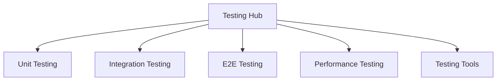
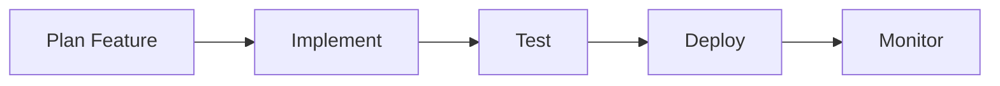
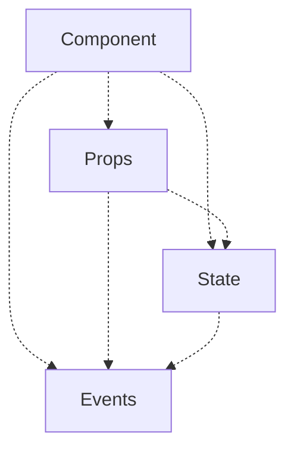
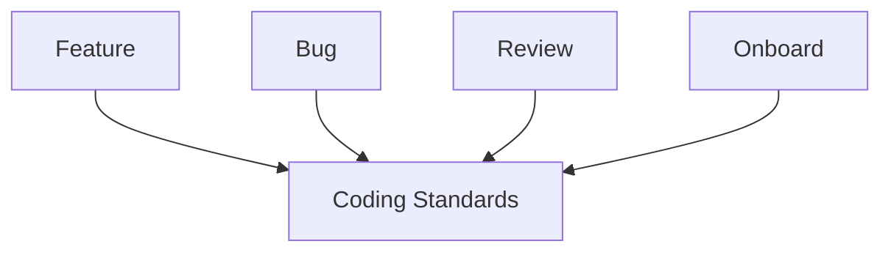

# Documentation Connection Strategies

> **Generated**: 2025-06-17
> **Agent**: Orphan Detector (Agent 3)
> **Purpose**: Systematic approaches to create and maintain documentation connections

## Connection Philosophy

Strong documentation networks follow these principles:
1. **Every document has a home** - Clear parent/child relationships
2. **Multiple discovery paths** - Various ways to find content
3. **Contextual navigation** - Links make sense in context
4. **Progressive disclosure** - From overview to detail

## Connection Types

### 1. Hierarchical Connections (Parent-Child)
```
Architecture Overview
├── Monorepo Structure
├── Package Design
└── Technology Choices
```

**Implementation**:
- Parent documents list all children
- Children link back to parent
- Breadcrumb navigation shows hierarchy

### 2. Sequential Connections (Workflows)
```
Getting Started → Setup → First Feature → Testing → Deployment
```

**Implementation**:
- "Next" and "Previous" navigation
- Progress indicators
- Workflow overview diagrams

### 3. Topical Connections (Related Content)
```
Performance Standards ←→ Performance Examples
                    ←→ Performance Testing
                    ←→ Performance Monitoring
```

**Implementation**:
- "See Also" sections
- Tag-based relationships
- Topic hub pages

### 4. Prerequisite Connections (Dependencies)
```
Advanced Patterns ← requires ← TypeScript Basics
                             ← React Fundamentals
```

**Implementation**:
- "Prerequisites" section
- Skill level indicators
- Learning path suggestions

## Connection Patterns

### Hub-and-Spoke Pattern
Central document links to all related topics:



**Use When**: 
- Topic has many subtopics
- Need central reference point
- Organizing tool-specific docs

### Chain Pattern
Documents link in sequence:



**Use When**:
- Process has clear steps
- Order matters
- Building on previous knowledge

### Web Pattern
Highly interconnected documents:



**Use When**:
- Topics are interrelated
- Multiple valid paths
- Flexible learning

### Star Pattern
One document referenced by many:



**Use When**:
- Foundational document
- Universal reference
- Policy/standard document

## Implementation Strategies

### Strategy 1: Automated Link Injection

**Approach**: Script that adds links based on keywords and topics

```typescript
// Example link injection rules
const linkRules = [
  {
    keyword: "performance",
    links: [
      { text: "Performance Standards", path: "/standards/performance.md" },
      { text: "Performance Examples", path: "/examples/performance/" }
    ]
  },
  {
    keyword: "testing",
    links: [
      { text: "Testing Guide", path: "/guides/testing.md" },
      { text: "Test Examples", path: "/examples/tests/" }
    ]
  }
];
```

### Strategy 2: Navigation Templates

**Approach**: Consistent navigation sections in all documents

```markdown
## 📍 Navigation

**You are here**: Architecture > Monorepo > Package Structure

### Prerequisites
- [TypeScript Basics](/guides/typescript.md)
- [Monorepo Concepts](/concepts/monorepo.md)

### In This Section
- [Current Page] **Package Structure**
- [Next] [Package Dependencies](/architecture/dependencies.md)
- [Previous] [Monorepo Benefits](/architecture/benefits.md)

### Related Topics
- [Build Configuration](/guides/build-config.md)
- [Development Workflow](/guides/dev-workflow.md)

### Next Steps
- [ ] Set up your first package
- [ ] Configure shared dependencies
- [ ] Run cross-package tests
```

### Strategy 3: Dynamic Link Generation

**Approach**: Build-time link validation and generation

```javascript
// build-docs.js
function generateDynamicLinks(doc) {
  return {
    relatedByTags: findDocsBySharedTags(doc.tags),
    relatedByDirectory: findDocsInSameDir(doc.path),
    referencedBy: findDocsReferencingThis(doc.path),
    prerequisites: extractPrerequisites(doc.frontmatter)
  };
}
```

### Strategy 4: Interactive Discovery

**Approach**: Tools for exploring connections

```typescript
// Documentation Explorer Component
interface DocExplorer {
  currentDoc: Document;
  showConnections: () => Connection[];
  suggestNextRead: () => Document[];
  findShortestPath: (to: Document) => Document[];
  visualizeLocalNetwork: () => NetworkGraph;
}
```

## Connection Maintenance

### Automated Health Checks

```bash
#!/bin/bash
# doc-health-check.sh

# Check for broken links
find docs -name "*.md" -exec markdown-link-check {} \;

# Find orphaned documents
node scripts/find-orphans.js

# Validate connection minimums
node scripts/validate-connections.js --min-links=3

# Generate connection report
node scripts/connection-report.js > reports/connections.json
```

### Connection Metrics

Track these metrics monthly:
- **Connection Density**: Links per document
- **Orphan Rate**: Disconnected documents
- **Dead Link Rate**: Broken connections
- **Navigation Success**: User path completion
- **Discovery Rate**: How users find documents

### Refactoring Guidelines

When restructuring documentation:

1. **Map existing connections** before moving
2. **Update all references** using find-and-replace
3. **Add redirects** for moved documents
4. **Test navigation paths** after changes
5. **Monitor 404 rates** post-refactoring

## Best Practices

### DO ✅
- Link to prerequisites before advanced topics
- Provide multiple discovery paths
- Use descriptive link text
- Group related links together
- Test links in CI/CD pipeline

### DON'T ❌
- Create circular dependencies only
- Link without context
- Use "click here" link text
- Break existing links without redirects
- Assume single navigation path

## Connection Templates

### For New Features
```markdown
## Related Documentation

### Before You Start
- [ ] Review [Architecture Overview](/architecture/README.md)
- [ ] Understand [Coding Standards](/standards/code.md)
- [ ] Set up [Development Environment](/guides/setup.md)

### Implementation Guides
- [Component Patterns](/patterns/components.md) - For UI work
- [API Patterns](/patterns/api.md) - For backend work
- [Testing Patterns](/patterns/testing.md) - For test coverage

### After Implementation
- [Performance Optimization](/guides/performance.md)
- [Deployment Guide](/guides/deployment.md)
- [Monitoring Setup](/guides/monitoring.md)
```

### For Troubleshooting
```markdown
## Quick Links

🔥 **Common Issues**: [FAQ](/faq.md) | [Known Bugs](/bugs.md)
🛠️ **Tools**: [Debugger](/tools/debugger.md) | [Logger](/tools/logger.md)
📚 **Deep Dives**: [Architecture](/architecture/) | [Internals](/internals/)
💬 **Get Help**: [Discord](/community/discord.md) | [Issues](github.com/...)
```

### For Learning Paths
```markdown
## 🎓 Learning Path

### Your Journey
1. **You are here** → 2. Next Step → 3. Advanced Topic

### Prerequisites ✓
- ✅ JavaScript Basics
- ✅ React Fundamentals
- ⏳ TypeScript (learning now)
- ⬜ Advanced Patterns (next)

### Choose Your Path
- 🚀 **Fast Track**: Skip to [Quick Start](/quick-start.md)
- 📖 **Deep Dive**: Continue to [Concepts](/concepts/)
- 🔧 **Hands-on**: Try [Tutorial](/tutorial/)
```

## Implementation Timeline

### Week 1: Foundation
- [ ] Implement orphan detection script
- [ ] Create connection validation tool
- [ ] Set up CI/CD link checking
- [ ] Generate initial connection report

### Week 2: Enhancement
- [ ] Add automated link suggestions
- [ ] Create navigation templates
- [ ] Build connection visualizer
- [ ] Implement breadcrumb generation

### Week 3: Optimization
- [ ] Add dynamic related content
- [ ] Create learning path generator
- [ ] Implement search with connections
- [ ] Set up analytics tracking

### Week 4: Maintenance
- [ ] Document connection patterns
- [ ] Train team on best practices
- [ ] Establish review process
- [ ] Create monitoring dashboard

---

**Connection Strategy Status**: Active Implementation
**Next Review**: 2025-06-24
**Success Metric**: <5% orphan rate, >4 avg connections