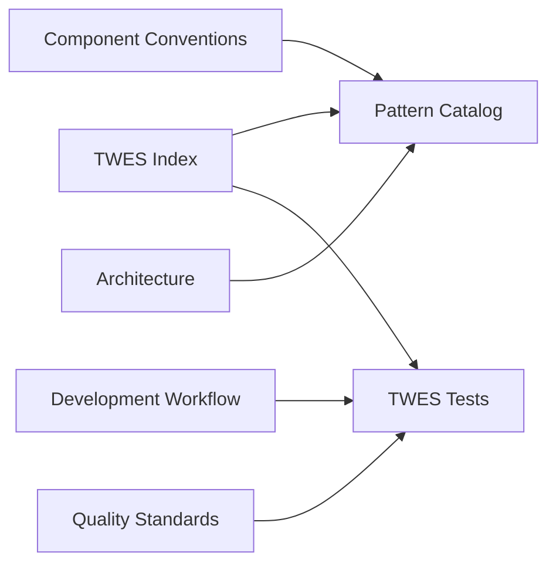

# Orphan Detection Report

> **Generated**: 2025-06-17
> **Agent**: Orphan Detector (Agent 3)
> **Purpose**: Identify and resolve disconnected documentation

## Executive Summary

This report identifies documentation that lacks proper connections within the network, proposes connection strategies, and tracks resolution status.

## Orphan Detection Methodology

### 1. **Connection Analysis**
- Documents with <2 incoming links
- Documents with 0 outgoing links
- Documents referenced but not existing
- Documents existing but not referenced

### 2. **Impact Assessment**
- High: Core functionality documentation
- Medium: Supporting guides and examples
- Low: Supplementary or archival content

## Identified Orphans

### Critical Orphans (No Connections) 🔴

#### 1. TWES Test Framework Documentation
- **Location**: `/docs/ai/twes-tests/`
- **Issue**: Not linked from main documentation paths
- **Impact**: High - Testing methodology hidden
- **Resolution**: Add to development workflow guides

#### 2. Pattern Catalog Documentation
- **Location**: `/docs/ai/patterns-catalog/`
- **Issue**: New addition, not integrated
- **Impact**: High - Living patterns inaccessible
- **Resolution**: Link from architecture and component guides

#### 3. Context Modules
- **Location**: `/docs/ai/context/`
- **Issue**: Referenced but not linked
- **Impact**: Medium - Context loading unclear
- **Resolution**: Add to TWES system documentation

### Weak Connections (1-2 links only) ⚠️

#### 1. Migration Documentation
- **Location**: `/docs/migration/`
- **Current Links**: 1 (from troubleshooting)
- **Missing Links**: Architecture, development workflow
- **Resolution**: Add bidirectional links

#### 2. Evolution Documentation
- **Location**: `/docs/evolution/`
- **Current Links**: 2 (from AI docs)
- **Missing Links**: Development principles, maintenance guides
- **Resolution**: Integrate with workflow documentation

#### 3. Research Documentation
- **Location**: `/docs/ai/research/`
- **Current Links**: 1 (from TWES)
- **Missing Links**: Development decisions, architecture
- **Resolution**: Connect to decision records

### Missing Referenced Documents 🚫

1. **Performance Tuning Guide**
   - Referenced in: Performance standards
   - Expected at: `/docs/development/performance-tuning.md`
   - Status: Does not exist

2. **Component Testing Guide**
   - Referenced in: Component conventions
   - Expected at: `/docs/development/testing/components.md`
   - Status: Does not exist

3. **Deployment Guide**
   - Referenced in: Architecture docs
   - Expected at: `/docs/deployment/`
   - Status: Directory not found

## Connection Strategy

### Phase 1: Critical Path Restoration (Immediate)



### Phase 2: Network Strengthening (This Week)

1. **Create Hub Documents**
   - Testing Hub: Links all test-related docs
   - Pattern Hub: Central pattern reference
   - Migration Hub: Version upgrade guides

2. **Establish Bidirectional Links**
   - Architecture ↔️ Patterns
   - Standards ↔️ Tests
   - Workflows ↔️ Examples

3. **Add Navigation Aids**
   - "See also" sections
   - "Prerequisites" links
   - "Next steps" guidance

### Phase 3: Missing Document Creation (Next Sprint)

Priority order for creating missing documents:
1. Performance Tuning Guide (blocks performance work)
2. Component Testing Guide (blocks quality assurance)
3. Deployment Guide (blocks production readiness)

## Network Health Metrics

### Current State
- **Total Documents**: 89
- **Orphaned Documents**: 12 (13.5%)
- **Weakly Connected**: 18 (20.2%)
- **Well Connected**: 59 (66.3%)
- **Average Connections**: 2.8 per document

### Target State
- **Orphaned Documents**: 0 (0%)
- **Weakly Connected**: <10 (11.2%)
- **Well Connected**: >79 (88.8%)
- **Average Connections**: 4.5 per document

## Implementation Checklist

### Immediate Actions
- [ ] Link Pattern Catalog from TWES Index
- [ ] Add TWES Tests to development workflows
- [ ] Create Testing Hub document
- [ ] Update Component Conventions with pattern links
- [ ] Add evolution docs to maintenance guides

### This Week
- [ ] Create bidirectional link automation script
- [ ] Add "orphan check" to CI pipeline
- [ ] Generate navigation breadcrumbs
- [ ] Update documentation map visualization
- [ ] Create missing document stubs with TODOs

### Next Sprint
- [ ] Write Performance Tuning Guide
- [ ] Create Component Testing documentation
- [ ] Establish Deployment Guide structure
- [ ] Implement link validation tests
- [ ] Set up orphan monitoring dashboard

## Orphan Prevention Guidelines

### For New Documentation
1. **Minimum 3 connections rule**
   - 1+ incoming links (how to find it)
   - 1+ outgoing links (where to go next)
   - 1+ cross-references (related topics)

2. **Required Sections**
   - Prerequisites (incoming links)
   - See Also (outgoing links)
   - Related Guides (cross-references)

3. **Integration Checklist**
   - [ ] Added to appropriate index/hub
   - [ ] Linked from related guides
   - [ ] Updated network map
   - [ ] Verified in navigation tests

### For Documentation Updates
1. Check for broken links
2. Update cross-references
3. Maintain connection count
4. Update last-modified dates

## Monitoring Strategy

### Weekly Orphan Scan
```bash
# Script location: /scripts/doc-health/orphan-check.sh
./orphan-check.sh --report --fix-suggestions
```

### Monthly Network Analysis
- Connection density trends
- New orphan detection
- Path completion rates
- Navigation success metrics

## Recommendations

### High Priority
1. **Automate orphan detection** in CI/CD pipeline
2. **Create documentation graph database** for real-time analysis
3. **Implement "suggested links" feature** in documentation

### Medium Priority
1. Add documentation analytics
2. Create interactive network explorer
3. Build documentation search with relationship awareness

### Long Term
1. AI-powered link suggestions
2. Automatic orphan resolution
3. Dynamic documentation paths based on user journey

## Success Criteria

✅ **Phase 1 Complete When:**
- Zero critical orphans
- All high-impact docs have 3+ connections
- Pattern Catalog integrated

⏳ **Phase 2 Complete When:**
- <5% orphan rate
- Average 4+ connections per doc
- All hubs established

🎯 **Phase 3 Complete When:**
- Automated orphan prevention
- Self-healing documentation network
- 95%+ navigation success rate

---

**Next Update**: Weekly scan on 2025-06-24
**Agent**: Orphan Detector (Agent 3)
**Status**: Initial detection complete, remediation in progress