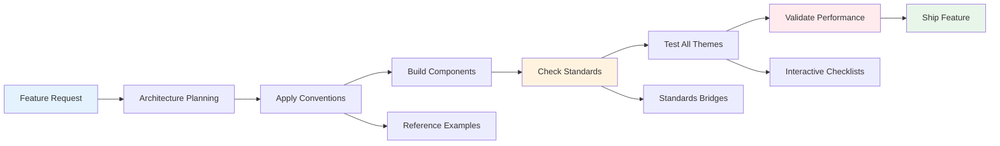

# Feature Development Path

> **Purpose**: Optimized path for developing new features from concept to deployment
> **Typical Duration**: 2-8 hours depending on complexity
> **Goal**: Build features that maintain standards while shipping quickly

## Development Flow



## Stage 1: Planning & Architecture (30-60 min)

### 📍 Starting Point
**[Add a Blog Feature Guide](/docs/evolution/orchestration/outputs/3-guides/v1/tasks/01-add-blog-feature.md)** - Section 1: Planning

### 🎯 Key Activities
1. **Define Feature Scope**
   - User stories and requirements
   - Performance budget allocation
   - Accessibility requirements

2. **Architecture Decisions**
   - Component breakdown
   - State management needs
   - Data flow design

### 📚 Reference Documents
- **[Component Conventions](/docs/evolution/orchestration/outputs/1-discovery/v1/conventions/01-component-conventions.md)** - For structure planning
- **[Type System Conventions](/docs/evolution/orchestration/outputs/1-discovery/v1/conventions/03-type-system-conventions.md)** - For data modeling
- **[Performance Standards](/docs/ai/shared-context/standards/performance.md)** - For budgeting

### ✅ Planning Checklist
- [ ] Feature broken into components
- [ ] Types/interfaces designed
- [ ] Performance impact estimated
- [ ] Accessibility plan created

## Stage 2: Component Development (1-3 hours)

### 📍 Development Hub
**[Quick Reference Card](/docs/evolution/orchestration/outputs/1-discovery/v1/conventions/QUICK-REFERENCE.md)** - Keep open while coding

### 🎯 Build Process
1. **Create Base Components**
   ```typescript
   // Follow the standard pattern
   const Component = React.forwardRef<...>
   ```

2. **Apply Styling Patterns**
   - Use CVA for variants
   - Follow theme system
   - Ensure responsive design

3. **Implement Interactions**
   - Keyboard navigation
   - Touch targets (44px min)
   - Loading states

### 📚 Essential References
- **[Component Examples](/docs/evolution/orchestration/outputs/1-discovery/v1/examples/components/)** - Copy patterns
- **[Accessibility Component Patterns](/docs/evolution/orchestration/outputs/2-bridges/v1/examples/accessibility-component-patterns.tsx)** - A11y implementation
- **[Import/Export Conventions](/docs/evolution/orchestration/outputs/1-discovery/v1/conventions/04-import-export-conventions.md)** - Module organization

### 🔨 Code Pattern Reference
```typescript
// Standard component structure
import * as React from 'react'
import { cn } from '@/lib/utils'
import { cva } from 'class-variance-authority'

// Types first
export interface ComponentProps extends React.HTMLAttributes<HTMLDivElement> {
  variant?: 'default' | 'special'
}

// Variants
const componentVariants = cva(
  "base-classes",
  {
    variants: {
      variant: {
        default: "default-classes",
        special: "special-classes"
      }
    }
  }
)

// Component with forwardRef
const Component = React.forwardRef<HTMLDivElement, ComponentProps>(
  ({ className, variant = 'default', ...props }, ref) => {
    return (
      <div 
        ref={ref} 
        className={cn(componentVariants({ variant }), className)} 
        {...props} 
      />
    )
  }
)
Component.displayName = 'Component'

export { Component }
```

### ✅ Development Checklist
- [ ] All components use forwardRef
- [ ] CVA variants implemented
- [ ] Proper TypeScript types
- [ ] Accessibility attributes added

## Stage 3: Standards Compliance (30-45 min)

### 📍 Validation Hub
**[Standards Validation Tests](/docs/evolution/orchestration/outputs/2-bridges/v1/examples/standards-validation.test.tsx)** - Test patterns

### 🎯 Compliance Checks

1. **Accessibility Validation**
   - WCAG AA compliance
   - Keyboard navigation
   - Screen reader testing
   - Color contrast

2. **Performance Validation**
   - Component render time
   - Bundle size impact
   - Lighthouse scores

3. **Theme Compliance**
   - Test all four themes
   - Check contrast ratios
   - Verify responsive behavior

### 📚 Standards References
- **[Accessibility Standards](/docs/ai/shared-context/standards/accessibility.md)** - Full requirements
- **[Four Theme System](/docs/ai/shared-context/themes/four-themes.md)** - Theme testing
- **[Performance Benchmarks](/docs/evolution/orchestration/outputs/2-bridges/v1/metrics/performance-benchmarks.md)** - Targets

### ✅ Standards Checklist
- [ ] Lighthouse scores ≥98
- [ ] WCAG AA compliant
- [ ] Works in all themes
- [ ] No console errors

## Stage 4: Content Integration (30-60 min)

### 📍 Content Guide
**[Manage Content Guide](/docs/evolution/orchestration/outputs/3-guides/v1/tasks/03-manage-content.md)** - If feature handles content

### 🎯 Content Considerations

1. **Sensitivity Levels**
   - Determine content classification
   - Implement ContentWarning if needed
   - Test blur/reveal mechanics

2. **Data Handling**
   - Type-safe content models
   - Validation rules
   - Error boundaries

### 📚 Content References
- **[Content Sensitivity Framework](/docs/ai/shared-context/philosophies/content-sensitivity.md)** - Classification system
- **[Content Sensitivity Display](/docs/evolution/orchestration/outputs/2-bridges/v1/examples/content-sensitivity-display.tsx)** - Implementation example
- **[Type Patterns](/docs/evolution/orchestration/outputs/1-discovery/v1/analysis/type-patterns.json)** - Type structures

### ✅ Content Checklist
- [ ] Content types defined
- [ ] Sensitivity handled properly
- [ ] Loading states implemented
- [ ] Error states covered

## Stage 5: Testing & Optimization (1-2 hours)

### 📍 Testing Guide
**[Interactive Checklists](/docs/evolution/orchestration/outputs/3-guides/v1/interactive/checklists.md)** - Validation tools

### 🎯 Testing Process

1. **Unit Testing**
   ```typescript
   // Test pattern from examples
   describe('Component', () => {
     it('should forward ref', () => {})
     it('should handle all variants', () => {})
     it('should be accessible', () => {})
   })
   ```

2. **Integration Testing**
   - User flows
   - Data mutations
   - Error scenarios

3. **Performance Testing**
   - Bundle analysis
   - Runtime performance
   - Memory usage

### 📚 Testing References
- **[Testing Patterns](/docs/evolution/orchestration/outputs/1-discovery/v1/analysis/testing-patterns.json)** - Test structures
- **[Performance Validation Tests](/docs/evolution/orchestration/outputs/2-bridges/v1/examples/performance-validation-tests.md)** - Perf testing
- **[Optimize Performance Guide](/docs/evolution/orchestration/outputs/3-guides/v1/tasks/02-optimize-performance.md)** - If optimization needed

### ✅ Testing Checklist
- [ ] Unit tests passing
- [ ] Integration tests complete
- [ ] Performance validated
- [ ] Manual testing done

## Stage 6: Documentation & Deployment (30 min)

### 📍 Final Steps
**[SESSION.md Maintenance](/CLAUDE.md#automatic-session-management)** - Update progress

### 🎯 Documentation Tasks

1. **Update Documentation**
   - Component usage docs
   - API documentation
   - Example updates

2. **Update Tracking**
   - SESSION.md entry
   - TaskMaster status
   - PR description

### 📚 Final References
- **[Progress Trackers](/docs/evolution/orchestration/outputs/3-guides/v1/interactive/progress-trackers.md)** - Track completion
- **[Usage Analytics Setup](/docs/evolution/orchestration/outputs/3-guides/v1/analytics/usage-tracking-setup.md)** - Add tracking

### ✅ Deployment Checklist
- [ ] All tests passing
- [ ] Documentation updated
- [ ] SESSION.md current
- [ ] PR ready for review

## Quick Decision Trees

### 🤔 "Where does this code go?"
```
Is it a shadcn/ui component? → packages/web/src/components/ui/
Is it app-specific? → packages/web/src/components/
Is it a design token? → packages/ui/
Is it shared logic? → packages/shared/
```

### 🤔 "Which pattern should I use?"
```
Is it a UI component? → forwardRef pattern
Does it have variants? → CVA pattern
Does it show content? → Consider sensitivity
Is it interactive? → Check accessibility
```

### 🤔 "Something's not working"
```
Build error? → Check imports order
Type error? → Verify type exports
Performance issue? → Run Lighthouse
Accessibility issue? → Check WCAG requirements
```

## Common Feature Patterns

### 📋 Data Display Feature
1. Plan data structure → Type conventions
2. Build display component → Component examples
3. Add loading states → Error handling
4. Test performance → Performance guide

### 🔄 Interactive Feature
1. Design interactions → Accessibility standards
2. Build with keyboard support → A11y examples
3. Add touch targets → Quick reference
4. Test all themes → Theme system

### 📝 Content Feature
1. Plan sensitivity → Content framework
2. Build with warnings → Content examples
3. Add validation → Type system
4. Test all levels → Content guide

## Success Metrics

Feature is ready when:
- ✅ All checklists complete
- ✅ Performance maintained (98+)
- ✅ Works in all themes
- ✅ Accessible (WCAG AA)
- ✅ Tests passing
- ✅ Documentation updated

## Optimization Tips

### ⚡ Speed Up Development
- Keep Quick Reference open
- Copy from examples liberally
- Use interactive checklists
- Test early and often

### 🎯 Avoid Rework
- Check standards early
- Test in all themes immediately
- Validate performance frequently
- Get accessibility right first time

### 📚 Learn As You Go
- Read linked docs when stuck
- Study examples for patterns
- Use decision trees for choices
- Track questions for later

## Next Features

After shipping, consider:
1. Performance optimization if needed
2. Additional test coverage
3. Documentation improvements
4. Share learnings with team

Remember: The path is optimized for shipping quality features quickly while maintaining all standards!