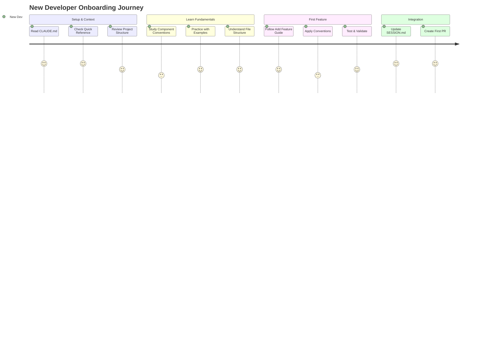

# Onboarding Journey Path

> **Purpose**: Optimized learning path for new developers joining the project
> **Time to Complete**: 4-6 hours
> **Goal**: Get productive quickly while learning essential patterns

## Journey Overview



## Phase 1: Project Context (30 minutes)

### 🎯 Objectives
- Understand project mission and tech stack
- Learn development rules and patterns
- Set up local environment

### 📚 Required Reading
1. **[CLAUDE.md](/CLAUDE.md)** - Project overview and rules
   - Focus on: Core Mission, Tech Stack, Development Rules
   - Key takeaway: Always use pnpm, understand package split

2. **[Quick Reference Card](/docs/evolution/orchestration/outputs/1-discovery/v1/conventions/QUICK-REFERENCE.md)**
   - Print or bookmark for constant reference
   - Review all sections briefly

3. **[Project File Structure](/docs/evolution/orchestration/outputs/1-discovery/v1/conventions/02-file-structure-conventions.md)**
   - Understand where code lives
   - Learn package boundaries

### ✅ Checkpoint 1
- [ ] Can explain why this is a monorepo
- [ ] Know which package to add components to
- [ ] Have Quick Reference accessible

## Phase 2: Core Conventions (1 hour)

### 🎯 Objectives
- Master component creation patterns
- Understand import/export rules
- Learn type system basics

### 📚 Study Path
1. **[Component Conventions](/docs/evolution/orchestration/outputs/1-discovery/v1/conventions/01-component-conventions.md)**
   - Read sections 1-3 thoroughly
   - Study the standard pattern

2. **[Component Examples](/docs/evolution/orchestration/outputs/1-discovery/v1/examples/components/)**
   - Start with `01-forwardref-pattern.tsx`
   - Copy and modify locally

3. **[Import/Export Conventions](/docs/evolution/orchestration/outputs/1-discovery/v1/conventions/04-import-export-conventions.md)**
   - Memorize the import order
   - Understand @ alias usage

### 🔨 Practice Exercise
Create a simple `Card` component following conventions:
```typescript
// Practice creating this in packages/web/src/components/
// Follow the forwardRef pattern
// Add proper types and exports
```

### ✅ Checkpoint 2
- [ ] Created a component using forwardRef
- [ ] Imports are in correct order
- [ ] Component has displayName

## Phase 3: Standards & Philosophy (45 minutes)

### 🎯 Objectives
- Understand performance requirements
- Learn accessibility standards
- Grasp content sensitivity framework

### 📚 Essential Standards
1. **[Performance Standards](/docs/ai/shared-context/standards/performance.md)**
   - Focus on: Lighthouse targets, key metrics
   - Understand why 98+ scores matter

2. **[Accessibility Standards](/docs/ai/shared-context/standards/accessibility.md)**
   - Review WCAG AA requirements
   - Study touch target sizes

3. **[Content Sensitivity Framework](/docs/ai/shared-context/philosophies/content-sensitivity.md)**
   - Understand 3-tier system
   - Know when to use ContentWarning

### ✅ Checkpoint 3
- [ ] Know the four themes and their purposes
- [ ] Can explain Level 1, 2, 3 content sensitivity
- [ ] Understand minimum touch target size

## Phase 4: First Feature (2-3 hours)

### 🎯 Objectives
- Complete a small feature end-to-end
- Apply all conventions learned
- Practice the development workflow

### 📚 Follow the Guide
1. **[Add a Blog Feature Guide](/docs/evolution/orchestration/outputs/3-guides/v1/tasks/01-add-blog-feature.md)**
   - Choose a simple feature (e.g., reading time indicator)
   - Follow all steps exactly

2. **Reference During Development:**
   - Quick Reference Card for patterns
   - Component examples for implementation
   - Performance standards for validation

### 🔨 Implementation Steps
1. Plan your feature architecture
2. Create necessary components
3. Add proper types
4. Test in all four themes
5. Check performance impact
6. Update SESSION.md

### ✅ Checkpoint 4
- [ ] Feature works in all themes
- [ ] Maintains 98+ Lighthouse scores
- [ ] Follows all conventions
- [ ] SESSION.md updated

## Phase 5: Integration & Collaboration (30 minutes)

### 🎯 Objectives
- Learn Git workflow
- Understand SESSION.md maintenance
- Prepare for code review

### 📚 Final Reading
1. **[SESSION.md Section in CLAUDE.md](/CLAUDE.md#automatic-session-management)**
   - Understand session tracking
   - Learn update requirements

2. **[Common Issues Guide](/docs/evolution/orchestration/outputs/3-guides/v1/tasks/04-fix-common-issues.md)**
   - Bookmark for future reference
   - Review common mistakes

### 🔨 Final Steps
1. Create proper Git branch
2. Run all validation commands
3. Update SESSION.md completely
4. Prepare PR description

### ✅ Final Checkpoint
- [ ] All tests pass
- [ ] SESSION.md is complete
- [ ] Ready for code review
- [ ] Understand next steps

## Quick Reference During Journey

### 🚀 Command Cheatsheet
```bash
# Always use pnpm
pnpm install
pnpm dev
pnpm build
pnpm test

# Before committing
pnpm format
pnpm lint
pnpm typecheck

# Git workflow
git checkout -b feat/{task-id}-{description}
gac "feat: add reading time indicator"
```

### 🔗 Bookmark These
1. Quick Reference Card (keep open)
2. Task Guides README (for next features)
3. Fix Common Issues (for troubleshooting)
4. Component Examples (for patterns)

## Success Metrics

You're ready for independent development when you can:
- ✅ Create a component without looking up the pattern
- ✅ Fix import order violations quickly
- ✅ Choose the right sensitivity level for content
- ✅ Maintain performance standards
- ✅ Update SESSION.md properly

## Next Steps After Onboarding

1. **Explore More Guides**
   - Try "Optimize Performance" guide
   - Read "Manage Content" for content work

2. **Deepen Knowledge**
   - Study advanced component patterns
   - Learn performance optimization techniques

3. **Contribute Back**
   - Document any confusion points
   - Suggest improvements to guides
   - Help onboard the next developer

## Common Onboarding Pitfalls

### ❌ Avoid These
- Skipping the Quick Reference Card
- Not testing in all themes
- Forgetting SESSION.md updates
- Using npm instead of pnpm
- Adding components to wrong package

### ✅ Do These Instead
- Keep Quick Reference visible
- Test early and often
- Update SESSION.md as you work
- Always use pnpm commands
- Components go in packages/web

## Onboarding Feedback

After completing this journey:
1. Note any confusion in SESSION.md
2. Track time spent on each phase
3. Suggest improvements for future developers

Welcome to the team! 🎉