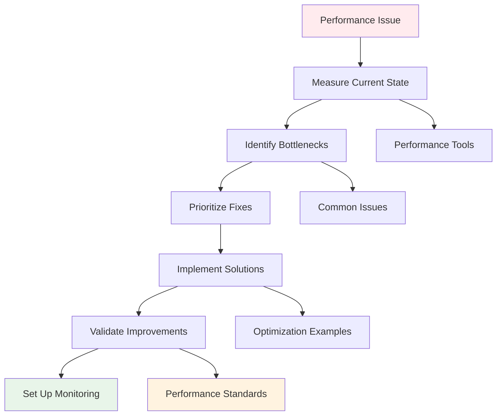

# Performance Optimization Path

> **Purpose**: Systematic approach to identifying and fixing performance issues
> **Expected Duration**: 3-5 hours for comprehensive optimization
> **Goal**: Achieve and maintain 98+ Lighthouse scores across all metrics

## Optimization Flow



## Stage 1: Performance Audit (30-45 min)

### 📍 Starting Point
**[Optimize Performance Guide](/docs/evolution/orchestration/outputs/3-guides/v1/tasks/02-optimize-performance.md)** - Section 1: Auditing

### 🎯 Initial Measurement

1. **Run Lighthouse Audit**
   ```bash
   # Development build
   pnpm build
   pnpm preview
   # Open Chrome DevTools → Lighthouse → Run audit
   ```

2. **Capture Baseline Metrics**
   - Performance score
   - Core Web Vitals (LCP, FID, CLS)
   - Accessibility score
   - Best practices score

3. **Identify Problem Areas**
   - Red metrics in Lighthouse
   - Opportunities section
   - Diagnostics details

### 📚 Analysis References
- **[Performance Standards](/docs/ai/shared-context/standards/performance.md)** - Target metrics
- **[Performance Benchmarks](/docs/evolution/orchestration/outputs/2-bridges/v1/metrics/performance-benchmarks.md)** - Expected values
- **[Baseline Measurements](/docs/evolution/orchestration/outputs/2-bridges/v1/metrics/baseline-measurements.md)** - Comparison data

### ✅ Audit Checklist
- [ ] Lighthouse scores recorded
- [ ] Core Web Vitals measured
- [ ] Problem areas identified
- [ ] Baseline documented

## Stage 2: Problem Identification (45-60 min)

### 📍 Diagnostic Hub
**[Fix Common Issues Guide](/docs/evolution/orchestration/outputs/3-guides/v1/tasks/04-fix-common-issues.md)** - Performance section

### 🎯 Common Performance Issues

1. **Bundle Size Problems**
   ```bash
   # Analyze bundle
   pnpm analyze
   ```
   - Large dependencies
   - Unoptimized imports
   - Missing code splitting

2. **Image Optimization**
   - Unoptimized formats
   - Missing responsive images
   - No lazy loading

3. **Rendering Issues**
   - Layout shifts (CLS)
   - Slow initial paint (LCP)
   - Blocking resources

### 📚 Pattern References
- **[Performance Blog Image Example](/docs/evolution/orchestration/outputs/2-bridges/v1/examples/performance-blog-image.tsx)** - Image optimization
- **[Code Splitting Example](/docs/evolution/orchestration/outputs/2-bridges/v1/examples/performance-code-splitting.tsx)** - Bundle optimization
- **[Component Patterns Analysis](/docs/evolution/orchestration/outputs/1-discovery/v1/analysis/component-patterns.json)** - Pattern efficiency

### 🔍 Diagnostic Tools
```bash
# Bundle analysis
pnpm analyze

# Build with stats
ANALYZE=true pnpm build

# Runtime performance
# Use Chrome DevTools Performance tab
```

### ✅ Identification Checklist
- [ ] Bundle size analyzed
- [ ] Images audited
- [ ] Render blocking identified
- [ ] Component efficiency checked

## Stage 3: Implementation Priority (30 min)

### 📍 Priority Matrix
**[Impact Analysis](/docs/evolution/orchestration/outputs/2-bridges/v1/metrics/impact-analysis.md)** - Prioritization guide

### 🎯 Fix Priority Order

1. **Critical (Immediate Impact)**
   - Blocking scripts
   - Huge images
   - Memory leaks
   
2. **High (Major Impact)**
   - Bundle splitting
   - Image optimization
   - Font loading

3. **Medium (Moderate Impact)**
   - Component optimization
   - Cache strategies
   - Preloading

4. **Low (Minor Impact)**
   - Micro-optimizations
   - Edge cases

### 📊 Impact vs Effort Matrix
```
High Impact, Low Effort → Do First
High Impact, High Effort → Plan Carefully
Low Impact, Low Effort → Quick Wins
Low Impact, High Effort → Skip/Defer
```

### ✅ Priority Checklist
- [ ] Issues ranked by impact
- [ ] Effort estimated
- [ ] Quick wins identified
- [ ] Implementation order set

## Stage 4: Solution Implementation (1-2 hours)

### 📍 Implementation Guide
**[Optimization Patterns](/docs/evolution/orchestration/outputs/2-bridges/v1/examples/)** - Code examples

### 🎯 Common Solutions

#### 1. **Bundle Optimization**
```typescript
// Dynamic imports for code splitting
const HeavyComponent = dynamic(() => import('./HeavyComponent'), {
  loading: () => <Skeleton />
})

// Tree-shakeable imports
import { specific } from 'library'  // ✅
import * as all from 'library'     // ❌
```

#### 2. **Image Optimization**
```typescript
// Use Next.js Image component
import Image from 'next/image'

<Image
  src="/hero.jpg"
  alt="Description"
  width={1200}
  height={600}
  priority={isAboveFold}
  placeholder="blur"
  blurDataURL={blurData}
/>
```

#### 3. **Performance Patterns**
```typescript
// Memoization for expensive operations
const expensiveValue = useMemo(() => {
  return computeExpensiveValue(props)
}, [props.dependency])

// Debounced handlers
const debouncedSearch = useDebouncedCallback(
  (value) => search(value),
  300
)
```

### 📚 Solution References
- **[Performance Code Splitting](/docs/evolution/orchestration/outputs/2-bridges/v1/examples/performance-code-splitting.tsx)** - Splitting patterns
- **[Optimization Examples](/docs/evolution/orchestration/outputs/2-bridges/v1/examples/)** - All examples
- **[Common Patterns](/docs/ai/shared-context/patterns/common-patterns.md)** - React patterns

### ✅ Implementation Checklist
- [ ] Code splitting applied
- [ ] Images optimized
- [ ] Components memoized
- [ ] Loading states added

## Stage 5: Validation & Testing (45-60 min)

### 📍 Validation Center
**[Performance Validation Tests](/docs/evolution/orchestration/outputs/2-bridges/v1/examples/performance-validation-tests.md)** - Test patterns

### 🎯 Validation Process

1. **Re-run Lighthouse**
   ```bash
   pnpm build && pnpm preview
   # Compare scores with baseline
   ```

2. **Test on Slow Networks**
   - Chrome DevTools → Network → Slow 3G
   - Verify acceptable performance
   - Check loading experience

3. **Cross-browser Testing**
   - Chrome (baseline)
   - Firefox
   - Safari
   - Mobile browsers

### 📚 Testing References
- **[Success Metrics](/docs/evolution/orchestration/outputs/3-guides/v1/analytics/success-metrics.md)** - What to measure
- **[Performance Standards](/docs/ai/shared-context/standards/performance.md)** - Required scores
- **[Testing Patterns](/docs/evolution/orchestration/outputs/1-discovery/v1/analysis/testing-patterns.json)** - Test approaches

### ✅ Validation Checklist
- [ ] Lighthouse scores ≥98
- [ ] Works on slow 3G
- [ ] No regressions
- [ ] Cross-browser tested

## Stage 6: Monitoring Setup (30 min)

### 📍 Monitoring Guide
**[Improvement Tracking](/docs/evolution/orchestration/outputs/2-bridges/v1/metrics/improvement-tracking.md)** - Tracking setup

### 🎯 Continuous Monitoring

1. **Automated Checks**
   ```json
   // package.json
   {
     "scripts": {
       "perf:check": "lighthouse-ci autorun",
       "bundle:check": "bundlesize"
     }
   }
   ```

2. **Performance Budgets**
   ```javascript
   // next.config.js
   module.exports = {
     experimental: {
       webVitalsAttribution: ['CLS', 'LCP']
     }
   }
   ```

3. **Real User Monitoring**
   - Web Vitals tracking
   - Error monitoring
   - Performance analytics

### 📚 Monitoring References
- **[Usage Analytics Setup](/docs/evolution/orchestration/outputs/3-guides/v1/analytics/usage-tracking-setup.md)** - Analytics implementation
- **[Metrics Documentation](/docs/evolution/orchestration/outputs/2-bridges/v1/metrics/)** - All metrics guides

### ✅ Monitoring Checklist
- [ ] CI checks configured
- [ ] Budgets defined
- [ ] Analytics tracking
- [ ] Alerts configured

## Quick Reference: Performance Fixes

### 🚀 Bundle Size Fixes
```typescript
// ❌ Bad
import _ from 'lodash'

// ✅ Good
import debounce from 'lodash/debounce'

// ✅ Better
import { useDebouncedCallback } from 'use-debounce'
```

### 🖼️ Image Optimization
```typescript
// ❌ Bad


// ✅ Good
<Image
  src="/large-image.png"
  alt="Description"
  width={800}
  height={600}
  loading="lazy"
/>
```

### ⚡ Component Performance
```typescript
// ❌ Bad
const Component = ({ items }) => {
  const filtered = items.filter(expensiveFilter)
  
// ✅ Good
const Component = ({ items }) => {
  const filtered = useMemo(
    () => items.filter(expensiveFilter),
    [items]
  )
```

## Common Performance Patterns

### 📦 Code Splitting Strategy
1. Route-based splitting (automatic with Next.js)
2. Component-based splitting (heavy components)
3. Library splitting (large dependencies)
4. Conditional splitting (feature flags)

### 🎨 CSS Optimization
1. Critical CSS inlining
2. Remove unused styles
3. Optimize font loading
4. Minimize reflows

### 🔄 State Management
1. Minimize re-renders
2. Use local state when possible
3. Memoize selectors
4. Optimize context usage

## Performance Decision Tree

```
Performance Issue?
├─ Slow Initial Load?
│  ├─ Large Bundle? → Code splitting
│  ├─ Many requests? → Bundle/combine
│  └─ Slow server? → SSG/caching
├─ Slow Interactions?
│  ├─ Heavy computation? → Web Workers/memoization
│  ├─ Many re-renders? → React optimization
│  └─ Memory leaks? → Cleanup effects
└─ Poor Metrics?
   ├─ High CLS? → Reserve space
   ├─ High LCP? → Optimize critical path
   └─ Low FID? → Reduce JS execution
```

## Emergency Performance Fixes

### 🚨 Site is Too Slow
1. **Quick Wins** (15 min)
   - Enable Next.js Image optimization
   - Add loading="lazy" to images
   - Remove unused dependencies

2. **Medium Fixes** (1 hour)
   - Implement code splitting
   - Optimize critical path
   - Add caching headers

3. **Deep Fixes** (2-3 hours)
   - Refactor heavy components
   - Implement virtualization
   - Optimize build configuration

## Success Metrics

Performance is optimized when:
- ✅ All Lighthouse scores ≥98
- ✅ LCP < 2.5s
- ✅ FID < 100ms
- ✅ CLS < 0.1
- ✅ Works well on 3G
- ✅ Monitoring in place

## Next Steps

After optimization:
1. Document changes in SESSION.md
2. Update performance benchmarks
3. Share learnings with team
4. Set up regular audits

Remember: Performance is not a one-time fix but an ongoing practice!