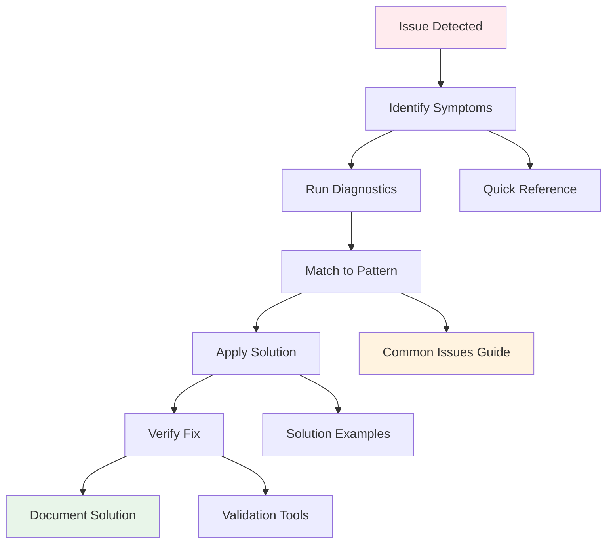

# Troubleshooting Path

> **Purpose**: Systematic approach to diagnosing and fixing development issues
> **Typical Duration**: 30 minutes - 2 hours depending on issue complexity
> **Goal**: Quickly identify root causes and implement proven solutions

## Troubleshooting Flow



## Stage 1: Issue Identification (5-10 min)

### 📍 Starting Point
**[Fix Common Issues Guide](/docs/evolution/orchestration/outputs/3-guides/v1/tasks/04-fix-common-issues.md)** - Quick diagnostics

### 🎯 Symptom Categories

1. **Build/Compile Errors**
   - TypeScript errors
   - Module resolution failures
   - Build process crashes

2. **Runtime Errors**
   - Hydration mismatches
   - Component crashes
   - State management issues

3. **Style/UI Issues**
   - Theme problems
   - Layout breaks
   - Responsive issues

4. **Performance Problems**
   - Slow loads
   - Memory leaks
   - Bundle size issues

### 🔍 Quick Diagnostic Script
```bash
# Run this first for any issue
echo "=== Quick Diagnostics ==="
echo "Node version: $(node -v)"
echo "PNPM version: $(pnpm -v)"
echo "Current branch: $(git branch --show-current)"
echo "Modified files: $(git status --porcelain | wc -l)"
echo ""
echo "Running checks..."
pnpm typecheck && echo "✅ TypeScript OK" || echo "❌ TypeScript errors"
pnpm lint && echo "✅ Linting OK" || echo "❌ Linting errors"
pnpm build && echo "✅ Build OK" || echo "❌ Build failed"
```

### ✅ Identification Checklist
- [ ] Error message captured
- [ ] Reproduction steps noted
- [ ] Environment checked
- [ ] Recent changes reviewed

## Stage 2: Pattern Matching (10-15 min)

### 📍 Issue Database
**[Common Issues Guide](/docs/evolution/orchestration/outputs/3-guides/v1/tasks/04-fix-common-issues.md)** - Full solutions

### 🎯 Common Error Patterns

#### TypeScript Errors
```
Error: Cannot find module '@/components/ui/button'
→ Import path issue
→ Check: tsconfig.json paths
→ Fix: Verify @ alias configuration

Error: Type 'X' is not assignable to type 'Y'
→ Type mismatch
→ Check: Interface definitions
→ Fix: Update types or add assertions
```

#### Build Failures
```
Error: Module not found
→ Missing dependency
→ Check: package.json
→ Fix: pnpm install

Error: ENOSPC: System limit for watchers
→ System limit reached
→ Check: fs.inotify settings
→ Fix: Increase watchers limit
```

#### Hydration Errors
```
Error: Hydration failed because initial UI does not match
→ Server/client mismatch
→ Check: Dynamic content
→ Fix: Use useEffect or suppressHydrationWarning
```

### 📚 Pattern References
- **[Error Handling Patterns](/docs/evolution/orchestration/outputs/1-discovery/v1/analysis/error-handling-patterns.json)** - Error structures
- **[Resolution Strategies](/docs/evolution/orchestration/outputs/1-discovery/v1/conflicts/resolution-strategies.md)** - Conflict fixes
- **[Migration Guides](/docs/evolution/orchestration/outputs/1-discovery/v1/conflicts/migration-guides/)** - Breaking changes

### ✅ Pattern Matching Checklist
- [ ] Error matched to pattern
- [ ] Root cause identified
- [ ] Solution strategy selected
- [ ] Similar issues checked

## Stage 3: Solution Application (15-30 min)

### 📍 Solution Hub
**[Error Handling Examples](/docs/evolution/orchestration/outputs/1-discovery/v1/examples/error-handling/)** - Implementation patterns

### 🎯 Common Solutions by Category

#### 1. **Import/Module Issues**
```typescript
// ❌ Problem: Cannot find module
import { Button } from 'components/ui/button'

// ✅ Solution 1: Use @ alias
import { Button } from '@/components/ui/button'

// ✅ Solution 2: Fix tsconfig.json
{
  "compilerOptions": {
    "paths": {
      "@/*": ["./src/*"]
    }
  }
}
```

#### 2. **Type Errors**
```typescript
// ❌ Problem: Type mismatch
interface Props {
  onClick: () => void
}

// ✅ Solution: Extend correct HTML attributes
interface Props extends React.ButtonHTMLAttributes<HTMLButtonElement> {
  // Custom props only
}
```

#### 3. **Build Issues**
```bash
# ❌ Problem: Build fails with memory error
pnpm build

# ✅ Solution: Increase Node memory
NODE_OPTIONS='--max-old-space-size=4096' pnpm build
```

#### 4. **Component Issues**
```typescript
// ❌ Problem: forwardRef not working
const Component = (props, ref) => { }

// ✅ Solution: Use proper pattern
const Component = React.forwardRef<HTMLDivElement, Props>(
  (props, ref) => { }
)
Component.displayName = 'Component'
```

### 📚 Solution References
- **[Quick Reference Card](/docs/evolution/orchestration/outputs/1-discovery/v1/conventions/QUICK-REFERENCE.md)** - Correct patterns
- **[Component Examples](/docs/evolution/orchestration/outputs/1-discovery/v1/examples/components/)** - Working code
- **[Validation Tools](/docs/evolution/orchestration/outputs/1-discovery/v1/validation/)** - Auto-fixing

### ✅ Application Checklist
- [ ] Solution implemented
- [ ] Code follows conventions
- [ ] No new errors introduced
- [ ] Changes are minimal

## Stage 4: Verification (10-15 min)

### 📍 Testing Center
**[Interactive Checklists](/docs/evolution/orchestration/outputs/3-guides/v1/interactive/checklists.md)** - Validation steps

### 🎯 Verification Process

1. **Immediate Verification**
   ```bash
   # Check if error is resolved
   pnpm dev
   # No errors in console
   # Feature works as expected
   ```

2. **Full System Check**
   ```bash
   # Run all checks
   pnpm typecheck
   pnpm lint
   pnpm test
   pnpm build
   ```

3. **Cross-Environment Test**
   - Test in development
   - Test production build
   - Test in all themes
   - Test on different browsers

### 📚 Verification References
- **[Standards Validation](/docs/evolution/orchestration/outputs/2-bridges/v1/examples/standards-validation.test.tsx)** - Test patterns
- **[Success Metrics](/docs/evolution/orchestration/outputs/3-guides/v1/analytics/success-metrics.md)** - What to verify

### ✅ Verification Checklist
- [ ] Original issue resolved
- [ ] No regression bugs
- [ ] All tests passing
- [ ] Performance maintained

## Stage 5: Prevention & Documentation (10-15 min)

### 📍 Documentation Hub
**[SESSION.md](/CLAUDE.md#automatic-session-management)** - Progress tracking

### 🎯 Prevention Strategies

1. **Add Safeguards**
   ```typescript
   // Add type guards
   function isValidProp(prop: unknown): prop is ValidType {
     return typeof prop === 'string' && prop.length > 0
   }
   
   // Add error boundaries
   <ErrorBoundary fallback={<ErrorFallback />}>
     <Component />
   </ErrorBoundary>
   ```

2. **Update Linting Rules**
   ```javascript
   // .eslintrc.js
   rules: {
     'import/order': ['error', { /* config */ }],
     '@typescript-eslint/explicit-module-boundary-types': 'error'
   }
   ```

3. **Document in SESSION.md**
   ```markdown
   ### Issue Resolved
   - **Issue**: TypeScript cannot find @ alias imports
   - **Cause**: Missing baseUrl in tsconfig.json
   - **Fix**: Added "baseUrl": "./src" to compiler options
   - **Prevention**: Added to onboarding checklist
   ```

### 📚 Documentation References
- **[Developer Feedback System](/docs/evolution/orchestration/outputs/2-bridges/v1/feedback/developer-feedback-system.md)** - Report patterns
- **[Improvement Tracking](/docs/evolution/orchestration/outputs/2-bridges/v1/feedback/improvement-tracking.md)** - Track fixes

### ✅ Prevention Checklist
- [ ] Root cause documented
- [ ] Prevention added
- [ ] Team notified if needed
- [ ] Guides updated

## Quick Fix Reference

### 🔧 Top 10 Quick Fixes

1. **Module not found**
   ```bash
   pnpm install
   # or
   rm -rf node_modules pnpm-lock.yaml && pnpm install
   ```

2. **Type errors**
   ```bash
   pnpm typecheck
   # Fix types based on errors
   ```

3. **Import order**
   ```bash
   pnpm format
   # Auto-fixes import order
   ```

4. **Build memory**
   ```bash
   NODE_OPTIONS='--max-old-space-size=4096' pnpm build
   ```

5. **Git issues**
   ```bash
   git status
   git stash
   # or
   git reset --hard HEAD
   ```

6. **Theme not working**
   - Check ThemeProvider wrapping
   - Verify theme class on html element
   - Clear localStorage

7. **Component not rendering**
   - Check imports
   - Verify export name
   - Add displayName

8. **Performance degraded**
   - Run Lighthouse
   - Check bundle size
   - Remove large deps

9. **Tests failing**
   ```bash
   pnpm test -- --no-cache
   ```

10. **Hydration mismatch**
    - Wrap dynamic content in useEffect
    - Use suppressHydrationWarning
    - Check for date/time rendering

## Troubleshooting Decision Tree

```
What type of error?
├─ Build/Compile Error?
│  ├─ TypeScript? → Check types & tsconfig
│  ├─ Module? → Check imports & deps
│  └─ Memory? → Increase Node heap
├─ Runtime Error?
│  ├─ Crash? → Add error boundary
│  ├─ Hydration? → Check SSR/CSR mismatch
│  └─ State? → Check hooks & effects
├─ UI/Style Issue?
│  ├─ Theme? → Check providers & classes
│  ├─ Layout? → Check responsive & CSS
│  └─ A11y? → Run accessibility audit
└─ Performance Issue?
   ├─ Bundle? → Analyze & split
   ├─ Runtime? → Profile & optimize
   └─ Memory? → Check for leaks
```

## Emergency Procedures

### 🚨 Everything is Broken
1. **Don't Panic**
   ```bash
   git stash  # Save current work
   git checkout main
   git pull
   pnpm install
   ```

2. **Verify Clean State Works**
   ```bash
   pnpm dev  # Should work
   ```

3. **Gradually Reintroduce Changes**
   ```bash
   git checkout your-branch
   # Apply changes incrementally
   ```

### 🔥 Production Emergency
1. **Immediate Rollback**
   ```bash
   git revert HEAD
   git push
   ```

2. **Investigate Offline**
   ```bash
   git checkout -b fix/emergency
   # Debug and fix
   ```

3. **Test Thoroughly**
   - All environments
   - All browsers
   - Performance check

## Success Indicators

Issue is resolved when:
- ✅ Error no longer occurs
- ✅ Feature works correctly
- ✅ No new issues introduced
- ✅ Performance maintained
- ✅ Solution documented
- ✅ Prevention in place

## Learning from Issues

After resolution:
1. Update troubleshooting guide
2. Add to common issues if recurring
3. Share solution with team
4. Consider automation/tooling

Remember: Every issue is a learning opportunity and makes the project more robust!