# Documentation Network Map

> **Generated**: 2025-06-17
> **Purpose**: Visual representation of all documentation connections and relationships
> **Navigation Aid**: Shows how different documentation pieces connect and support each other

## Network Overview

```mermaid
graph TB
    %% Entry Points
    Start[Developer Start] --> QuickRef[Quick Reference]
    Start --> TaskGuides[Task Guides]
    Start --> Conventions[Conventions]
    
    %% Phase 1: Discovery Layer
    QuickRef --> ComponentConv[Component Conventions]
    QuickRef --> FileStructure[File Structure]
    QuickRef --> TypeSystem[Type System]
    QuickRef --> ImportExport[Import/Export]
    QuickRef --> ErrorHandling[Error Handling]
    
    %% Examples Layer
    ComponentConv --> CompExamples[Component Examples]
    FileStructure --> FileExamples[File Examples]
    TypeSystem --> TypeExamples[Type Examples]
    ErrorHandling --> ErrorExamples[Error Examples]
    ImportExport --> ImportExamples[Import Examples]
    
    %% Phase 2: Standards Bridges
    ComponentConv --> AccessibilityStd[Accessibility Standards]
    ComponentConv --> PerformanceStd[Performance Standards]
    TypeSystem --> ContentSensitivity[Content Sensitivity]
    ErrorHandling --> ErrorPatterns[Error Patterns]
    
    %% Phase 3: Task-Based Guides
    TaskGuides --> AddFeature[Add Blog Feature]
    TaskGuides --> OptimizePerf[Optimize Performance]
    TaskGuides --> ManageContent[Manage Content]
    TaskGuides --> FixIssues[Fix Common Issues]
    
    %% Cross-References
    AddFeature --> ComponentConv
    AddFeature --> AccessibilityStd
    AddFeature --> PerformanceStd
    
    OptimizePerf --> PerformanceStd
    OptimizePerf --> CodeSplitting[Performance Examples]
    
    ManageContent --> ContentSensitivity
    ManageContent --> TypeSystem
    
    FixIssues --> ErrorHandling
    FixIssues --> ValidationTools[Validation Tools]
    
    %% Supporting Documentation
    AccessibilityStd --> InteractiveGuides[Interactive Elements]
    PerformanceStd --> Metrics[Performance Metrics]
    ContentSensitivity --> ContentExamples[Content Examples]
    
    %% TaskMaster Integration
    TaskGuides --> TaskTemplates[Task Templates]
    TaskTemplates --> TimeEstimates[Time Estimates]
    TaskTemplates --> SubtaskPatterns[Subtask Patterns]
    
    %% Analytics & Tracking
    InteractiveGuides --> UsageTracking[Usage Analytics]
    Metrics --> SuccessMetrics[Success Metrics]
    UsageTracking --> CompletionPatterns[Completion Patterns]
    
    %% Style Classes
    classDef entry fill:#e3f2fd,stroke:#1976d2,stroke-width:3px
    classDef phase1 fill:#fff3e0,stroke:#f57c00,stroke-width:2px
    classDef phase2 fill:#f3e5f5,stroke:#7b1fa2,stroke-width:2px
    classDef phase3 fill:#e8f5e9,stroke:#388e3c,stroke-width:2px
    classDef support fill:#fafafa,stroke:#757575,stroke-width:1px
    
    class Start,QuickRef,TaskGuides entry
    class ComponentConv,FileStructure,TypeSystem,ImportExport,ErrorHandling phase1
    class AccessibilityStd,PerformanceStd,ContentSensitivity phase2
    class AddFeature,OptimizePerf,ManageContent,FixIssues phase3
    class CompExamples,FileExamples,TypeExamples,ErrorExamples,ImportExamples,InteractiveGuides,Metrics,ContentExamples,TaskTemplates,TimeEstimates,SubtaskPatterns,UsageTracking,SuccessMetrics,CompletionPatterns support
```



## Documentation Layers

### 1. **Entry Layer** 🚪
Quick access points for developers based on their immediate needs:

- **Quick Reference Card** → Immediate lookup for common patterns
- **Task Guides** → Step-by-step instructions for specific goals
- **Conventions** → Detailed standards and patterns

### 2. **Foundation Layer** 🏗️
Core conventions and patterns (Phase 1 outputs):

- **Component Conventions** → How to build UI components
- **File Structure** → Where things go
- **Type System** → TypeScript patterns
- **Import/Export** → Module organization
- **Error Handling** → Error patterns and boundaries

### 3. **Bridge Layer** 🌉
Standards that connect conventions to implementation (Phase 2):

- **Accessibility Standards** → WCAG compliance guides
- **Performance Standards** → Lighthouse optimization
- **Content Sensitivity** → 3-tier content system
- **Error Patterns** → Advanced error handling

### 4. **Task Layer** 📋
Practical guides for common development tasks (Phase 3):

- **Add Blog Feature** → Feature development workflow
- **Optimize Performance** → Performance tuning guide
- **Manage Content** → Content workflow and sensitivity
- **Fix Common Issues** → Troubleshooting guide

### 5. **Support Layer** 🛠️
Examples, tools, and interactive elements:

- **Code Examples** → Real implementation patterns
- **Interactive Guides** → Checklists and decision trees
- **Metrics & Analytics** → Success tracking
- **TaskMaster Integration** → Project management

## Connection Types

### Direct Dependencies →
- Component Conventions → Accessibility Standards
- Type System → Content Sensitivity
- Task Guides → Multiple conventions

### Contextual Links ↔️
- Performance Standards ↔️ Optimize Performance Guide
- Error Handling ↔️ Fix Common Issues Guide
- Content Sensitivity ↔️ Manage Content Guide

### Supporting Resources ⟶
- Examples support conventions
- Metrics track success
- Templates accelerate development

## Navigation Patterns

### 1. **New Developer Journey**
```
Start → Quick Reference → Component Conventions → Component Examples → Add Feature Guide
```

### 2. **Performance Optimization Path**
```
Performance Issue → Fix Common Issues → Optimize Performance → Performance Standards → Metrics
```

### 3. **Content Management Flow**
```
Content Task → Manage Content → Content Sensitivity → Type System → Content Examples
```

### 4. **Troubleshooting Path**
```
Error → Fix Common Issues → Error Handling → Error Examples → Validation Tools
```

## Key Documentation Hubs

### 📌 Primary Hubs (Most Connected)
1. **Quick Reference Card** - 8 outgoing connections
2. **Task Guides README** - 7 connections
3. **Component Conventions** - 6 connections
4. **Performance Standards** - 5 connections

### 🔄 Bridge Documents
1. **Add Blog Feature Guide** - Connects tasks to conventions
2. **Content Sensitivity Framework** - Bridges types to content
3. **Error Handling Conventions** - Links patterns to fixes

### 🎯 Destination Documents
1. **Code Examples** - Implementation references
2. **Interactive Checklists** - Validation tools
3. **Success Metrics** - Measurement guides

## Usage Recommendations

### For Quick Lookups
1. Start with Quick Reference Card
2. Jump to specific convention
3. Review relevant examples

### For Feature Development
1. Begin with Task Guides
2. Follow to related conventions
3. Check standards compliance
4. Use interactive checklists

### For Problem Solving
1. Check Fix Common Issues
2. Trace to underlying patterns
3. Review error handling guides
4. Validate with tools

### For Learning
1. Follow complete paths
2. Explore examples
3. Practice with templates
4. Track progress with analytics

## Network Statistics

- **Total Documents**: 47 core documents
- **Primary Connections**: 23 major pathways
- **Average Connections per Doc**: 3.2
- **Maximum Path Length**: 4 hops
- **Hub Documents**: 4 major hubs

## Maintenance Notes

This network map should be updated when:
- New documentation is added
- Connection patterns change
- Usage analytics show new paths
- Developer feedback suggests improvements

Last network analysis: 2025-06-17