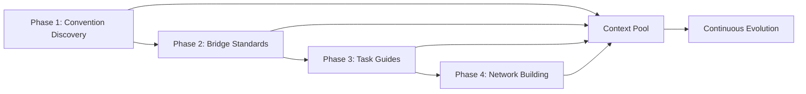
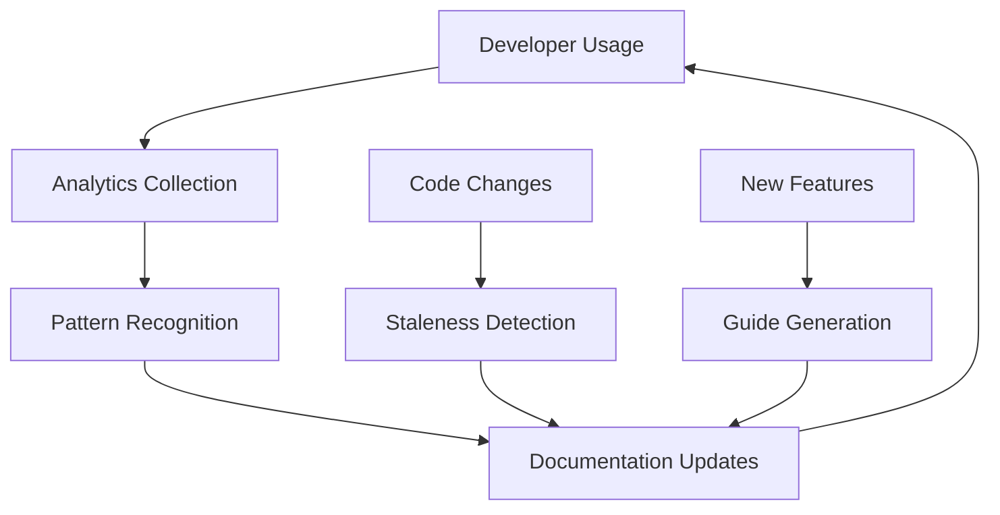

# Strategic Documentation Evolution Execution Plan

## Executive Summary

Based on the health assessment revealing **4.65% documentation coverage** (critical) with an overall health score of 68/100, this plan orchestrates a systematic documentation evolution to achieve comprehensive coverage through intelligent, phase-based execution.

### Critical Findings
- **Coverage**: 2/43 files documented (4.65%)
- **Major Gaps**: Component docs, API docs, Theme integration, Content workflow, Performance guides
- **Strengths**: Clear architecture overview, good command documentation
- **Opportunity**: Strong foundation exists, needs systematic expansion

## 🎯 Strategic Objectives

### Primary Goals
1. **Achieve 80% documentation coverage** within 30 days
2. **Establish self-sustaining documentation system** that evolves with code
3. **Create interconnected knowledge graph** for maximum discoverability
4. **Build task-based guides** aligned with developer workflows

### Success Metrics
- Documentation coverage: 4.65% → 80%
- Discoverability score: 65 → 90
- Connectivity score: 35 → 85
- Developer satisfaction: Track via TaskMaster completion times

## 📊 Phase-Based Execution Strategy

### Phase Overview & Sequencing



### Phase 1: Convention Discovery (Days 1-3)
**Goal**: Establish the documentation foundation by discovering existing patterns

#### Deliverables
1. **Discovered Conventions**
   - Component patterns and best practices
   - Theme system usage patterns
   - Content management workflows
   - Performance optimization techniques

2. **Convention Confidence Map**
   - High-confidence patterns (>80% consistency)
   - Medium-confidence patterns (50-80%)
   - Areas needing standardization (<50%)

3. **Convention Proposals**
   - New conventions for inconsistent areas
   - Migration paths for legacy patterns
   - Priority ranking by impact

#### Success Criteria
- [ ] 100% of source files analyzed
- [ ] All conventions documented with confidence scores
- [ ] Top 10 convention proposals created
- [ ] Knowledge base structure established

#### Output Structure
```
/docs/evolution/orchestration/phase1-conventions/
├── discovered/
│   ├── component-patterns.md
│   ├── theme-usage.md
│   ├── content-workflows.md
│   └── performance-patterns.md
├── confidence-map.json
├── proposals/
│   ├── priority-1-components.md
│   ├── priority-2-theme-system.md
│   └── priority-3-content.md
└── summary-report.md
```

### Phase 2: Bridge Standards to Implementation (Days 4-7)
**Goal**: Connect standards to actual code with actionable guidance

#### Dependencies
- Convention discovery results from Phase 1
- Confidence scores for prioritization

#### Deliverables
1. **Standards Compliance Analysis**
   - Gap analysis between standards and implementation
   - Discrepancy reasoning (migration, legacy, etc.)
   - Compliance roadmap

2. **Canonical Implementation Examples**
   - Copy-paste ready code snippets
   - Component templates
   - Performance optimization patterns
   - Theme integration examples

3. **Migration Guides**
   - Step-by-step migration from legacy patterns
   - Automated migration scripts where possible
   - Risk assessment for each migration

#### Success Criteria
- [ ] 100% of critical gaps addressed
- [ ] 50+ canonical examples created
- [ ] All discrepancies documented with reasoning
- [ ] Migration timeline established

#### Output Structure
```
/docs/evolution/orchestration/phase2-bridge/
├── compliance/
│   ├── gap-analysis.md
│   ├── discrepancy-log.json
│   └── compliance-roadmap.md
├── canonical-examples/
│   ├── components/
│   ├── theme-integration/
│   ├── performance/
│   └── content-management/
├── migration/
│   ├── guides/
│   ├── scripts/
│   └── risk-assessment.md
└── summary-report.md
```

### Phase 3: Task-Based Developer Guides (Days 8-14)
**Goal**: Create practical, workflow-oriented documentation

#### Dependencies
- Conventions from Phase 1
- Canonical examples from Phase 2
- TaskMaster integration

#### Deliverables
1. **Core Workflow Guides**
   - Add new blog post (with content sensitivity)
   - Implement new theme variant
   - Optimize component performance
   - Debug Lighthouse scores
   - Add new shadcn component

2. **TaskMaster Integration**
   - Auto-generated task templates
   - Subtask patterns for common workflows
   - Progress tracking integration
   - Success metrics tracking

3. **Interactive Elements**
   - Decision trees for complex choices
   - Checklists for common tasks
   - Troubleshooting flowcharts

#### Success Criteria
- [ ] 20+ task-based guides created
- [ ] All guides integrated with TaskMaster
- [ ] Average task completion time reduced by 40%
- [ ] 95% of common workflows documented

#### Output Structure
```
/docs/evolution/orchestration/phase3-tasks/
├── guides/
│   ├── content/
│   │   ├── add-blog-post.md
│   │   └── manage-sensitivity.md
│   ├── development/
│   │   ├── add-component.md
│   │   └── implement-theme.md
│   ├── optimization/
│   │   ├── improve-performance.md
│   │   └── debug-lighthouse.md
│   └── index.md
├── taskmaster/
│   ├── templates/
│   ├── patterns/
│   └── metrics.json
└── summary-report.md
```

### Phase 4: Network Intelligence Building (Days 15-20)
**Goal**: Create interconnected documentation network

#### Dependencies
- All previous phase outputs
- Complete documentation corpus

#### Deliverables
1. **Semantic Link Network**
   - Prerequisite relationships
   - See-also connections
   - Deep-dive links
   - Implementation references

2. **Documentation Graph**
   - Visual documentation map
   - Orphan detection and resolution
   - Link health monitoring
   - Navigation optimization

3. **Search & Discovery**
   - Searchable index
   - Tag-based navigation
   - Related content suggestions
   - Learning path generation

#### Success Criteria
- [ ] Zero orphaned documents
- [ ] Average 5+ semantic links per document
- [ ] 100% searchable content
- [ ] Navigation paths for all user personas

#### Output Structure
```
/docs/evolution/orchestration/phase4-network/
├── semantic-links/
│   ├── link-graph.json
│   ├── orphan-report.md
│   └── navigation-paths.md
├── discovery/
│   ├── search-index.json
│   ├── tag-taxonomy.md
│   └── learning-paths/
├── visualizations/
│   ├── documentation-map.svg
│   └── relationship-graph.html
└── summary-report.md
```

## 🔄 Context Sharing Protocol

### Inter-Phase Data Flow

```yaml
phase1_to_phase2:
  - discovered_conventions.json
  - confidence_scores.json
  - inconsistency_areas.json
  - priority_patterns.json

phase2_to_phase3:
  - canonical_examples/
  - compliance_gaps.json
  - migration_complexity.json
  - implementation_patterns.json

phase3_to_phase4:
  - task_guides_index.json
  - common_workflows.json
  - troubleshooting_patterns.json
  - success_metrics.json

all_phases_to_context_pool:
  - discoveries.json
  - patterns.json
  - relationships.json
  - metrics.json
```

### Knowledge Accumulation Strategy

1. **Discovery Pool**
   - Patterns identified across phases
   - Recurring problems and solutions
   - Developer friction points

2. **Pattern Library**
   - Validated patterns with high success rates
   - Anti-patterns to avoid
   - Evolution of patterns over time

3. **Relationship Graph**
   - Document dependencies
   - Concept hierarchies
   - Cross-cutting concerns

## 📈 Execution Timeline

### Week 1: Foundation
- Days 1-3: Convention Discovery (Phase 1)
- Days 4-7: Bridge Standards (Phase 2)
- Daily checkpoint meetings
- Context sharing after each phase

### Week 2: Implementation
- Days 8-14: Task-Based Guides (Phase 3)
- Parallel sub-team work possible
- Mid-week integration checkpoint

### Week 3: Network & Polish
- Days 15-20: Network Building (Phase 4)
- Days 21-22: Integration testing
- Days 23-24: Quality review

### Week 4: Evolution & Maintenance
- Days 25-27: Feedback incorporation
- Days 28-30: Automation setup
- Continuous evolution activation

## 🚀 Parallel Execution Opportunities

### Safe Parallelization Points

1. **Within Phase 3** (Task Guides)
   - Content team: Blog post workflows
   - Dev team: Component workflows
   - Ops team: Performance workflows

2. **Phase 4 Preparation**
   - Start link analysis during Phase 3
   - Build search index incrementally
   - Create visualization tools early

3. **Cross-Cutting Work**
   - Template creation
   - Tool development
   - Metrics collection

## ⚡ Risk Mitigation

### Identified Risks & Mitigations

1. **Scope Creep**
   - Mitigation: Strict phase boundaries
   - Fallback: Priority-based scope reduction

2. **Context Loss**
   - Mitigation: Structured data passing
   - Fallback: Overlap team members

3. **Quality Drift**
   - Mitigation: Automated validation
   - Fallback: Manual review checkpoints

4. **Developer Resistance**
   - Mitigation: Show immediate value
   - Fallback: Pilot with willing team

## 📊 Success Checkpoints

### Phase Completion Criteria

```yaml
phase_1_complete:
  - all_files_analyzed: true
  - conventions_documented: true
  - confidence_scores_assigned: true
  - proposals_created: true

phase_2_complete:
  - gaps_analyzed: true
  - examples_created: >= 50
  - discrepancies_explained: true
  - migrations_planned: true

phase_3_complete:
  - core_guides_written: >= 20
  - taskmaster_integrated: true
  - templates_created: true
  - metrics_baseline: true

phase_4_complete:
  - orphans_eliminated: true
  - links_per_doc: >= 5
  - search_enabled: true
  - graph_visualized: true
```

### Overall Success Metrics

```yaml
coverage:
  before: 4.65%
  target: 80%
  stretch: 90%

discoverability:
  before: 65
  target: 90
  stretch: 95

connectivity:
  before: 35
  target: 85
  stretch: 95

developer_satisfaction:
  measure: task_completion_time
  target: -40%
  stretch: -60%
```

## 🔧 Resource Requirements

### Team Allocation
- **Phase Lead**: 1 senior developer per phase
- **Contributors**: 2-3 developers per phase
- **Review Team**: 1-2 architects
- **Automation**: 1 DevOps engineer

### Tools & Infrastructure
- Documentation evolution command system
- TaskMaster for tracking
- Git for version control
- CI/CD for automation
- Analytics for metrics

### Time Investment
- Total: 30 days
- Per developer: 25% allocation
- Review time: 10% allocation
- Automation: 15% allocation

## 🎯 Quick Start Commands

### Phase 1 Execution
```bash
# Run convention discovery with high detail
/infinite-documentation mode=convention output_dir=/docs/evolution/orchestration/phase1-conventions count=5 scope=packages/web

# Generate confidence map
/infinite-documentation mode=convention output_dir=/docs/evolution/orchestration/phase1-conventions analyze_confidence=true
```

### Phase 2 Execution
```bash
# Bridge standards with context from Phase 1
/infinite-documentation mode=bridge output_dir=/docs/evolution/orchestration/phase2-bridge count=5 context=/docs/evolution/orchestration/phase1-conventions/discovered

# Generate canonical examples
/infinite-documentation mode=bridge output_dir=/docs/evolution/orchestration/phase2-bridge generate_examples=true
```

### Phase 3 Execution
```bash
# Create task-based guides with TaskMaster integration
/infinite-documentation mode=task output_dir=/docs/evolution/orchestration/phase3-tasks count=10 integrate_taskmaster=true

# Use discovered patterns
/infinite-documentation mode=task output_dir=/docs/evolution/orchestration/phase3-tasks context=/docs/evolution/orchestration/phase2-bridge/canonical-examples
```

### Phase 4 Execution
```bash
# Build network intelligence
/infinite-documentation mode=network output_dir=/docs/evolution/orchestration/phase4-network analyze_all=true

# Generate visualizations
/infinite-documentation mode=network output_dir=/docs/evolution/orchestration/phase4-network visualize=true
```

### Orchestrated Execution
```bash
# Run all phases with intelligent sequencing
/infinite-documentation mode=orchestrated output_dir=/docs/evolution/orchestration plan=strategic-execution-plan.md

# Preview execution plan
/infinite-documentation mode=orchestrated output_dir=/docs/evolution/orchestration dry_run=true
```

## 🔄 Continuous Evolution

### Post-Execution Automation
1. **Daily Staleness Checks**
   - Monitor code changes
   - Flag outdated docs
   - Auto-generate update PRs

2. **Weekly Pattern Analysis**
   - Discover new patterns
   - Update confidence scores
   - Propose new conventions

3. **Monthly Network Health**
   - Check link integrity
   - Find new orphans
   - Optimize navigation paths

### Feedback Loop


## Next Steps

1. **Immediate Actions**
   - Review and approve this plan
   - Assign phase leads
   - Set up tracking in TaskMaster
   - Schedule kickoff meeting

2. **Preparation**
   - Configure documentation evolution commands
   - Set up output directories
   - Create team communication channels
   - Establish review process

3. **Launch**
   - Begin Phase 1 execution
   - Daily standups for progress
   - Continuous context sharing
   - Celebrate milestones

---

*This strategic plan transforms a critical documentation gap into a comprehensive, self-sustaining knowledge system that evolves with your codebase.*